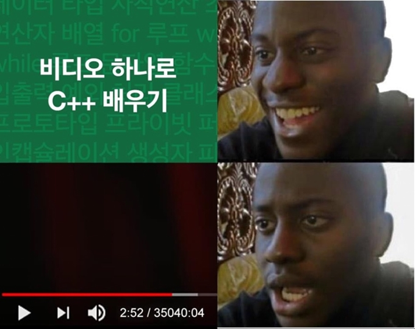

# 전역

~~프엔(X) 그냥 몬스터(O)~~

드디어 전역했다! 
학교 다닐 때는 적체라서 못 가고 있다가 졸업하고 나서야 겨우 연말에 입대해서... 드디어 전역의 해가 밝았습니다.

물론 군생활 하면서도 꾸준히 코딩도 하고, 일과 시간 도중 남는 시간엔 개발 서적 읽고, 출퇴근 때는 폰으로 블로그 글들을 꾸준히 봐왔지만... 전역하고 하는 공부의 양이 훨씬 더 많다고 느껴진다.

산업요원으로 전직할까도 생각을 해봤었는데, 그러기엔 그때 근무지가 나쁘지 않아서 정착하고 싶었었던 것 같다.
~~안 돼 어서 돌아가서 경력 쌓아~~

> 위 사진은 학부 + 동아리 시절에 프론트엔드 + `JS`로 스타 개발자...? 가 되어버려서 생긴 별명입니다ㅋㅋㅋㅋ

# 취준 시작

일단 기본기를 다지기 시작했다.
복무하는 동안 정말 많이도 다른 길로 새서 해보고 싶었던 개발들을 해봤으니, 이젠 취준에 필요한 스킬들을 공부할 때라고 판단했기 때문이다.

## 개발 서적들

그렇게 잡은 책들은

- `JS` 로는 `자바스크립트 Deep Dive` 
- `React`는 `리액트를 다루는 기술`
- 코딩 테스트로는 `이것이 취업을 위한 코딩 테스트다 with 파이썬`
- 클린 코드

이렇게 되시겠다. 

> 이제보니 저자분들이 다 스타 개발자이시다...

### 자바스크립트 Deep Dive

`자바스크립트 Deep Dive`는 요근래 나온 `JS` 책들 중에서 상당히 좋은 책이었다. 그동안 `모던 자바스크립트 입문` 이나 `자바스크립트 완벽 가이드` 책을 읽어봤었지만, 문법과 가독성의 면에서 이 책을 따라올 수는 없다.