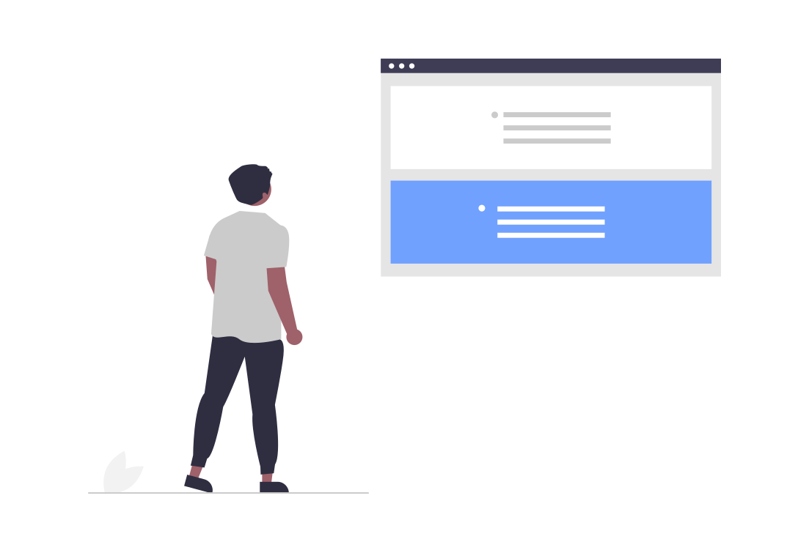
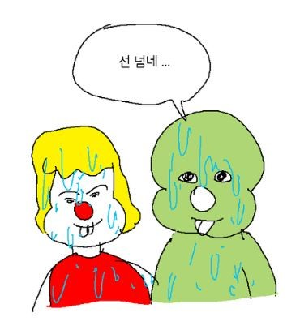

## 0. Intersection Observer 를 해석한다면

`Intersection Observer`의 역할을 알기 전에 뜻을 먼저 알고 가보는 건 어떠실까요?

- **Intersection**은 _Inter + section_ 으로, **'교차로', '서로 만나는 지점'** 을 뜻합니다.

- **Observer**는 다들 아시다시피 **'감시자'** 의 뜻을 가지고 있습니다. ~~스타크래프트 덕분~~

그럼 이 둘을 합치면 어떻게 될까요?

**교차지점 감시자** 정도가 어울리네요!

> 어때요? 뭐하는 친구인지 느낌이 오죠?

## 1. 역할

`Intersection Observer`, 즉 교차지점을 감시하는 이 `api`는 **특정한 뷰포트내에서 요소가 교차지점을 지나는지 감시하는 역할**을 해주는 편리한 방법을 제공해줍니다.

여기서 특정한 뷰포트는 **우리가 보는 문서의 테두리**가 될 수도 있고, **특정한 요소**가 될 수도 있습니다.


유명한 영화인 기생충의 한 장면처럼
이렇게 관리인이(요소가) 선을(뷰포트의 테두리를) 넘는 모습을 바라보는 기우가 바로 `Intersection Observer`인 것입니다!

이렇게 `Intersection Observer`는 명령대로 잘 감시하고 있다가 **선을 넘는 순간** 우리에게 알려주는 것이죠.

> 이전에는 `scrollHeight`랑 `scrollTop` 같은 것들을 조합해서 `scroll` 이벤트에 등록시켜 계산했었는데, 이젠 그런 고생은 하지 않아도 됩니다!

> 게다가 `scroll` 이벤트의 성능 최적화를 위해선 `throttle` 같은 것도 고려를...



## 2. 사용하기

그럼 이제 본격적으로 사용하는 방법을 알아봅시다.

> 사실 이 코드 블럭 하나면 설명이 끝난 거나 마찬가지입니다.

```js
const intersectionObserver = new IntersectionObserver((entries, observer) => {
  entries.forEach(entry => {
    if (entry.isIntersecting) {
      // 선 넘네...
      observer.unobserve(entry.target) // 필요한 경우 감시 대상에서 제외
    }
  })
})

intersectionObserver.observe(element) // 감시할 요소를 등록해줍니다
```

### 한 줄 씩 차근차근

1.  ```js
    let observer = new IntersectionObserver(callback, options)
    ```

    먼저 이렇게 `IntersectionObserver`를 선언해줍니다.
    보이는대로 **콜백 함수와 옵션**을 넘겨줘야 합니다.

2.  ```js
    let callback = (entries, observer) => {
      entries.forEach(entry => {
        if (entry.isIntersecting) {
          // 이 안의 entry는 선을 넘는 요소들을 뜻합니다.
          console.log(`${entry.target}이 선을 넘어 뷰포트 내로 들어왔어요!`)
          observer.unobserve(entry.target) // 이벤트에서 벗어나려면 호출하세요
        }
      })
    }
    ```

    넘겨줄 콜백 함수의 `entries`는 **감시 대상이 된 요소들**을 뜻합니다. 그리고 `.isIntersecting`, 즉 **선을 넘는지 확인하는 과정**을 거칩니다.
    만약 이벤트를 한 번만 발생시킬 거면 `.unobserve`를 해서 이벤트를 해제해줍시다. 그렇지 않으면 선을 넘을 때마다 계속 이벤트가 발생해요!

3.  ```js
    observer.observe(element)
    ```

    마지막으로 **감시를 원하는 요소**를 `.observe`의 매개변수로 넘겨주면 끝입니다!

### 옵션을 붙여보자

```js
let options = {
  root: document.querySelector('#scrollArea'),
  rootMargin: '0px',
  threshold: 1.0,
}
```

생성자의 두번째 매개변수인 options입니다.

1. `root`는 말 그대로 **루트가 되는 요소를 설정**합니다. 위에서 말했듯이 뷰포트가 꼭 문서 전체(`body`)를 뜻하지 않아도 됩니다.

2. `rootMargin`은 위의 `root`가 가진 여백입니다. 이 옵션을 사용하면 뷰포트에 나타나기 몇 픽셀 전에 **미리 이벤트를 활성화**시키는 것이 가능합니다. `lazy loading` 같은 것에 쓰기 좋겠네요.

3. `threshold`는 감시 대상이 **얼만큼 보여야 이벤트를 활성화**시킬지 결정하는 옵션입니다. 1로 설정하면 요소의 모든 부분이 다 보여야 이벤트가 활성화됩니다.

> 이렇게 하면 `Intersection Observer`가 **지금 선을 넘어서 우리가 볼 수 있는 곳에 닿고 있습니다!** 라고 우리에게 친절히 알려줍니다!


## 3. 사용처

막 언급했다시피 `lazy loading` 같은 곳에 주로 쓰입니다. 처음부터 전부 불러오지 않고, 필요한 부분만 원할 때마다 부를때 유용하죠.

비슷하게 `무한 스크롤링`도 가능합니다. 특정 요소를 아래에 넣고, 그 요소가 뷰포트 안으로 들어오면 다음 데이터를 불러오면 그게 무한 스크롤이죠!

> 저는 인터랙티브 웹을 만들때 써봤네요. 그때는 다시 위로 스크롤하면 이벤트도 다시 활성화해야해서 `.unobserve`를 호출하지 않았습니다.

## 4. 참고자료

- [Intersection Observer API](https://developer.mozilla.org/ko/docs/Web/API/Intersection_Observer_API)
- [IntersectionObserver를 이용한 이미지 동적 로딩 기능 개선](https://tech.lezhin.com/2017/07/13/intersectionobserver-overview)
