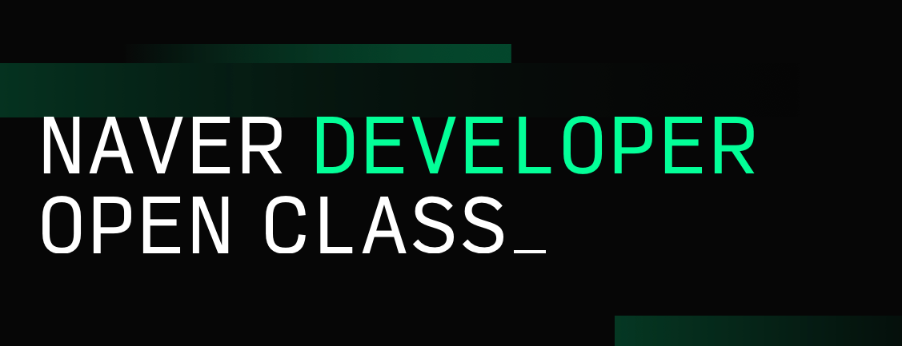

# 1. 클린 코드란

`클린 코드 (Clean Code)` 란 무엇일까? 영어 해석 그대로 **깔끔한 코드**, **깨끗한 코드** 라는 뜻이다. 그럼 깔끔한 코드란 무엇일까? 이 질문에 자신만의 답이 나오지 않는다면 이 책을 꼭 읽어봐야 한다. 자신만의 답이 나오더라도 읽어봐야 한다.

분명 자신이 쓴 코드인데 며칠이 지나면 알아보지 못해서 이 파일 저 파일 옮겨다니며 고생했던 경험이라면 개발자인 이상 모두가 가진 경험일 것이다.

또한 함수의 로직을 짜며 옆에 주석으로 주절주절 설명을 써놓은 경험도 있을 것이다.

한참을 거슬러 올라가 코딩 뉴비 시절일 때는 변수와 함수의 식별자명을 `a`, `b`, `aa` 이런 식으로 지을 때도 있을 것이다. ~~아직도 이러면 안 된다!!~~

> **클린 코드는 이러한 경험을 줄여줌으로써 더 좋은 가독성과 빠른 이해를 돕는다.**

# 2. 클린 코드를 읽게 된 계기

작년 20년도에 진행했던 `네이버 개발자 공채 오픈 클래스` 에서 이런 질문이 올라왔었다.

> 개발자로서 꼭 읽어야 하는 책이 있다면?

기억나는 답변이 2개인데 그 중 하나는

- 학부 시절에 배운 전공 서적을 다시 읽어보세요.

나머지 하나는

- **클린 코드**를 꼭 읽어보세요.

평소에도 깨끗한 코드, 깔끔한 아키텍처에 관심이 많았던 나는 그날 곧바로 클린 코드를 주문했다.

~~전공 서적은 이미 후배들 다 줘버렸다...~~

> 자바 개발자가 아니라 저자가 경고한대로 챕터2가 너무 어렵긴 했다... 다른 언어 개발자라면(나처럼) 2장은 빠르게 훑어도 될 거 같다.

# 3. 🧹깨끗한 코드

사실 많은 사람들이 클린 코드를 정리해두었고, 공교롭게도 나는 중복을 싫어하는 개발자라 그들과 같은 설명이나 해석을 하고 싶은 맘이 없다.

그래서 클린 코드의 마지막 챕터 `휴리스틱`처럼 간단명료하게 이것만큼은 지켜줬으면 하는 규칙들을 나열해 보기로 했다.

## 식별자의 이름은 중요하다

- 많은 개발자들이 순간을 귀찮아해서 변수나 함수명 같은 식별자를 단순하고도 짧게 지어버린다. 이건 기피해야할 행동이다.

- 게임 캐릭터 이름은 한참 생각하면서 식별자의 이름을 대충 짓는 건 있어서는 안 된다.
  식별자의 이름을 숙고해서 짓자. 실제로 많은 숙련된 개발자들은 변수명을 짓는데 많은 고민을 한다고 한다.

- 만약 식별자의 이름이 너무 길어지거나, 제대로 목표를 가지고 있지 않다면 그 변수 또는 함수는 대체로 잘못 설계되었을 가능성이 크다는 것을 내포하고 있는 셈이다.

- 주석을 달아야만 설명이 되는 이름도 수정해야한다. 이름과 로직 그 자체가 설명이 되어야 한다.

- 조직 내 컨벤션이 있다면 꼭 지키도록 하자.

- `camelCase`, `PascalCase`, `snake_case` 등의 각 언어별 기법을 잘 지키자.

- 나중에 이 식별자를 찾기 용이하게 지어야 한다.

- 자신만이 아는 숫자나 상수는 반드시 변수로 만들어 이름을 지어주자.

## 로직으로 설명되는 함수

- `단일 책임 원칙`을 기억하자. 함수의 이름이 복잡해진다면 원칙을 깨고 있는 것이다.

- 매개 변수는 적을 수록 좋다.

- 매개 변수로 `boolean` 타입을 넘겨야 한다면 잘못된 로직을 가지고 있을 가능성이 크다. 함수를 쪼개라.

- 최대한 잘게 쪼개고, 이해하기 쉬운 이름을 붙여라.

- `Call by Reference`를 조심하고, 부수 효과를 피해라.

- 중복을 없애라.

## 코드는 주석을 이긴다

- 주석이 꼭 필요한 상황을 만들지 마라.

- `Comment`는 코멘트(주석)일뿐 코드가 아니다.

## 읽어 내려가는 형식

- 위에서부터 자연스럽게 읽으며 이해되는 코드를 짜야 한다.

- 파트를 나누는 적절한 개행은 가독성을 크게 높인다.

## 피할 수 없는 오류 처리

- `null`을 반환하지도 전달하지도 마라.

- `try-catch` 문과 친해져라.

## 기타

- 중첩이 깊어진다면 문제가 커지고 있는 것이다.

- `테스트`를 진심으로 생각해라.

## 나만의 규칙

기억나는 중요한 규칙들은 위와 같다. 변수명과 함수 파트가 길어보이는 건 착각이다. 모두 중요하다. 단지 내가 저 두 개에 더 정성을 쏟아서 그렇다.

나도 나름 나만의 규칙을 가지고 있었다. 함수명과 컴포넌트명은 두 단어 이상으로, 숫자는 꼭 상수로 선언하여 이름을 붙여주기, 변수는 변수끼리 함수는 함수끼리 묶어주기, 매개변수로 `boolean`을 전해주지 않기, 주석 피하기 등등

이 책을 보고 바뀌게 된 나만의 규칙도 있다. 예를 들어 `Person`의 `interface`를 작성한다고 할 때... `IPerson` 이런 식으로 예전에 많이 지었었다. 허나 책에 따르면 안티패턴이라고 한다. 다른 것들도 있다. `LayoutComponent`, `CarClass` 처럼 뒤에 성격을 붙여주었는데, 이것또한 안티패턴이었다.

> 이제부터 고쳐나가면 된다.

# 4. 에필로그

정말 개발자 모두가 읽어봐야 할 책이라는 생각이 든다. 나는 동아리를 운영하며 많은 클린하지 않은 코드들을 보았었다. 이러한 코드들은 유지보수를 힘들게 할 뿐더러, 오류를 일으키는 잠재적 주범이다.

> 학생들의 오류를 잡아주며 무슨 의도로 이렇게 짰는지 많이 물어보곤 했다...

이 책에서 빠지지 않는 명언이 있다. 바로

**신은 디테일함에 깃든다.**

인데, 어떤 클린 코드 관련 글을 보든 빠지지 않는 격언이다.

여기에 `리팩토링`의 저자의 말도 인용하고 싶다.

기계가 이해할수 있는 코드는 바보라도 작성할수 있지만, **인간이 이해할수 있는 코드는 실력있는 프로그래머만이 작성할수 있다.**

우리는 **'제 컴퓨터에서는 돌아가는데요'** 라고 변명하는 개발자를 어떤 시선으로 바라보는지 알고 있다. 부디 자기 자신을 **'제 머리로는 이해되는데요'** 라고 변명하는 사람으로 만들지 말자.

> 개발자를 위한 교양 서적이 아니다. 작정하고 공략해야하는 책이다!
