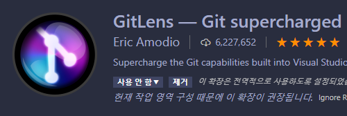
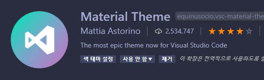
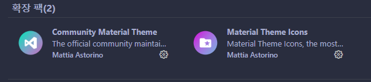
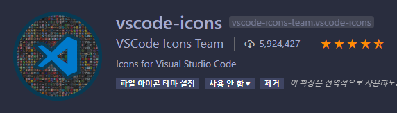
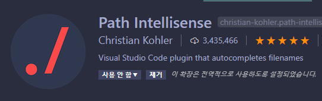
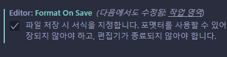

블로그 리모델링과 함께 글도 리워크하기로 결정했다!

애초에 이런 커스터마이징을 위해 로컬에서 개발하는 것이고, 개발 환경 설정 이후에는 코딩하고 싶은 열정이 더 커지니, 매우 장려하고 싶은 활동이기도 하다.
잡다한 건 제외하고, 유용하게 사용하고 있는 것들로 추천 드릴테니 잘 따라와주시길 바란다.

---

# 👨‍👨‍👧‍👦협업

## Git History

협업하는 상황에서나, 개인 프로젝트를 하는 상황에서나 `git`으로 코드를 트래킹하는 건 중요한 일이다. 그런데 정작 기록만 해놓고 보는데 애로사항이 있으면 말짱 도루묵 아니겠는가. 이 확장을 통해 보기 좋게 만들어보자.

## GitLens

`git`의 로그를 보는 것이 중요하다고 앞서 말했다시피, 이 확장 또한 `git`을 `vscode` 안으로 들여놓는 기분을 느끼에 해줄 것이다.

## Live Share

이름 그대로 자신의 `vscode`를 팀원에게 원격으로 공유할 수 있는 확장 프로그램이다. 필자는 주로 팀원의 버그를 대신 잡아주는데 사용했다.

# 🎨테마

## Material Theme

기본 색상의 `vscode`는 이제 지겹다! 새로운 테마를 쓰고 싶으면 추천! 필자는 `Palenight` 테마를 선호한다.

## Material Theme etc.

위의 `Material Theme` 말고도 다른 테마를 가진 `Community` 버전의 테마와, `vscode`의 파일 아이콘을 바꿀 수 있는 확장도 있으니 찾아보길 바란다.

## vscode-icons

위에서 설명했던 것과 같이 `vscode`의 파일 아이콘을 바꾸어주는 기능이다. 필자는 파일 아이콘을 바꾸는 것이 거의 반필수적이라고 생각하는데, 가독성을 크게 높여주기 때문이다.

# 🔨편의성

## Live Server

`html`, `css`, `js` 만을 다룬다면 꽤나 편리한 확장프로그램이다. 매번 변화가 있을 때마다 새로고침할 필요 없이 알아서 변화를 적용시켜준다.

## Path Intellisense

`image` 파일이나, `js` 파일처럼 다른 곳에서 `import` 할 때 자동으로 경로를 서치해주는 고마운 도구이다. 이런 자동완성 도구를 사용하면 오타로 인한 오류를 방지할 수 있다는 게 최대 장점.

## Prettier

개발 편의성 끝판왕 도구이다. 엉망이거나 더러운(?) 코드들을 깔끔하게 만들어준다. ~~클린 코드~~ 따로 설정 파일을 만들어둔다면, 속해 있는 그룹의 정책대로 알아서 코드의 모습을 바꾸어주기도 한다. **필수!!**

이렇게 설정에 들어가서 `format on save`를 검색한 뒤 체크해준다면, 매번 저장시마다 깔끔하게 변하는 코드를 확인할 수 있을 것이다!

## Visual Studio Intellicode

듣기로는 AI가 사용자가 다음에 사용할 코드를 예측하여 자동완성으로 추천해준다는 도구이다. 미묘하게 도움이 되는 거 같기도 하고... 아니기도 하고... 하지만 AI가 추천하는 자동 완성이라는 것 자체가 재미있다.

# 🛒기타

## WakaTime

순수하게 코딩을 한 **시간**과 **프로젝트명**, **개발 언어** 모두 기록을 하여 보여주는 도구이다. 개발 동기를 부여해주는데 도움이 많이 된다.

> 내가 저번 주에 코딩을 5시간 밖에 안 했다고?!

## 마무리

이번에는 각 언어들에 대한 `snippet` 등 특정 유저만 사용할만한 부가기능은 되도록 제외하고, 누구나 사용할 수 있는 확장에 대해 주로 다루었다.
각자 사용하는 언어에 대한 확장 기능은 언어명으로 확장 검색창에 검색해보기만 해도 많이 나오니 알아서 잘 설치하시길 바란다.
