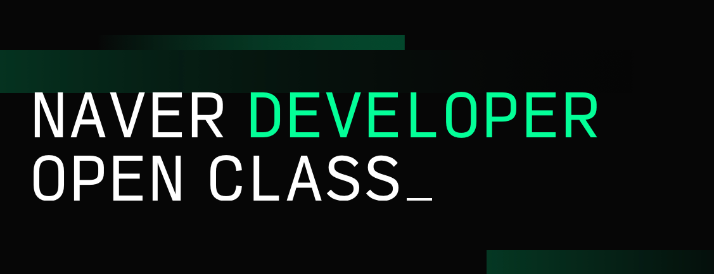

# 1. 클린 코드란

`클린 코드 (Clean Code)` 란 무엇일까? 영어 해석 그대로 **깔끔한 코드**, **깨끗한 코드** 라는 뜻이다. 그럼 깔끔한 코드란 무엇일까? 이 질문에 자신만의 답이 나오지 않는다면 이 책을 꼭 읽어봐야 한다. 자신만의 답이 나오더라도 읽어봐야 한다.

분명 자신이 쓴 코드인데 며칠이 지나면 알아보지 못해서 이 파일 저 파일 옮겨다니며 고생했던 경험이라면 개발자인 이상 모두가 가진 경험일 것이다.

또한 함수의 로직을 짜며 옆에 주석으로 주절주절 설명을 써놓은 경험도 있을 것이다.

한참을 거슬러 올라가 코딩 뉴비 시절일 때는 변수와 함수의 식별자명을 `a`, `b`, `aa` 이런 식으로 지을 때도 있을 것이다. ~~아직도 이러면 안 된다!!~~

**클린 코드는 이러한 경험을 줄여줌으로써 더 좋은 가독성과 빠른 이해를 돕는다.**

# 2. 클린 코드를 읽게 된 계기

작년 20년도에 진행했던 `네이버 개발자 공채 오픈 클래스` 에서 이런 질문이 올라왔었다.

> 개발자로서 꼭 읽어야 하는 책이 있다면?

기억나는 답변이 2개인데 그 중 하나는

- 학부 시절에 배운 전공 서적을 다시 읽어보세요.

나머지 하나는

- **클린 코드**를 꼭 읽어보세요.

평소에도 깨끗한 코드, 깔끔한 아키텍처에 관심이 많았던 나는 그날 곧바로 클린 코드를 주문했다.

~~전공 서적은 이미 후배들 다 줘버렸다...~~

# 3. 깨끗한 코드

# 4. 후기
