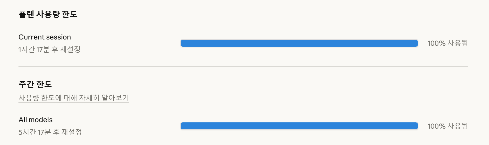
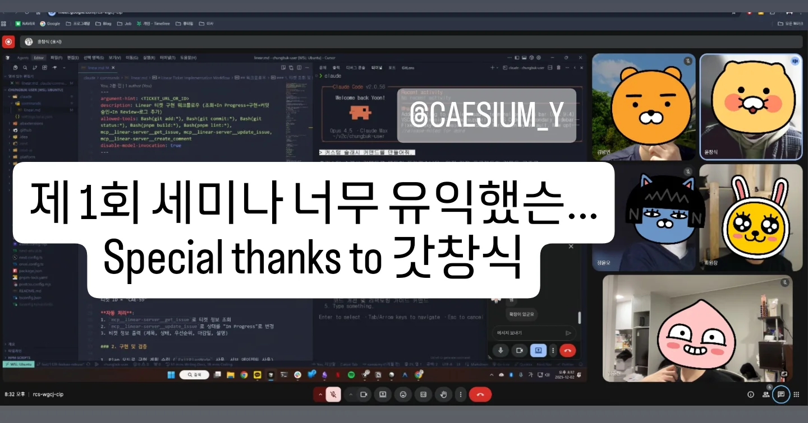
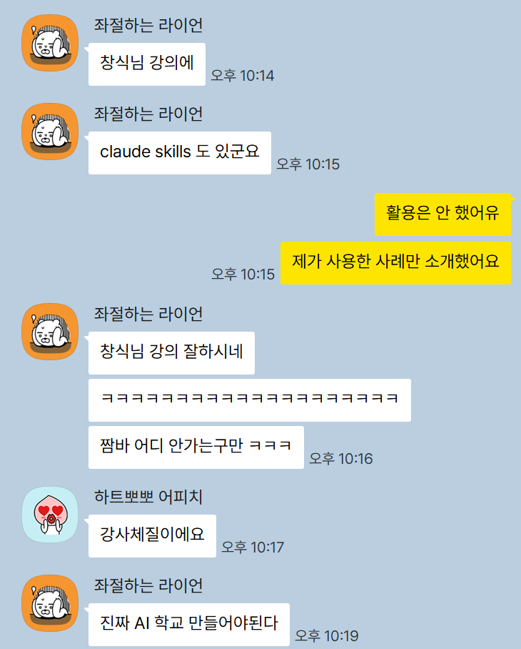
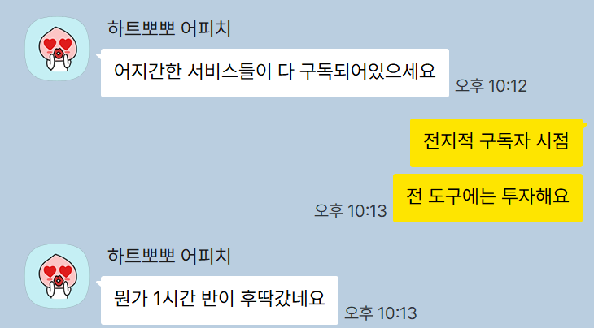

## 목차

## 세션을 열게 된 계기



최근 반년 사이에 개발 생태계는 굉장히 많은 변혁을 거쳐왔다고 생각한다. 대표적으로는 클로드 코드(Claude Code)의 등장이 있다. 나도 Max 요금제를 사용하고 있음에도 불구하고 주간 할당량을 다 쓰는 정도로 사용하고 있기에 이러한 변화를 매우 실감하고 있는 중이다.

그래서 난 주변 동료들이나 개발자 분들도 모두 이러한 변화에 적응하고 있는 줄로만 알았다. **하지만 그게 아니었다.** 만났던 개발자 중에서 클로드 코드를 사용하고 있지 않은 분들이 많았다. 거의 대다수 그 이상이었다.

그래서 내가 사용하고 있는 방법을 조금 설명했더니 세미나를 열어달라고 하셨다. 수요가 조금이라도 있는 상황이라면 나서는 성격을 가진 터라 세션을 열게 되었다.

## 세션 준비 과정


세션은 크게 준비할 것이 없었다. 그냥 평소에 내가 개발하는 대로만 보여주면 된다고 생각했다. 그래서 외주 개발을 하며 대표적으로 마주하는 상황에 대해 어떻게 AI로 대응하고 개발하는지에 대해 다루기로 했다.

> 분명 나는 평소에 개발하는 방법을 소개하려고 했는데 다들 기대를 많이 하셔서 부담스럽긴 했다... 
> 내가 튜터 출신이 아니었다면 무척 긴장했을 것...!


## 세션 진행

세션은 크게 3가지 부분으로 나뉘었다.

1. 클로드 코드 소개
2. 슬랙 메세지로부터 비즈니스 로직 티켓 생성하기
3. Figma UI 디자인 그대로 생성하기

### 클로드 코드 소개

클로드 코드를 아예 처음 접하는 분들을 위한 챕터였다. 다들 해봐야 커서 정도 잠깐 써보신 분들이고, 탭 자동 완성에 익숙해진 수준이라, 정말 자동화된 Agentic 코딩을 접하지 못한 분들을 위한 챕터였다.

다룬 내용은 평범하다. 다른 도구들과 달리 클로드 코드가 가지고 있는 특징들:
1. 커스텀 슬래시 커맨드(Custom Slash Commands)
2. 서브 에이전트(Sub Agent)
3. 스킬(Skills)

그리고 유용하게 쓰이는 기능들:
1. MCP(Model Context Protocol)
2. 플랜 모드(Plan Mode)

이러한 기능들에 대해 이론적인 부분과 함께 실제 내가 사용하고 있는 방법을 소개했다.

### 슬랙 메세지로부터 비즈니스 로직 티켓 생성하기

보통 개발 회사에서는 지라, 노션 같은 업무용 협업 툴을 통해 개발 진행 단계를 트래킹한다. 하지만 외주는 그렇지 않다... 클라이언트는 대부분 개발자가 아니다.

그 덕분에 대표님에게 카톡을 받거나, 내부 개발자에게 슬랙 메세지를 받는 형식으로 작업이 진행되는 경우가 많다. 대표적으로 들어오는 막막한 메세지는...

> 창식 님 이거 홈페이지가 이상해요.

> 로그인이 안 돼요.

> 이거 예쁘게 바꿔주세요.

외주 개발의 단점이라고 볼 수도 있지만 어쩔 수 없는 생태계라고도 생각한다. 클라이언트는 어떻게 정보를 전달해야 하는지 잘 모르는 것이다.

그러면 나는 이러한 메세지가 오면 클라이언트와 몇 번 확인을 위해 대화를 주고 받는다.

> 홈페이지의 어떤 부분일까요?

> 에러 재현은 어떻게 해보셨을까요?

> 생각하시는 레퍼런스가 있을까요?

그렇게 몇 번 티키타카를 주고 받고 나면 내가 생각하는 **완성도의 윤곽**이 그려진다. 이 이후에는 바로 AI를 통한 자동화 워크플로우를 진행한다.

**커스텀 슬래시 커맨드**를 이용해서 티키타카한 슬랙 메세지를 그저 복사 붙여넣기해서 매개변수로 넘겨준다.
그러면 해당 커맨드를 이용해서 내가 정의해놓은 워크플로우가 실행된다.

1. Linear MCP를 호출해서 프로젝트를 생성 or 조회
2. 프로젝트 생성 or 조회 결과를 바탕으로 티켓 생성
   - 이 과정에서 AI가 자료 조사를 한 다음 모호한 부분이 있다면 나에게 물어본다.
3. 티켓 생성 결과를 바탕으로 티켓 상태 업데이트(Todo)

결국 이렇게 티켓을 만드는 과정 자체가 하나의 **메타 프롬프팅** 과정이 되는 것이다. 이후에 나는 만들어진 티켓에 내가 생각한 완성도의 윤곽이 정확히 담겨있는지 확인한다.

다음 워크플로우도 커스텀 슬래시 커맨드를 이용해서 자동화한다.

1. Linear MCP를 호출해서 티켓을 조회
2. 티켓의 상태를 업데이트(In Progress)
3. 작업 계획 작성(Plan Mode)
   - 이때의 계획을 **꼼꼼히** 보고 승인해야 한다!
4. 작업 완료 후에 검증 요청
5. 검증 성공 시에 커밋
   - 이 과정에서 브랜치 이동이나 PR을 작성하기도 한다.
6. 티켓의 상태를 업데이트(In Review)
7. 티켓에 작업 로그를 코멘트로 남기기(디버깅 추적용)

이러한 워크플로우를 통해 작업의 진행 상황도 클라이언트에게 Linear 스크린샷이나 링크 하나로 공유가 가능하고, 나 스스로의 작업 진행 상황 파악도 쉬워진다.

### Figma UI 디자인 그대로 생성하기

프론트엔드에서 빼놓을 수 없는 것은 UI 개발이다. 허나 AI에게 피그마의 디자인을 서술해서 생성하도록 하는 것은 쉽지 않다. 물론 스크린샷을 바탕으로 만드는 방법도 있지만 그건 100% 수준의 재현으로 이어지기는 힘들다.

100% 재현을 위해서는 피그마의 데이터를 바탕으로 생성하는 것이 가장 좋다. 그래서 내가 사용한 것이 바로 Figma MCP이다. 하지만 이것도 무지성으로 사용하면? 내가 원하는 100% 수준을 역시나 기대하기 힘들다.

이번에도 커스텀 슬래시 커맨드를 사용하는 것은 같다. 내 작업의 많은 부분이 미리 만들어놓은 커스텀 슬래시 커맨드로 이루어지므로...

해당 커스텀 슬래시 커맨드는 아래와 같은 워크플로우를 가진다:

1. Figma MCP를 호출해서 피그마 프로젝트를 조회
2. 피그마 프로젝트를 바탕으로 UI 생성
3. **테스트 페이지 생성**
4. Chrome DevTools를 통해 테스트 페이지 검증

여기서 핵심은 바로 **테스트 페이지 생성**이다. 가능하면 가장 좋은 옵션은 역시 스토리북(Storybook)을 사용하는 것이지만... 내가 작업하는 모노레포에 도입하기엔 여러 복잡한 사정이 있다. 그래서 나는 나름의 대안으로 AI에게 스토리북을 가장한 테스트 페이지를 만들어 달라고 하는 것이다.

그 이후에는 내가 테스트 페이지에서 직접 손으로 테스트하기 보다 Chrome DevTools를 통해 검증하는 방법을 사용한다. 그러면 AI가 직접 만든 것이다 보니 그 작동 로직을 잘 알고 있는 개발자처럼 검증을 할 수 있게 된다.

## 참가자 반응



무려 2시간의 세션이었지만 실제로 클로드 코드가 대신 코딩해주는 모습을 보시곤 많이들 충격에 빠진듯했다. 나는 당장 세션 도중에 **단 한 줄의 코드도 작성하지 않고** 벌써 외주 개발의 티켓 2개를 해결해버렸기 때문이다. 그것도 절대 2시간 안에 할 수 없는 양의 티켓을 말이다.

더욱 놀라웠던 건 이건 발표 도중이었다는 것. 나는 CLI의 특성을 이용해 여러 터미널을 한 번에 띄우고 커스텀 슬래시 커맨드로 동시에 병렬 처리를 한다고 하니 모두가 놀라워했다.

해당 세션 이후에 다들 다음에는 2부 세미나도 진행해달라고 요청도 하셨고, 어떤 분은 나에게 따로 연락을 주셔서 여러 질문도 하시고 외주 프로젝트 공고를 보여주시며 본인도 지원해보겠다고 하셨다.


단톡방에서는 간증(?)이 이어져서 '창식 님은 역시 강사 체질이다' 라는 말이 나오기도 하고, 다른 칭찬들도 많이 해주셔서 뿌듯했다.


(구글 구독 만세)

게다가 더욱 나아가서 시간 관계상 참여하지 못한 분들은 녹화본을 요청하셔서 드리기도 했다. 정말 보셨는지 다시 질문도 해주셔서 '내가 반년간 헛 개발한 것은 아니구나~' 생각이 들어 안도의 미소를 지었다.

## 앞으로의 계획


이렇게 외주 개발에서 AI Agentic 코딩을 하는 방법에 대해 많이 익숙해졌다지만, 나는 최근 **정규직 전환**을 노리고 있다. 이전까지는 현재 생활에 큰 불편함이 없었기에 절박함을 못 느꼈다만, 외주 생활이 길어지는 것에 경계를 하게 된다...

게다가 현재까지는 이러한 워크플로우로 대부분의 일을 처리할 수 있었기에, 새로운 챌린지를 찾지 못하면 지금 상황에 안주하게 될 것 같은 마음이기도 하다.

## 마무리

이번에 소개한 2가지 워크플로우는 기회가 된다면 새 게시글로 소개할 예정이다.
많은 개발자들이 이미 AI를 업무에 충분히 활용하고 있다고 생각했지만 꼭 그렇지만은 않은 것이 밝혀졌으니 내가 다루는 방법을 공유하고, 나는 넥스트 레벨로 나아가야지 싶다.

그렇다면 블로그에 시리즈 기능을 추가해야겠지? 역시 나는 일을 찾아서 만드는 타입인 것만 같다.

## 오늘의 클로드 코드 프롬프트
다음 시리즈 글을 못 기다리겠다면 직접 아래 프롬프트를 클로드 코드에게 전달해서 커스텀 슬래시 커맨드를 만들어줘도 된다.

```bash
https://caesiumy.dev/posts/ai/claude-code-token-burning-session-retrospect

해당 게시글을 읽고 내용을 분석한 다음, 현재 프로젝트에 적용하기 위한 커스텀 슬래시 커맨드를 만들어줘.
```

---

## Coming Soon

- Custom Slash Commands로 비즈니스 로직 티켓 생성하기
- MCP(Model Context Protocol)로 Figma UI 디자인 그대로 생성하기
