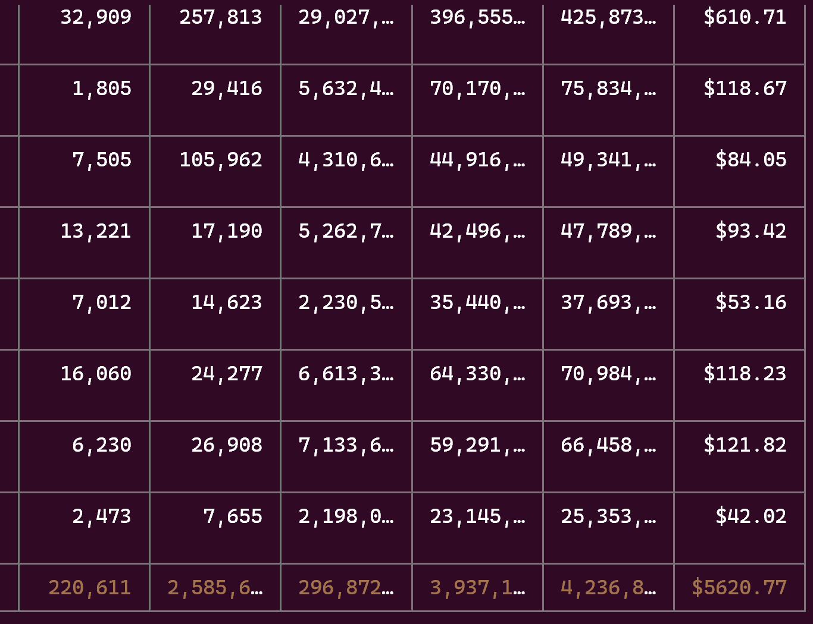

## 목차

## 개요
마크다운 기반 블로그를 직접 만들고 나면 떠오르는 문제점은 바로 **마크다운 파일을 어떻게 관리할 것인가**라고 생각한다. 관리자 대시보드가 있는 것도 아니고, 그저 코드 에디터로 파일을 관리하기 때문이다. 특히 '프론트매터(Frontmatter)' 와 같이 매번 마크다운 글 생성 때마다 규칙을 지켜 작성해야 하는 것이 꽤나 번거롭다.

## CLI 방식의 글 생성 방법
그래서 떠올린 게 바로 마크다운 파일 생성기이다. CLI 라고 하면 거창하지만, 그저 스크립트 파일을 만들고 명령어를 입력하면(`npm run gen:blog`) CLI 툴처럼 여러 선택지를 거쳐 마크다운 파일을 생성할 수 있는 것이다. 
하나 예시를 들자면 `npm create vite` 정도가 있겠다. 해당 명령어 입력 시에는 프로젝트 명, 사용할 프레임워크와 언어, 번들러를 고를 수 있는 것처럼 말이다.

이런 툴을 만들어야지! 하고 생각하니 신나서 CLI용 프레임워크도 찾아보고, npm 패키지로 배포할 생각도 해보았**었**다.

## CLI 방식의 한계점

그러나 굳이 CLI 도구를 만들어야 할까? 라는 포인트에 봉착했다. 나는 항상 기회비용을 바탕으로 계획을 액션에 옮기는 편인데, 예를 들어 코드로 해결하기와 직접 노가다로 해결하기 이지선다가 존재한다고 가정해보자. 평소대로의 개발자 마인드라면 ~~멋있게~~ 코드로 해결했을 터이지만, 만약 코드로 해결하는 방법이 시간과 리소스가 더 든다면? 재사용할 횟수도 적다면? 이러한 상황에서는 그저 일회성 노가다가 더 나은 선택이 될 수도 있다는 것이다.

그렇다면 블로그 글 작성은 과연 CLI 도구를 사용하는 게 가장 최선의 선택일까? 물론 일회성은 아니지만, 수단이 무엇이고 목표가 무엇인지 상기해야 한다.
**우리의 목표는 블로그 글 작성이지, 블로그 글 초안 작성을 위한 도구가 아니다.** 그 시간에 블로그 글 작성을 하는 것이 더 가치가 있다고 판단했다.

그래서 나는 다른 길을 선택했다. 아주 친숙하게 다루고 있는 도구를 활용하는 길을 말이다.

## Claude Code Custom Slash Commands 소개



Claude Code는 내가 정말 잘 사용하고 있는 도구이다. 한 달에 쓰는 토큰의 비용만 해도 5000 달러에 육박하는 정도...(구독을 사용하고 있어 다행이다)
이러한 Claude Code에는 반복되는 명령이나 프롬프트를 자동화하기 위한 기능이 있다. 바로 **[Custom Slash Commands](https://docs.claude.com/ko/docs/claude-code/slash-commands#%EC%82%AC%EC%9A%A9%EC%9E%90-%EC%A0%95%EC%9D%98-%EC%8A%AC%EB%9E%98%EC%8B%9C-%EB%AA%85%EB%A0%B9%EC%96%B4)** 기능이다.

이제 정답이 나온 거 같지 않은가? CLI 도구를 굳이 만들어 사용하지 않고 Claude Code의 커스텀 슬래시 커맨드(Custom Slash Commands) 기능을 사용하면 되는 것이다.

Claude Code의 커스텀 슬래시 커맨드 사용으로 얻을 수 있는 이점은 다음과 같다:
- 마크다운 기반 명령어 정의로 사용하기 쉽다
- AI의 도움을 받아 동적 콘텐츠 생성이 가능하다
- 그때그때 수정이나 기능 추가가 편하다

CLI 도구에도 AI를 붙이면 도움을 받을 수야 있겠지만, 그건 나름대로 또 리소스가 드는 작업이다. 차라리 Claude Code의 커스텀 슬래시 커맨드 기능을 사용하는 게 더 편리하고 효율적인 선택이 될 것이라고 판단했다.

## 커스텀 슬래시 커맨드 기본 구조

사용하는 방법은 정말 간단하다. 그저 원하는 명령어에 대한 내용을 구조화된 마크다운 문서로 작성하는 것이다. 신경 쓸 점이라면 Arguments 정도가 되겠다.
Arguments를 잘 사용하면 CLI 도구에서 선택지를 주는 것과 동일한 역할을 할 수 있게 되는데, 내가 만든 커스텀 슬래시 커맨드의 사용 예시는 다음과 같다.

```
/blog-gen [제목] [--category <카테고리>] [--tags <태그>] [--featured] [--draft] [--template <경로>]
```

그렇다면 현재 글의 초안을 생성하는 명령어는 다음과 같다.

```
/blog-gen 블로그 글 초안을 생성하는 CLI 대신 Custom Slash Commands 만들기(feat. Claude Code)
```
이렇게 하면 Claude가 알아서 카테고리 및 태그를 추천해주고, 섹션 구조를 자동으로 생성해준다.

만약 직접 수동으로 다른 카테고리나 태그를 지정하고 싶다면 다음과 같이 입력하면 된다.
```
/blog-gen 블로그 글 초안을 생성하는 CLI 대신 Custom Slash Commands 만들기(feat. Claude Code) --category "ai" --tags "ai,blog,guide" --featured --draft --template "contents/blog/ai/custom-commands-instead-of-cli-claude-code"
```

마크다운으로 만드는 게 어렵다고? 어떠한 구조를 가져야 하는지 모르겠다고? 그렇다면 당연하게도 Claude Code에게 커스텀 슬래시 커맨드를 만들어 달라고 명령을 내리면 된다. ~~아무래도 본인이 제일 잘 알겠지~~

실제로 내가 만들어서 사용하고 있는 `blog-gen` 명령어도 Claude Code와 함께 상의하면서 만들었고, 또 다시 상의하면서 업데이트하고 있는 중이다.

> `blog-gen` 커스텀 슬래시 커맨드 명령어 내용을 참고하고 싶다면 [해당 링크](https://github.com/CaesiumY/CaesiumY.github.io/blob/main/.claude/commands/blog-gen.md)로 이동하면 된다.

## 블로그 생성 명령어 구현

위에서 말한 것처럼 `blog-gen` 명령어는 Claude Code에게 커스텀 슬래시 커맨드를 만들어 달라고 명령을 내려서 만들었다.
그러기 위해서는 여러 준비와 프롬프트가 필요하다.

### 공식 문서 첨부
아무리 Claude Code 본인의 기능이라고 하더라도 LLM의 고질적인 단점인 [지식 컷오프](https://en.wikipedia.org/wiki/Knowledge_cutoff)를 염려했기에 문서를 첨부하는 것이 안심되었다. 특히 Claude의 문서 같은 경우에는 LLM을 위한 복사 방법이 나와 있으니 복사하기도 편리했다.

### 프롬프트 작성
나는 항상 **Plan Mode** 로 Claude Code를 사용한다. 그래야 올바른 계획을 세웠는지 점검하여 승인할 수 있기 때문이다.
또한 프롬프트의 말미에는 '관련 정보를 모두 탐색한 다음, 모호하거나 확실하지 않은 부분이 있다면 꼭 질문해줘' 라는 문구를 추가한다. 그러면 Claude Code와 함께 서너번 정도 질의응답을 거치며 올바른 계획을 세울 수 있게 된다. 이 과정에서 내가 틀린 점이나 인사이트를 얻기도 한다.

### 프롬프트 예시

그렇다면 커스텀 슬래시 커맨드 생성을 위한 프롬프트 예시는 어떻게 될까?

```
지금부터 Claude Code Custom Slash Command를 만들거야. 명령어의 목적은 블로그 글 초안을 생성하는 거야. 명령어 이름은 `blog-gen`이고, 마크다운 기반의 블로그에 필요한 프론트매터를 자동으로 생성해줘. 카테고리와 태그는 자동으로 추천해줘야 해. 가능한 존재하는 데이터를 사용하는 것이 좋지만 필요하다면 새로 만들어서 추천해줘. 이에 따른 섹션 구조도 자동으로 생성해줘. 처음은 draft 상태로 생성해줘. featured 플래그는 기본 값으로 false야. 글 생성 시간은 현재 시간으로 설정해줘.
공식 문서는 https://docs.claude.com/ko/docs/claude-code/slash-commands 이니 참고해줘. 관련 정보를 모두 탐색한 다음, 모호하거나 확실하지 않은 부분이 있다면 꼭 질문해줘.
```
> 공식 문서 링크를 제공해도 되나 LLM용 텍스트 복사를 사용해도 된다.


이 정도가 될 수 있겠다. 조금 길어보이지만, 이것은 내가 글을 작성하고 있는 상태라 그런 것이고, 실제로는 Plan Mode를 통해 서너 번 질의응답을 거치며 올바른 계획을 세우고 검증할 수 있게 된다.

### 하지만 결과를 장담할 수 없지 않나요?
API를 사용해서 결과 객체를 강제하는 것이 아니기에 결과가 온전하지 않을 수 있다.

다행히도 Astro 블로그를 비롯한 여러 마크다운 블로그에서는 프론트매터의 타입 체크를 지원하고 있어 오류를 방지할 수 있다.

나는 `CLAUDE.md`의 문서에 항상 작업 이후에는 타입 체크 및 빌드 검증을 해달라는 내용을 추가해놓는 편이다. 그러면 Claude Code가 잠깐 실수하더라도 빌드에서 걸리는 오류를 보고 스스로 수정할 수 있게 된다.

## CLI vs 커스텀 슬래시 커맨드 비교

물론 어떠한 도구에도 Trade-Off는 존재한다. 각자 비교해보자.

### CLI 도구
- ~~멋있다~~
- CLI 도구를 만드는 경험을 쌓을 수 있다
- npm 패키지를 배포할 수 있다
- 시간이 오래 걸린다
- 빠른 기능 수정이 어렵다

### 커스텀 슬래시 커맨드
- 마크다운 기반으로 빠르게 만들 수 있고 쉽게 수정이 가능하다
- 프롬프트 작성 경험을 쌓을 수 있다
- AI의 도움을 받아 동적 데이터 생성이 가능하다
- 생성된 데이터의 검증이 필요하다
- **Claude Code의 구독이 필요하다**

## 마무리

*만약 시간이 난다면 CLI 도구를 만들 것이냐?* 라고 질문한다면 아직 내 대답은 '아니오' 이다.
물론 Claude Code를 통해 CLI 도구를 만들 수도 있을 것이다. 그러나 개발자 없는 바이브 코딩은 키 없이 항해하는 것과 같기에 이러한 작업에도 개발자의 리소스가 당연하게도 들어간다.

옛날에는 'AI를 소개하는 이 글도 사실 AI를 통해 작성되었습니다' 라고 하면 놀람을 감추지 못했었는데, 현재 이 글을 포함해서 미래의 블로그 글도 AI가 초안을 작성해주는 시대가 되었다.
그렇다고 해서 모두 AI에게 블로그 글 작성을 맡기지는 않는다. AI를 믿지 않는 것은 아니다. 나보다도 학습 속도가 빠르기 때문에 AI가 더 잘 알고 있는 것이 당연하다. 그러나 세상 어딘가에는 사람의 손길이 필요하다. 나에게는 블로그 글이 그러하다. 그래서 초안만을 작성하는 것이고, 번역을 할 때도 무조건 AI한테 맡기지 않는 것처럼 말이다(이건 나중에 다시 얘기할 기회를 잡아보겠다).

반대로 *앞으로도 AI 도구를 활용해서 생산성 향상을 추구할 것이냐?* 라고 질문한다면 내 대답은 **'그렇다'** 이다. 기술의 흐름은 막을 수 없으니 편승하는 것이 최선이라고 생각한다. 이젠 CLI 도구 작성 방법을 배우는 것보다 AI 도구를 활용하는 방법을 배우는 게 더 효과적인 시대가 온 것일지도 모른다.

## 참고 자료

- [Claude Code Slash Commands 공식 문서](https://docs.claude.com/ko/docs/claude-code/slash-commands#%EC%82%AC%EC%9A%A9%EC%9E%90-%EC%A0%95%EC%9D%98-%EC%8A%AC%EB%9E%98%EC%8B%9C-%EB%AA%85%EB%A0%B9%EC%96%B4)