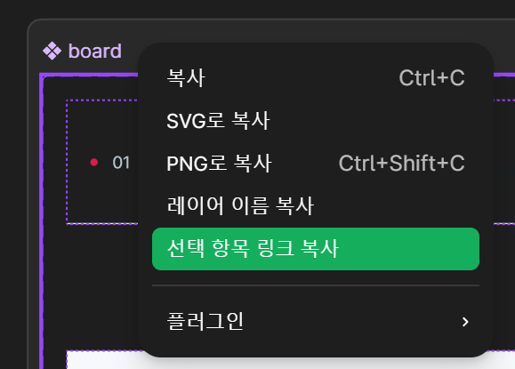

## 목차

## 문제 상황: 디자인 스펙 확인의 반복 노동

프론트엔드 개발자라면 누구나 경험했을 것이다. Figma에서 디자인을 보면서 색상 코드 복사하고, 간격 재고, 폰트 사이즈 확인하고... 이 과정을 컴포넌트마다 반복한다.

```
[기존 워크플로우]
디자이너: Figma에 디자인 완성
    ↓
개발자: Figma 열고 디자인 스펙 확인
    ↓
    - 색상값 복사 (#C3002F)
    - 간격 측정 (padding: 16px)
    - 폰트 확인 (font-size: 14px, weight: 600)
    - border-radius, shadow 등...
    ↓
개발자: 코드 작성
    ↓
디자이너: "이거 간격이 좀 다른데요?"
    ↓
(반복)
```

Claude Code나 Cursor 같은 AI 코딩 도구를 사용해도 결국 디자인 스펙은 개발자가 직접 확인해서 알려줘야 한다. AI가 Figma 파일을 직접 볼 수 없기 때문이다.

**MCP(Model Context Protocol)** 를 사용하면 이 문제를 해결할 수 있다.

## MCP란 무엇인가

MCP(Model Context Protocol)는 Anthropic에서 만든 AI 모델과 외부 도구/서비스를 연결하는 표준 프로토콜이다. Claude가 외부 세계와 소통할 수 있게 해주는 다리 역할을 한다.

```
[MCP 아키텍처]
┌─────────────────────────────────────────────────────┐
│                    Claude Code                       │
├─────────────────────────────────────────────────────┤
│                     MCP Layer                        │
├─────────┬─────────┬─────────┬─────────┬────────────┤
│ Figma   │ GitHub  │ Slack   │ Chrome  │ ...        │
│ MCP     │ MCP     │ MCP     │ DevTools│            │
└─────────┴─────────┴─────────┴─────────┴────────────┘
```

Claude Code에서 MCP를 통해 연결할 수 있는 대표 서비스들:

| MCP 서버            | 기능                              |
| ------------------- | --------------------------------- |
| **Figma**           | 디자인 파일 읽기, 이미지 다운로드 |
| **GitHub**          | PR 생성, 이슈 관리, 코드 리뷰     |
| **Chrome DevTools** | 브라우저 제어, 스크린샷, DOM 분석 |
| **Slack**           | 메시지 전송, 채널 관리            |

이외에도 무궁무진하다.

이 글에서는 **Figma MCP**를 활용해서 디자인 → 코드 변환을 자동화하는 방법을 다룬다.

## Figma MCP 서버 설정하기

### 사전 준비

Figma MCP를 사용하려면 두 가지가 필요하다.

**1. Figma Personal Access Token**
- Figma 설정 → Account → Personal access tokens에서 생성
- 권한은 `File content` 읽기 권한만 있으면 충분

**2. Claude Code**
- Claude Code가 설치되어 있어야 한다
- Max 구독 권장
  - Figma MCP는 토큰을 많이 소모한다

### MCP 서버 설치

[Framelink Figma MCP](https://github.com/GLips/Figma-Context-MCP)를 사용한다. Claude Code에서 MCP 서버를 추가하는 방법은 두 가지다.

**방법 1: CLI로 추가**

```bash
claude mcp add framelink-figma -- npx -y figma-developer-mcp --figma-api-key=YOUR_API_KEY
```

**방법 2: 설정 파일에 직접 추가**

```json
// .claude/settings.local.json
{
  "mcpServers": {
    "Framelink-Figma-MCP": {
      "command": "npx",
      "args": ["-y", "figma-developer-mcp", "--figma-api-key=YOUR_API_KEY"]
    }
  }
}
```

설치 후 `/mcp` 명령어로 서버 연결 상태를 확인할 수 있다.

### Figma MCP가 제공하는 도구

| 도구                    | 설명                          | 용도                           |
| ----------------------- | ----------------------------- | ------------------------------ |
| `get_figma_data`        | Figma 노드의 디자인 정보 조회 | 크기, 색상, 폰트, 간격 등 추출 |
| `download_figma_images` | Figma에서 이미지 다운로드     | 아이콘, 일러스트 등 에셋 추출  |

## 실전: Figma 디자인을 코드로 변환하기

### Step 1: Figma URL 가져오기



위처럼 원하는 노드에서 우클릭으로 컨텍스트 메뉴를 연 다음 '선택 항목 링크 복사' 를 클릭해 노드 URL을 복사한다.


### Step 2: Claude에게 디자인 분석 요청

Claude Code에서 Figma URL을 전달하면 MCP를 통해 디자인 정보를 자동으로 가져온다.

```
이 Figma 디자인을 분석해줘: https://figma.com/design/ABC123/Button?node-id=123-456
```


### Step 3: 컴포넌트 코드 생성

분석이 끝나면 코드 생성을 요청한다.

```
위 디자인을 React + TailwindCSS 컴포넌트로 만들어줘. CVA 패턴 사용해줘.
```

생성 결과 예시:

```typescript
import { cva, type VariantProps } from "class-variance-authority";
import { cn } from "@/lib/utils";

const buttonVariants = cva(
  "inline-flex items-center justify-center rounded-lg font-medium transition-colors",
  {
    variants: {
      variant: {
        primary: "bg-[--primary] text-white hover:bg-[--primary-hover]",
        secondary: "bg-white text-[--primary] border border-[--primary]",
      },
      size: {
        sm: "h-8 px-3 text-sm",
        md: "h-10 px-4 text-base",
        lg: "h-12 px-6 text-lg",
      },
    },
    defaultVariants: {
      variant: "primary",
      size: "md",
    },
  }
);

interface ButtonProps
  extends React.ButtonHTMLAttributes<HTMLButtonElement>,
    VariantProps<typeof buttonVariants> {}

export function Button({ variant, size, className, ...props }: ButtonProps) {
  return (
    <button
      className={cn(buttonVariants({ variant, size }), className)}
      {...props}
    />
  );
}
```

## 워크플로우 자동화: 커스텀 슬래시 커맨드

매번 같은 과정을 반복하는 것은 비효율적이다. Claude Code의 커스텀 슬래시 커맨드를 만들어 전체 워크플로우를 자동화할 수 있다.

### 4단계 워크플로우

```
[자동화된 디자인 → 코드 파이프라인]

Phase 1: 탐색 (Discovery)
    │
    ├── Figma 디자인 분석 (MCP)
    ├── 기존 디자인 시스템 패턴 확인
    └── 사용 가능한 디자인 토큰 조회
    │
    ▼
Phase 2: 계획 (Planning)
    │
    ├── UI 구조 시각화 (ASCII)
    ├── 컴포넌트 분리 계획
    ├── 토큰 매핑 테이블 작성
    └── ⏸️ 사용자 승인 대기
    │
    ▼
Phase 3: 구현 (Implementation)
    │
    ├── 컴포넌트 파일 생성
    ├── 테스트 페이지 생성
    └── index.ts export 업데이트
    │
    ▼
Phase 4: 검증 (Validation)
    │
    ├── Chrome DevTools로 스크린샷 캡처
    ├── Figma 원본과 비교
    └── 반응형 테스트 (Mobile/Tablet/Desktop)
```

### 커스텀 슬래시 커맨드 사용 예시

```bash
/design-system-implement [모노 레포 앱 이름] [Figma URL]
```

이 명령어 하나로 위 4단계가 자동으로 실행된다.

### Phase 2에서 생성되는 계획 예시

```
[UI 미리보기]
┌─────────────────────────────┐
│  [Icon]  Title Text         │
│  Subtitle or description    │
│  ┌─────┐ ┌─────────────┐   │
│  │ CTA │ │ Secondary   │   │
│  └─────┘ └─────────────┘   │
└─────────────────────────────┘

[토큰 매핑]
| Figma 값 | CSS 토큰                     | 용도      |
| -------- | ---------------------------- | --------- |
| #C3002F  | var(--primary)               | 메인 색상 |
| #DB1B4A  | var(--action-primary-filled) | 버튼 배경 |
| 16px     | var(--spacing-4)             | 기본 패딩 |

위 계획대로 구현해도 될까요? (Y/N)
```

**중요**: Plan Mode을 통한 승인 단계가 있어야 AI가 잘못된 해석으로 코드를 생성하는 것을 방지할 수 있다.

### Phase 3: 구현 (Implementation)

승인이 완료되면 실제 컴포넌트 코드를 생성한다.

**컴포넌트 파일 생성**

CVA(Class Variance Authority) 패턴을 사용하여 컴포넌트를 생성한다.

```typescript
// apps/{app-name}/src/shared/ui/{design-system}/{component}.tsx
import { cva, type VariantProps } from "class-variance-authority";
import { cn } from "@/lib/utils";

const componentVariants = cva(
  "base-classes",
  {
    variants: {
      variant: { primary: "...", secondary: "..." },
      size: { sm: "...", md: "...", lg: "..." },
    },
    defaultVariants: { variant: "primary", size: "md" }
  }
);

interface ComponentProps
  extends React.HTMLAttributes<HTMLElement>,
    VariantProps<typeof componentVariants> {}

export function Component({ variant, size, className, ...props }: ComponentProps) {
  return <div className={cn(componentVariants({ variant, size }), className)} {...props} />;
}
```

**테스트 페이지 생성**

현재 내가 작업하는 모노 레포 앱은 스토리북을 도입하기 어려운 상황이라 나름의 대안으로 AI에게 스토리북을 가장한 테스트 페이지를 만들어 달라고 하는 것이다.

만약 스토리북을 도입할 수 있는 환경이라면 스토리북을 사용하는 것이 더 좋다.

```typescript
// apps/{app-name}/app/test/{component-name}/page.tsx
export default function TestPage() {
  return (
    <div className="p-8 space-y-8">
      <h1>Component Name 테스트</h1>
      <section>
        <h2>Variants</h2>
        <div className="flex gap-4">
          <Component variant="primary" />
          <Component variant="secondary" />
        </div>
      </section>
    </div>
  );
}
```

**검증 명령어 실행**

```bash
pnpm -r typecheck
pnpm lint
```

### Phase 4: Chrome DevTools MCP 활용

구현이 완료되면 Chrome DevTools MCP로 결과를 검증한다.

```typescript
// 테스트 페이지로 이동
mcp__chrome-devtools__navigate_page({
  url: "http://localhost:3000/test/button"
})

// 스크린샷 캡처
mcp__chrome-devtools__take_screenshot({ fullPage: true })
```

반응형 테스트 자동화:

```typescript
// Mobile (375px)
mcp__chrome-devtools__resize_page({ width: 375, height: 812 })
mcp__chrome-devtools__take_screenshot({})

// Tablet (768px)
mcp__chrome-devtools__resize_page({ width: 768, height: 1024 })
mcp__chrome-devtools__take_screenshot({})

// Desktop (1280px)
mcp__chrome-devtools__resize_page({ width: 1280, height: 800 })
mcp__chrome-devtools__take_screenshot({})
```

## 실전 팁

### 1. 디자인 토큰 우선 사용

하드코딩된 색상값보다 디자인 토큰을 사용하면 유지보수가 쉬워진다.

```css
/* ❌ 하드코딩 */
background-color: #C3002F;

/* ✅ 토큰 사용 */
background-color: var(--primary);
```

토큰 매핑 시 기존 토큰을 최대한 활용하고, 새 토큰 생성은 최소화한다.

### 2. 합성 컴포넌트 패턴

복잡한 디자인은 단일 컴포넌트로 만들지 않는다.

```
Card 컴포넌트 분리 예시:
├── CardHeader      (제목, 아이콘)
├── CardContent     (본문)
├── CardFooter      (하단 정보)
└── CardActions     (버튼 그룹)
```

각각 독립적으로 만들면 재사용성과 유지보수성이 높아진다.

### 3. 이미지/아이콘 다운로드

Figma에 있는 에셋이 필요하면 `download_figma_images`를 사용한다.

```typescript
mcp__Framelink_Figma_MCP__download_figma_images({
  fileKey: "ABC123",
  nodeIds: ["icon-1", "icon-2"],
  format: "svg",  // svg, png, jpg, pdf
  scale: 2        // @2x 해상도
})
```

## 장점과 한계

### 장점

| 이점                | 설명                               |
| ------------------- | ---------------------------------- |
| **시간 절약**       | 디자인 스펙 확인 시간 크게 감소    |
| **일관성**          | 동일한 디자인은 동일한 코드로 생성 |
| **자동 검증**       | Chrome DevTools로 자동 테스트      |
| **워크플로우 통합** | 커스텀 커맨드로 전체 과정 자동화   |

### 한계

| 한계점             | 대응 방안                                                                             |
| ------------------ | ------------------------------------------------------------------------------------- |
| 복잡한 인터랙션    | 애니메이션, 상태 관리는 수동 구현                                                     |
| 모호한 디자인 해석 | 승인 단계에서 검토 후 진행 필수, 아스키 아트로 미리보기를 그려달라고 하는 이유가 이것 |
| 100% 정확도 아님   | 어느 정도의 미세 조정은 수동으로                                                      |

## 마무리

MCP는 Claude Code의 가능성을 확장하는 핵심 기능이다. Figma MCP를 활용하면 디자인 → 코드 변환 과정에서 반복적인 수작업을 대폭 줄일 수 있다.

핵심은 세 가지다:

1. **Figma MCP**: 디자인 스펙 자동 추출
2. **커스텀 슬래시 커맨드**: 워크플로우 자동화
3. **Chrome DevTools MCP**: 결과 검증 자동화

```
[결과]
기존: 디자인 확인 → 스펙 복사 → 코드 작성 → 검토 → 수정 (반복)
개선: /design-system-implement [url] → 승인 → 완료
```

물론 완벽하지는 않다. 하지만 80%를 자동화하고 20%만 수동으로 다듬는 것만으로도 개발 생산성은 확실히 달라진다.

게다가 우리가 사용하는 것은 무려 CLI 도구. Claude Code를 여러 창에 열어 동시에 Plan Mode를 사용한다면 병렬로 토큰을 태워버릴 수 있다.

## AI Agent에게 전달할 프롬프트

아래 프롬프트를 Claude Code에 복사해서 붙여넣으면, Figma → 코드 변환 워크플로우를 자동화하는 **커스텀 슬래시 커맨드**를 생성한다.

````
Figma MCP를 활용한 디자인 시스템 컴포넌트 구현 커스텀 슬래시 커맨드를 만들어줘.

## 목표
`/figma-to-code [Figma URL]` 명령어로 Figma 디자인을 분석하고 React 컴포넌트를 생성하는 워크플로우를 자동화한다.

## 커맨드 파일 위치
`.claude/commands/figma-to-code.md`

## 워크플로우 (4단계)

### Phase 1: 탐색 (Discovery)
- Figma MCP (`get_figma_data`)로 디자인 정보 추출
- 기존 디자인 시스템 패턴 확인
- 사용 가능한 CSS 토큰(디자인 토큰) 조회

### Phase 2: 계획 (Planning)
- ASCII 아트로 UI 구조 시각화
- 합성 컴포넌트 패턴 사용
- Figma 값 → CSS 토큰 매핑 테이블
- **⏸️ 사용자 승인 대기** (Plan Mode 활용)

### Phase 3: 구현 (Implementation)
- CVA 패턴으로 컴포넌트 파일 생성
- 테스트 페이지 생성
- index.ts export 업데이트
- typecheck, lint 실행

### Phase 4: 검증 (Validation)
- Chrome DevTools MCP로 스크린샷 캡처 (있는 경우)
- 반응형 테스트 (Mobile/Tablet/Desktop)
- Figma 원본과 비교

## 커맨드 요구사항

### Frontmatter
```yaml
---
allowed-tools: [mcp__Framelink_Figma_MCP__get_figma_data, mcp__Framelink_Figma_MCP__download_figma_images, Read, Write, Edit, Glob, Grep, Bash]
argument-hint: <FIGMA_URL> [추가 요청사항]
description: Figma 디자인을 분석하여 React 컴포넌트 생성
---
```

### 제약 조건
- 하드코딩된 색상값 대신 CSS 토큰 사용
- 새 토큰 생성 최소화, 기존 토큰 우선 활용
- Phase 2에서 반드시 사용자 승인 후 구현 진행
- 출력: TypeScript + TailwindCSS + CVA 패턴

### 예외 처리
- 모호한 디자인: 사용자에게 질문
- 이미지/아이콘 필요: `download_figma_images` 사용
- 복합 디자인: 컴포넌트 분리 계획 수립

이제 커맨드 파일을 생성해줘.
````

## 참고 자료

- [Claude Code MCP 공식 문서](https://docs.claude.com/ko/docs/claude-code/mcp)
- [Model Context Protocol 공식 사이트](https://modelcontextprotocol.io/)
- [Framelink Figma MCP GitHub](https://github.com/GLips/Figma-Context-MCP)
