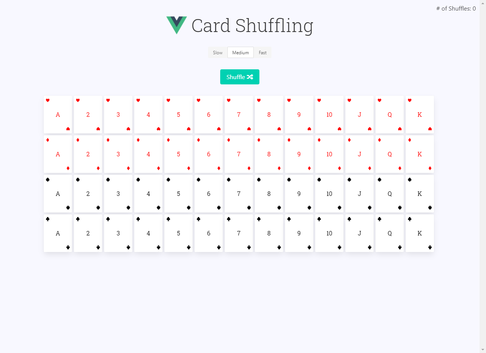

# Fisher Yates Shuffle 이란

`Fisher Yates Shuffle`, 한글로 피셔 예이츠 알고리즘은 배열의 값들을 무작위로 배열할 때 사용되는 무작위 생성 알고리즘의 하나이다.

## 0. pseudo code

_Code wins Arguments_ 라고, pseudo code를 살펴보자.

```
-- To shuffle an array a of n elements (indices 0..n-1):
for i from n−1 downto 1 do
     j ← random integer such that 0 ≤ j ≤ i
     exchange a[j] and a[i]
```

원리는 축약한다면 2가지로 볼 수 있다.

1. 배열의 마지막부터 처음까지 내려온다.(반대도 가능하다)
2. 내려오면서 현재 `index`의 값과, 무작위로 생성된 `index`의 값을 `swap`한다.

그럼 `javascript`로 구현한 코드를 보자.

## 1. javascript로 구현하기

### 1번 케이스

```js
function shuffle(array) {
  var copy = [],
    n = array.length,
    i

  // While there remain elements to shuffle…
  while (n) {
    // Pick a remaining element…
    i = Math.floor(Math.random() * array.length)

    // If not already shuffled, move it to the new array.
    if (i in array) {
      copy.push(array[i])
      delete array[i]
      n--
    }
  }

  return copy
}
```

문제 없이 돌아가긴 하지만, 문제점들이 남아있다.
배열을 새로 만들고, 넣고, 삭제하고...

### 2번 케이스

```js
function shuffle(array) {
  var copy = [],
    n = array.length,
    i

  // While there remain elements to shuffle…
  while (n) {
    // Pick a remaining element…
    i = Math.floor(Math.random() * n--)

    // And move it to the new array.
    copy.push(array.splice(i, 1)[0])
  }

  return copy
}
```

조금 개선되었다.
하지만 배열의 크기만큼 돌면서, `splice` 함수 때문에 매번 배열을 재정렬해주어야 한다.잠재적으로 `O(n^2)`의 시간복잡도가 예상된다. 배열을 새로 만들어야 하는 문제점도 남아있다.

## 3번 케이스

```js
function shuffle(array) {
  var m = array.length,
    t,
    i

  // While there remain elements to shuffle…
  while (m) {
    // Pick a remaining element…
    i = Math.floor(Math.random() * m--)

    // And swap it with the current element.
    t = array[m]
    array[m] = array[i]
    array[i] = t
  }

  return array
}
```

사실 `pseudo code`를 잘 이해한 사람이라면 바로 3번으로 생각했을 거라고 장담한다.
앞서 있었던 새로운 배열 선언 문제와, 배열을 이중으로 도는 문제가 해결되었다.

# 추가

[카드 덱 셔플하기](https://vue-with-games.netlify.app/9.%20%EB%8D%B1%EC%85%94%ED%94%8C/index.html) 프로젝트에서 쓰였으니 확인해봐도 좋다.
[코드는 여기에](https://github.com/CaesiumY/Vue-with-Games/tree/master/9.%20%EB%8D%B1%EC%85%94%ED%94%8C)



## 참고 문서

- https://bost.ocks.org/mike/shuffle/

- https://en.wikipedia.org/wiki/Fisher%E2%80%93Yates_shuffle

- https://medium.com/fullstackio/tutorial-shuffle-a-deck-of-cards-in-vue-js-b65da4c59b1