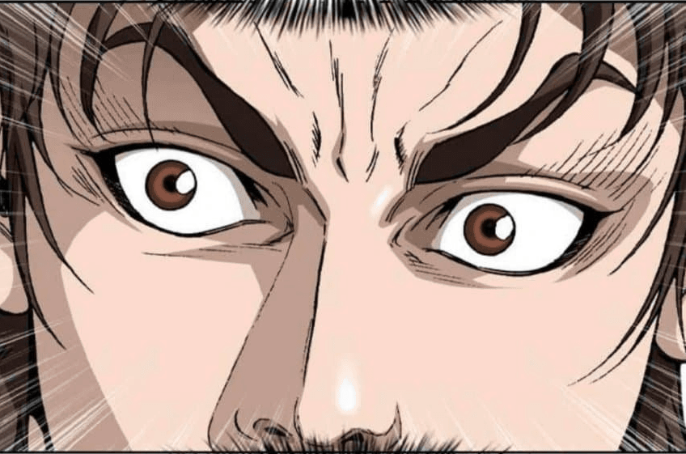

# 💥쇼미더럭키밈

<!--  -->

### [**서비스 바로가기**](https://show-me-the-lucky-meme.vercel.app/)

## 🚩서비스 개발 계기

막 리액트를 다루는 기술 책을 끝냈을 무렵, 무슨 프로젝트를 해볼까 서성거리던 차에 좋은 토이 프로젝트 아이디어를 발견했다.

바로 인터넷 커뮤니티에서 밈이 되어버린 **'말대꾸?!'** 짤이다.
처음 이 짤을 보고 어이 없는 웃음을 지어버렸는데, 다른 이들도 비슷한 경험을 했는지 이후로 여러 합성짤들이 만들어지기 시작했다.

밈짤 생성기... 아이디어는 옛날부터 있었지만 지금이 적기라고 생각해 개발을 시작했다.

<!--  -->

> 오늘도 개발자가 안 된다고 말했다

## 🚧시행착오

이전에 [토계피](https://caesiumy.github.io/review/togyepi-retrospect/) 개발 경험에 비롯된 시행착오이기도 하다.

*'사진 위에 글자를 그리는 거니 당연히 캔버스를 써야겠지?'* 라고 생각해버린 것이다. 아 물론 캔버스를 사용하는 게 나쁘다거나 틀린 것은 아니다. 다만 후술하겠지만 더 효율적인 방법을 구상하게 된다.

그래서 책에서 본 대로의 디렉토리 구조를 세팅한 뒤, 캔버스를 만지기 시작했다.
이전에 해봤으니 이번에도 되겠지라는 어설픈 마음가짐은 금방 무너졌다.

맞닥뜨린 문제는

### 1. 렌더링 문제

캔버스에 글자를 쓰고, 바로바로 업데이트를 통해 보여주려면 드는 **리소스가 상당**했다.

캔버스 위에 이미지를 그리고, 그 위에 글자를 그리는 [이미지 -> 글자] 의 과정을 `input`의 `change` 이벤트 때마다 호출해야 하는데... 말만 들어도 시간이 오래 걸릴 거 같지 않은가?

당장 이미지를 렌더링하는 데에도 시간이 소요될텐데 그걸 글자 하나하나마다 다시 그린다고...??

토계피 때는 이 문제를 피하기 위해 따로 그리기 버튼을 만들었지만, 밈의 특성상 유저가 짤을 얻는 데까지 걸리는 시간과, 미리보기가 중요하기 때문에 그런 **버튼을 통한 그리기는 지양**해야만 했다.

### 2. 글자 깨짐 및 픽셀화

토계피 때도 경험했던 문제 중 하나이다. 캔버스의 크기, 이미지의 크기에 따라 글자가 깔끔하게 그려지지 않고, 마치 작은 글자를 확대한 듯한 느낌을 주게 되는 것이다.

### 3. 저장 속도

위에서 언급했다시피 밈 짤을 만드는 데 중요한 요소 중 하나는 속도이다.
그런데 데이터로 바꾸는 로직을 지나는 시간이 오래 걸렸다. 
해결하려면 [canvas2image](https://github.com/hongru/canvas2image) 같은 라이브러리를 따로 사용해 이미지를 보여주면 되지만, 다시 유저가 이미지를 꾹 눌러 다운로드 해야하는 **번거로움**이 생긴다.

### 4. 반응형 디자인에 애로 사항이

반응형 디자인에 맞추려면 **화면 크기에 따라** 캔버스 크기, 이미지 크기, 글자 크기, 글자 좌표 등을 다시 업데이트 해야한다.
`css`로 캔버스 속성 조절은 안 되니 `js`로 전부 작성해줘야 하는데... 어느 세월에...

창 사이즈 조절 이벤트 리스너 등록부터 해서... 등등

## 🌊갈아엎다

갈아엎는다는 건 누구에게나 쉽지 않은 결정이다. 나도 작성했던 코드들에 대해 미련을 가졌던 시절이 있었다.

하지만 컴퓨터를 고치는 가장 빠른 방법은 재부팅이듯이 코딩 테스트 문제들을 풀면서 갈아엎는 결정을 하는 일이 많아졌고 익숙해졌다.

무엇보다도 그냥 막 갈아엎은 게 아니라, **다른 시도**를 해보기 위해 갈아엎은 것이다. 
> (대책 없이 갈아엎으면 안 돼요!!)

## 🏎따라잡히다

커뮤니티에 이미 만들어진 짤들이 많이 돌아다니길래 검색해보니, 누군가 이미 빠르게 만들어 출시를 했다...
`SSR`을 위해 `Nextjs`를 사용했고, 빠른 디자인을 위해 `UI 라이브러리`를 사용한 것 같았다.

하지만 포기하지 않았다. 내가 더 좋은 기능을 갖출 자신이 있었기 때문이다!

> **프로젝트를 진행할 때 하지 말아야 할 것:** 구글에 내가 진행하는 프로젝트 같은 서비스가 이미 있는지 검색해본다.

## 🧭대책을 찾다

캔버스를 사용하지 않고, 이미지 위에 글을 쓴다는 개념을 다시 생각해보았다. 굳이 어려운 길을 가지 않고, 쉬운 방법이 있다는 것을 깨달았다.

해결 방법은 심플하다. `div`로 프레임을 만들고, `img`를 넣어 배경을 고정한 뒤, `p` 태그로 대사를 넣어주면 된다!

이렇게 쉬운 일을, 과거의 프로젝트 경험 때문에 어렵게 가려고 했던 것이다...

<!--  -->

> 이렇게 그냥 이미지 위에 텍스트 태그를 넣어주면 된다!

이걸 어떻게 저장해야 하는지는 이미 알고 있었다. 크롬 개발자 도구에서 컨트롤 패널`(ctrl + shift + p)`을 열어 `capture`를 검색하면 `node capture`가 가능하다. 

그렇다는 것은 이걸 쉽게 쓸 수 있도록 구현한 라이브러리가 존재할 것이란 추측을 했고, 그 추측은 들어맞았다. [html-to-image](https://github.com/bubkoo/html-to-image)라는 라이브러리의 덕을 봤다.

덕분에 위에서 서술한 문제는 모두 해결되었다.

### 렌더링 문제 & 글자 깨짐

그냥 글자를 화면에 쓰는 것 뿐이다. 렌더링 부담도 전혀 없고, 글자가 깨질 우려도 없다!

### 저장 속도

기존 크롬 개발자 도구의 캡쳐만큼 빠르지는 않지만 충분히 견딜 수 있는 수준이다.

### 반응형 디자인

`img`태그의 크기를 지정해놓는다면, 대사를 보여주는 태그의 위치는 상대적으로 조절해줘야 한다. 이부분은 `%`와 `vw` 단위를 사용해 적절히 해결했다.

### 경쟁 서비스와의 차별점

개발하다보니 신경 쓸 수 밖에 없는 점이 되었다... 그래서 **차별성을 위주로** 개발을 하게 됐다. 그 차별성을 적어보자면

- 좀 더 개선된 반응형 디자인
- 인앱 브라우저에서 사용 가능
- `middle-dot` 추가하기
- `PWA` 패키징
- 커스터마이징 페이지 추가

<!--  -->

> 누끼를 못 따기에 말풍선이 그냥 잘렸다ㅠㅠ

## 🛑그럼에도 겪은 애로사항

사실 기술적으로 문제점을 없었다. 그냥 내 개발에 문제가 있었던 것뿐...

### 1. 타입 맞추기

아무래도 전역 상태 저장소를 쓸만큼 큰 프로젝트가 아니다보니 컴포넌트끼리 `props`로 내려보낼 일이 잦게 되었고... 그만큼 나는 `props`들의 타입을 정해줘야 하고...

### 2. 중복된 컨테이너

약간 아키텍쳐에서 고민을 했다. 2개의 컨테이너 컴포넌트... 그 안에서 **중복되는 메서드를 어떻게 둘 것인가...** 결국 중복되도록 두었다. 각각 페이지의 로직을 존중해서 말이다.

### 3. 디자인은 어려워

반응형 디자인은 그냥 숫자 맞추기일 뿐이지만... 화면 전체의 레이아웃이라든지, 데스크탑과 모바일 크기에서는 어떻게 보여질지에 대한 디자인이 필요했다. `부트스트랩`이나 `ant-design` 같은 라이브러리를 사용하지 않고 `emotion`으로만 했던 터라 `css`를 다루는 데에 다시 한 번 애로사항이 꽃을 피웠다.

그리고 버튼 색과, 나머지 헤더랑 배경색도 고민 좀 했다. 디자인 하는 데 쓴 시간이 아마 제일 많을 것이다...

### 4. 그리운 `SSR`

`Nextjs`의 소중함을 깨닫는 경험도 된 것 같다. 헤더에 넣어야할 태그를 모두 `public/index.html`에 넣어두자니 `SPA`로서 조금 찜찜하다.

> 그래도 잘 돌아가니 만족!

## ☀결과

<!--  -->

> 이런 짤도 만들 수 있게 되었다!

개발은 쉬웠다. 사실 하나의 컴포넌트에 비집고 밀어넣으면 가능할 수도 있는 프로젝트다. 하지만 그런 개발은 *내 안의 개발 영혼이 용서하지 않는다.* 뭔가... 뭔가 최적화 되고 가독성 좋은 깔끔하고 정돈된 코드를 짜야해...!! 라는 마음이 프로젝트를 이끈 것이 아닌가 하는 생각도 든다.

잘 작동한다는 점이 맘에 들지만, 아직도 맘에 걸리는 건 **디자인과 테스팅**이다. 

이런 경우엔 테스팅을 어떻게 해야하지...?? 대사를 쓰고 저장 버튼을 누르면 잘 캡쳐되었는지 테스트로 확인할 방법이 있기는 한 걸까? 결국 내가 결과 이미지 파일을 봐야하는 거잖아? 라는 생각이 아직도 머리를 스치곤 한다.

아 배포에는 처음으로 `vercel`을 써보았는데, 이거 진짜 물건이다... 앞으로 이 서비스만 사용할 듯하다. 브랜치별로 배포도 해주고 커밋에 맞춰 자동배포까지... 

`github page`는 이제 사요나라 아디오스야!

> 이것저것 기능 추가하다보니 홍보를 게을리해서 안 유명한 건 비밀
> 
> 벌써 밈의 수명이 끝나가는 것도 비밀ㅠ
