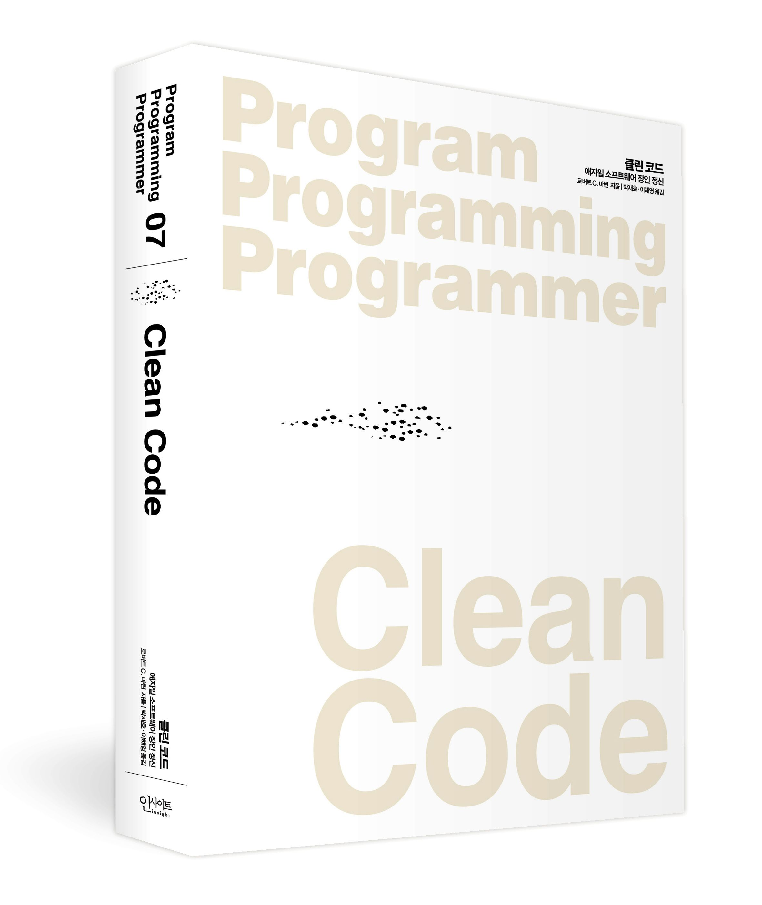
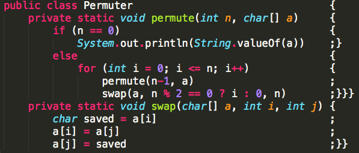

<!--  -->

# 1. 클린 코드란

`클린 코드 (Clean Code)` 란 무엇일까? 영어 해석 그대로 **깔끔한 코드**, **깨끗한 코드** 라는 뜻이다. 그럼 깔끔한 코드란 무엇일까? 이 질문에 자신만의 답이 나오지 않는다면 이 책을 꼭 읽어봐야 한다. 자신만의 답이 나오더라도 읽어봐야 한다.

분명 자신이 쓴 코드인데 며칠이 지나면 알아보지 못해서 이 파일 저 파일 옮겨다니며 고생했던 경험이라면 개발자인 이상 모두가 가진 경험일 것이다.

또한 함수의 로직을 짜며 옆에 주석으로 주절주절 설명을 써놓은 경험도 있을 것이다.

한참을 거슬러 올라가 코딩 뉴비 시절일 때는 변수와 함수의 식별자명을 `a`, `b`, `aa` 이런 식으로 지을 때도 있을 것이다. ~~아직도 이러면 안 된다!!~~

> **클린 코드는 이러한 경험을 줄여줌으로써 더 좋은 가독성과 빠른 이해를 돕는다.**

# 2. 클린 코드를 읽게 된 계기

<!--  -->

작년 20년도에 진행했던 `네이버 개발자 공채 오픈 클래스` 에서 이런 질문이 올라왔었다.

> 개발자로서 꼭 읽어야 하는 책이 있다면?

기억나는 답변이 2개인데 그 중 하나는

- 학부 시절에 배운 전공 서적을 다시 읽어보세요.

나머지 하나는

- **클린 코드**를 꼭 읽어보세요.

평소에도 깨끗한 코드, 깔끔한 아키텍처에 관심이 많았던 나는 그날 곧바로 클린 코드를 주문했다.

~~전공 서적은 이미 후배들 다 줘버렸다...~~

> 자바 개발자가 아니라 저자가 경고한대로 챕터2가 너무 어렵긴 했다... 다른 언어 개발자라면(나처럼) 2장은 빠르게 훑어도 될 거 같다.

# 3. 🧹깨끗한 코드

<!--  -->

사실 많은 사람들이 클린 코드를 정리해두었고, 공교롭게도 나는 중복을 싫어하는 개발자라 그들과 같은 설명이나 해석을 하고 싶은 맘이 없다.

하지만 아직 **클린 코드**를 읽어보지 않은 사람들에게는 이 책의 핵심 내용을 간단히 소개해드리는 게 좋을 것 같다.

## 3-1. 의미 있는 이름

변수명, 함수명, 클래스명 등 모든 이름은 **의도를 명확히 밝혀야** 한다.

```javascript
// 나쁜 예
let d; // 경과 시간 (일)
let list = [];

// 좋은 예
let elapsedTimeInDays;
let gameBoard = [];
```

## 3-2. 함수

함수는 **작아야 하고**, **한 가지 일만** 해야 한다.

```javascript
// 나쁜 예 - 너무 많은 일을 한다
function processUserData(user) {
  // 데이터 검증
  if (!user.email) throw new Error('Email required');
  
  // 데이터 변환
  user.email = user.email.toLowerCase();
  
  // 데이터베이스 저장
  database.save(user);
  
  // 이메일 발송
  emailService.sendWelcome(user.email);
}

// 좋은 예 - 하나의 책임만 진다
function validateUser(user) {
  if (!user.email) throw new Error('Email required');
}

function normalizeUser(user) {
  return {
    ...user,
    email: user.email.toLowerCase()
  };
}

function saveUser(user) {
  return database.save(user);
}
```

## 3-3. 주석

좋은 코드는 **자기 자신을 설명**한다. 주석은 최대한 피하되, 필요하다면 **왜**에 대해 설명해야 한다.

```javascript
// 나쁜 예
// i를 1씩 증가시킨다
i++;

// 좋은 예
// 사용자는 하루에 최대 5번까지만 로그인 시도할 수 있다
const MAX_LOGIN_ATTEMPTS = 5;
```

## 3-4. 형식 맞추기

코드의 형식은 **의사소통의 수단**이다. 일관성 있는 형식을 유지해야 한다.

- 적절한 들여쓰기
- 의미 있는 빈 줄
- 관련 코드의 근접 배치

## 3-5. 오류 처리

오류 처리는 **프로그램 논리와 분리**되어야 한다.

```javascript
// 나쁜 예
function getUser(id) {
  try {
    const user = database.findById(id);
    if (user) {
      return {
        success: true,
        data: user
      };
    } else {
      return {
        success: false,
        error: 'User not found'
      };
    }
  } catch (e) {
    return {
      success: false,
      error: e.message
    };
  }
}

// 좋은 예
function getUser(id) {
  const user = database.findById(id);
  if (!user) {
    throw new UserNotFoundError(`User with id ${id} not found`);
  }
  return user;
}
```

# 4. 인상 깊었던 부분들

## 4-1. 보이스카우트 규칙

> "캠프장은 처음 왔을 때보다 더 깨끗하게 해놓고 떠나라"

코드도 마찬가지다. 코드를 수정할 때마다 조금씩 더 개선해서 체크인하면, 시간이 지날수록 코드는 점점 나아진다.

## 4-2. 깨진 창문 이론

나쁜 코드를 발견했을 때 "나중에 고치지"라고 생각하면 절대 고치지 않는다. 발견 즉시 고치거나, 최소한 TODO 주석이라도 남겨두자.

## 4-3. 프로그래머의 책임

```
"나쁜 코드의 위험을 이해하지 못하는 관리자 말을 그대로 따르는 행동은 전문가답지 못하다."
```

일정이 촉박하다는 이유로 나쁜 코드를 작성하는 것은 전문가의 자세가 아니다. 오히려 나쁜 코드 때문에 나중에 더 많은 시간이 소요된다.

<!--  -->

# 5. 실제 적용해본 경험

## 5-1. 함수 분리

책을 읽고 나서 가장 먼저 적용한 것은 **함수 분리**였다.

기존에는 하나의 함수에서 여러 일을 처리했는데, 이를 작은 함수들로 나누니까 테스트하기도 쉬워졌고 재사용성도 높아졌다.

## 5-2. 의미 있는 변수명

```javascript
// 변경 전
const data = fetchUserData();
const result = processData(data);

// 변경 후
const userData = fetchUserData();
const processedUserProfile = processUserData(userData);
```

변수명을 구체적으로 바꾸니까 코드를 이해하는 시간이 확실히 단축되었다.

## 5-3. 주석 정리

불필요한 주석들을 대거 정리했다. 대신 코드 자체가 무엇을 하는지 명확히 드러내도록 변수명과 함수명을 개선했다.

# 6. 아쉬웠던 점

## 6-1. 자바 중심의 예제

책의 예제들이 대부분 자바로 되어 있어서, 자바스크립트 개발자인 나로서는 이해하기 어려운 부분들이 있었다.

특히 2장의 객체 지향 관련 내용은 자바의 특성을 많이 반영하고 있어서 다른 언어로 개발하는 사람들에게는 적용하기 어려울 수 있다.

## 6-2. 현실적인 제약 조건

책에서 제시하는 이상적인 코드와 현실 사이에는 간극이 있다. 레거시 코드, 타이트한 일정, 팀의 합의 등 현실적인 제약 조건들을 고려하면 모든 것을 완벽하게 적용하기는 어렵다.

# 7. 마무리

클린 코드는 **개발자라면 반드시 읽어야 할 필독서**라고 생각한다.

비록 모든 내용을 완벽하게 적용하기는 어렵지만, 적어도 **좋은 코드란 무엇인가**에 대한 기준을 세우는 데는 큰 도움이 된다.

특히 팀으로 개발할 때 코드 리뷰나 컨벤션을 정할 때 이 책의 내용을 기준으로 삼으면 좋을 것 같다.

> "읽기 좋은 코드가 좋은 코드다"

이 한 문장이 이 책의 핵심이라고 생각한다. 나 혼자 이해할 수 있는 코드가 아니라, **다른 사람도 쉽게 이해할 수 있는 코드**를 작성하는 것이 진정한 전문가의 자세가 아닐까?

앞으로도 코드를 작성할 때마다 "이 코드가 클린한가?"를 자문해보며 더 나은 개발자가 되도록 노력해야겠다.