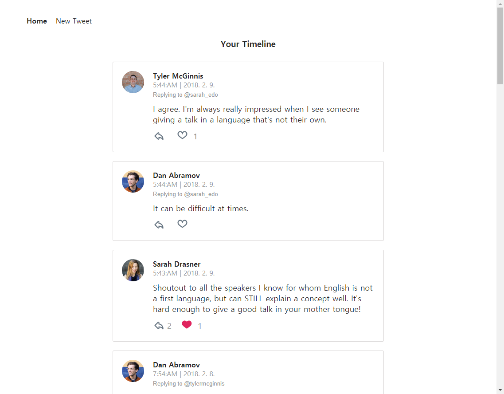
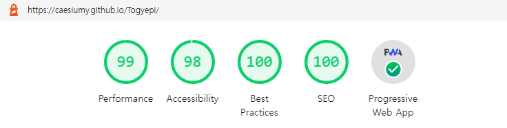

# 결과부터 보여주기

결과 사진이랑 다 깃허브에 올려두었습니다.

[버전2 깃허브 링크](https://github.com/CaesiumY/Togyepi)

[버전2 배포 링크](https://caesiumy.github.io/Togyepi/)

# 토계피가 뭔가요?

학부생 시절 4학년 2학기때(2018년) 했던 프로젝트이자, **처음**으로 자바스크립트를 쓴 프로젝트였고, **첫** 프론트엔드 프로젝트였고, **첫** 협업이었고, **첫** 외주작품으로 했던 프로젝트입니다.

당시 생명과학과 사람과 만나 요구사항에 대해서 얘기도 해보고, 중간 점검도 해보았던 프로젝트라 기억에 크게 남습니다.

기능은 **토질 수치를 계산**해주는 보통 계산기입니다. 거기에 이제 특이한 추가 요구사항을 곁들인...!

그 당시 요구 사항이

1. 논문과 책을 드릴테니 여기 나와있는 필요한 공식들을 간단히 계산할 수 있는 계산기를 만들어주세요.
2. 현장에 나가서 찍은 사진마다 위치와 제목 등을 사진 위에 메모 하고 싶습니다.
   1. 위치는 위도와 경도로 해주셨으면 합니다.
3. 달력을 기반으로 해서 해야할 일을 작성할 수 있도록 하고 싶습니다.
4. 컴퓨터와 휴대폰 전부에서 사용할 수 있으면 좋겠어요.

대강 이랬던 걸로 기억합니다.

> 달력은 없어도 되지 않나요? 를 항상 여쭤봤던 거 같다... '기본 달력이 더 좋아요...' 하면서

## 당시 버전 1 보러가기

[버전1 깃허브 브랜치](https://github.com/CaesiumY/Togyepi/tree/v1)

[버전1 배포 링크](https://togyepi-csy9617.firebaseapp.com/#/)

# 리뉴얼은 왜 하시죠?

아무래도 처음으로 했던 프론트엔드다보니 내부 코드가 (나쁜쪽으로) 기가 막힙니다.
그래서인지 항상 마음 속으로 불편했는데... 어차피 `리액트`를 주로 사용하니 이참에 토계피를 리뉴얼하고 `Vue`는 작별 인사를 하기 위해 리뉴얼을 진행했습니다.

# 뭘 바꿨을까

## 기존 Vue에서 React으로

**Vue**가 아닌 **React**를 사용했습니다.

제 경우에는, Vue쪽보다 React를 더 많이 사용해서, 생산성 측면에서도 React가 편했습니다!

언제 쓸지 모르겠지만... `Angular`도 언젠가 써보겠습니다.

## TypeScript 사용

Js에서 **TypeScript**를 사용했습니다.

사실 타입 지정이 정말 귀찮은게 맞는데, 한편으로는 개발을 하다 보면 매번 디버깅 콘솔을 찍는 일이 생각보다 많았습니다.

특히 API 통신을 하다 보면 '이 객체가 어떤 property를 갖고 있었지..?' 때문에 귀찮은 일이 많았는데, **TypeScript**로 interface나 type들을 미리 정의하니까 이런 일이 줄어들었습니다.

## 서버를 쓰자

토계피 버전 1에서는 달력 일정이나 사진을 추가하면 브라우저 로컬스토리지에 저장을 했습니다.

하지만 이렇게 되면 모바일에서 저장한 일정을 컴퓨터에서 볼 수 없어서, 결국 별도 서버가 필요했습니다.

하지만 서버를 따로 운영하기에는 비용이 부담되서, 결국 `Firebase`를 써보기로 했습니다.

처음으로 써보는 거라 신선하더라고요.

특히 **Firebase Firestore**에서 Real-time 업데이트를 지원해주는게 너무 재밌었습니다.

## UI 개편

화면 구성을 완전히 새롭게 했습니다.

기존에는 메뉴를 사이드 바 형식으로 표시했었는데, 이번엔 모바일 웹에서 많이 봤던 **하단 탭** 형식으로 바꿨습니다.

그리고 기존에는 세세한 요소들까지 다 프리미티브하게 만들었는데, 이번엔 [Ant Design](https://ant.design/)을 써서 생산성을 높였습니다.

UI 디자인이라는게... 잘 하려면 정말 어려운데, 그런 부분들을 잘 만들어진 걸로 대체하니까 확실히 편했습니다.

# 구현 후기

## 개발 스택

- **Frontend**: React + TypeScript + Ant Design
- **Backend**: Firebase (Firestore + Authentication)
- **Deployment**: GitHub Pages
- **Build**: Create React App

## 좋았던 점

1. **타입스크립트의 편의성**

   기존 코드에서 객체 구조를 찾기 위해 `console.log`를 매번 찍던 번거로움이 줄었습니다.

2. **Firebase의 실시간 동기화**

   Firestore의 실시간 업데이트 덕분에 여러 기기에서 데이터가 자동으로 동기화되는 경험이 새로웠습니다.

3. **Ant Design으로 인한 생산성 향상**

   UI 컴포넌트를 직접 구현하지 않고도 일관성 있는 디자인을 만들 수 있었습니다.

## 아쉬웠던 점

1. **Firebase 학습 곡선**

   처음 사용해보는 서비스라 Authentication과 Firestore 규칙 설정에 시간이 많이 걸렸습니다.

2. **모바일 최적화 부족**

   반응형 디자인은 적용했지만, 실제 모바일에서의 사용성 테스트가 부족했습니다.

3. **성능 최적화 미흡**

   이미지 최적화나 lazy loading 등의 성능 개선 사항들을 놓쳤습니다.

# 배운 점

## 1. 첫 프로젝트의 소중함

3년 전의 코드를 다시 보니 정말 많이 성장했다는 걸 느꼈습니다. 첫 프로젝트라서 코드 품질이 떨어지는 건 당연했지만, 그때의 열정과 도전정신은 지금도 소중합니다.

## 2. 기술 선택의 중요성

Vue에서 React로 넘어가면서 개발 생산성이 크게 달라졌습니다. 자신이 더 익숙한 기술을 선택하는 것도 중요한 결정이라는 걸 깨달았습니다.

## 3. 외부 서비스 활용

Firebase를 통해 서버리스 아키텍처의 장점을 체험할 수 있었습니다. 작은 프로젝트에서는 직접 서버를 구축하는 것보다 관리형 서비스를 활용하는 게 효율적이라는 점을 배웠습니다.

## 4. 사용자 중심 사고

실제 사용자(생명과학과 학생)의 요구사항을 듣고 구현하면서, 개발자 중심이 아닌 사용자 중심으로 생각하는 습관을 기를 수 있었습니다.

# 성능 측정

리뉴얼 후 Lighthouse로 성능을 측정해보았습니다.

# 마무리

토계피 리뉴얼 프로젝트를 통해 기술적 성장뿐만 아니라 프로젝트 관리, 사용자 경험 설계 등 다양한 측면에서 배울 수 있었습니다.

특히 3년 전의 첫 프로젝트를 현재의 기술로 다시 구현해보면서, 그동안의 성장을 직접 체감할 수 있어서 의미가 컸습니다.

앞으로도 이런 식으로 과거의 프로젝트들을 현재의 기술로 재구현해보는 것도 좋은 학습 방법이 될 것 같습니다.

> 하지만 달력 기능은 여전히... 기본 달력 앱이 더 좋은 것 같아요. 😅