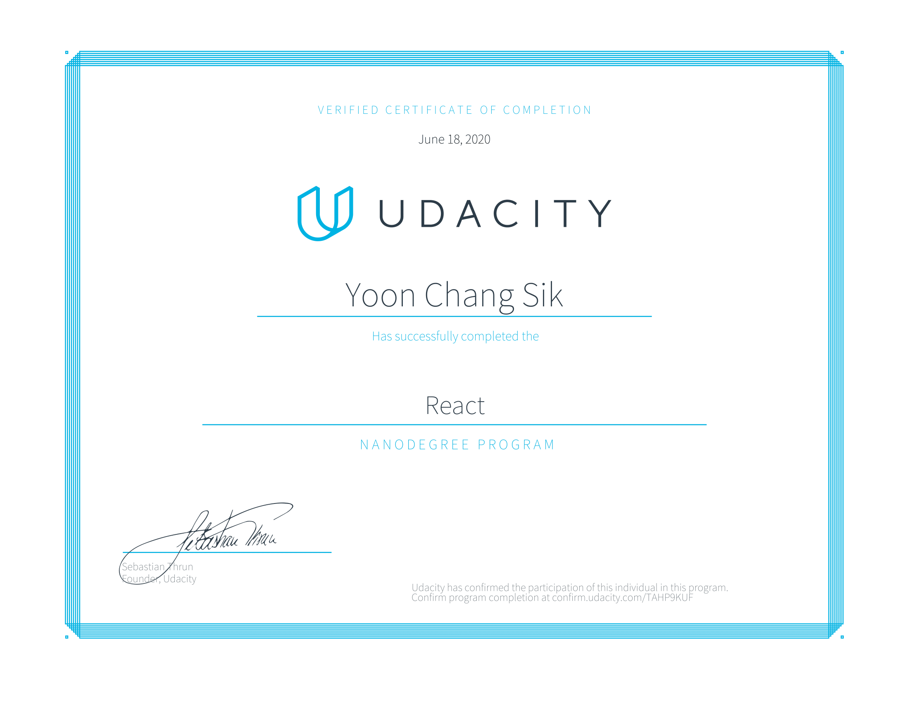
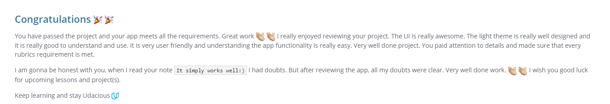
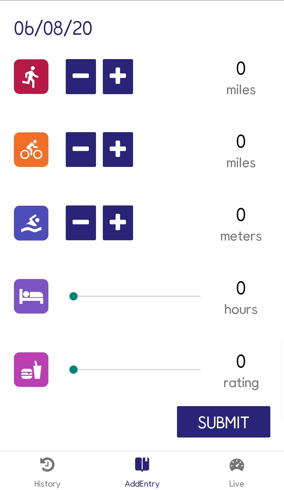

# 유다시티 ⚛리액트 나노디그리란?

일명 `Udacity React Nanodegree.` 뒤의 `React Nanodegree`는 줄여서 `reactnd`라고들 합니다.
[Udacity](https://www.udacity.com/)는 유명한 온라인 강좌 사이트로, `나노디그리` 라는 프로그램을 앞세워 홍보하고 있습니다. 실리콘밸리 등의 여러 해외 기업에서는 대학교 학위 대신에 나노디그리 또한 인정해준다고 하더군요. ~~개인적으로 공인력이 있는지는 잘 모르겠습니다~~

그 중에서도 **유다시티 리액트 나노디그리**는 나노디그리 수료 과정 중 `react.js`를 집중적으로 공략하는 코스입니다.

# 💎강의료는 얼마죠?

사실 밖으로 말을 꺼내지 않을 뿐이지 이런 온라인 강의는 가격이 중요하죠. 바로 말씀드리자면, **주 10시간 기준 4개월 분량의 코스에 매달 399달러** 입니다.

하지만 사실상의 399달러는 정가입니다. 평소에 **할인을 많이 하니** 그 시기를 노리시는 것을 추천드립니다. 저또한 할인을 듬뿍 받아서 강의를 들었구요.

> 이제 이 부분을 유념해두고, 앞으로 제 글을 읽으며 강의를 들을 가치가 있는지 잘 판단하시기를 바랍니다.

# 📜프로그램 구성

`react`를 처음 접하는 사람들을 위해 비기너 클래스부터 시작합니다. 리액트에 대해 전혀 모르는 사람도 쉽게 접근할 수가 있습니다.

게다가 `javascript`, `git` 등의 강의도 패키지로 같이 딸려옵니다. 이런 추가 구성 강의는 진도율에 영향을 미치지 않으니 원할 때 들어도 무방합니다.

조금 의아했던 건 `react native` 코스 또한 강의에 포함되어있었다는 것입니다. 하나에만 집중해도 되었을 것 같은데 굳이 네이티브 코스까지 포함했어야 했나...?? 라는 생각이 들었습니다.

`github`와 `linkedIn` 프로필을 꾸미는 과정도 포함되어있습니다. 역시 취업에 신경을 쓴 티가 납니다. 저는 이미 꾸며놓은 사람이라 **pass** 신청을 따로 했습니다. 이 과정을 **pass** 한 경우엔 취업에 불이익이 될 수 있다는 일종의 각서(?) 에 동의해야 했습니다.

## 🎨프로젝트

진행되었던 프로젝트들에 대해 살펴보겠습니다.

### 1. [my-reads](https://github.com/CaesiumY/reactnd-myreads)

프로젝트의 요구사항대로 **스스로** 웹 앱을 만드는 과정입니다. 기본적인 스타일은 제공되니, `react` 에만 집중할 수 있습니다. `외부 api`를 가져와서 개발해 `비동기 프로그래밍` 공부에도 도움이 됩니다. 다만 그 요구사항이 꽤 까다로워서 2번 정도 통과가 반려되었습니다... 하하하... 디테일이 필요한 프로젝트입니다.

### 2. [chirper](https://github.com/CaesiumY/reactnd-chirper)

`redux`에 대해 배우며 강의자와 같이 만들어나가는 프로젝트입니다. **트위터**를 클론하듯이 만들게 되고, `JSON`과 `DB` 공부에 도움이 됩니다.

### 3. [would-you-rather?](https://github.com/CaesiumY/reactnd-would-you-rather)

`reactnd`의 최종 보스라고 표현해도 무방합니다. 그동안 공부해온 리액트 지식을 십분 발휘하여, 스스로 맨바닥부터 하나하나 쌓아올려야 합니다. 스타일 가이드도 없고, 제공되는 템플릿이나 보일러 플레이트 또한 없습니다. 오직 요구사항 뿐입니다.

이번엔 한 번에 통과함과 동시에, 멘토로부터 칭찬도 크게 들었습니다😎!

### 4. [udacifitness](https://github.com/CaesiumY/reactnd-UdaciFitness)

`react native`를 처음 접하며 강의자와 같이 만들어가는 프로젝트입니다. 어려운 점은 없습니다. `android` 와 `ios` 간의 `UI`, `UX` 차이점을 배울 수 있습니다.

### 5. [flash cards](https://github.com/CaesiumY/reactnd-mobile-flashcards)

이번에는 마지막 프로젝트이자 스스로 만드는 프로젝트입니다. `would-you-rather` 프로젝트처럼 처음부터 만들어야 하지만, 이러이러하게 만들면 좋다하고 샘플 사진을 보여줍니다. ~~물론 샘플은 칙칙합니다...~~ 여기까지 수업을 착실히 들었다면 어려운 점은 스타일링 뿐일 겁니다.

# 🔎개인적인 감상과 후기

일단 저는 기존에 `SPA` 프레임워크들(`vue`, `react`)을 다룬 경험이 있기에 수월하게 강의를 수료했습니다. 주 10시간씩하면 4개월이 걸린다고 하는 강의를 **한 달만에** 슥삭했습니다...
덕분에 6월 한 달을 불태웠습니다.

> 다음 달이 되면 돈을 또 내야 하니 빨리 수료했습니다...!!

`would-you-rather` 프로젝트 완성하는 데에 꽤나 날을 소모한 것 같네요.

## 👍장점

- 리액트 입문자들에게 좋다.

- 리액트 외의 다른 강의들이 제공된다. (`git`, `github` 등)
- 리액트 네이티브 경험해보기에 좋다.
- 포트폴리오 만들기에도 좋다.
- 강의의 밀당이 아주 좋다. 매번 10분이 조금 안 되는 실습 영상과, 긴 텍스트로 구성되어 있는데 이게 집중하기에 참 좋게 완급조절이 기가 막힌다.
- 필수 라이브러리들을 자신의 손으로 직접 구현해본다. `redux`, `redux-thunk` 등 리액트 개발에 있어서 필수적인 라이브러리들을 자신의 손으로 직접 구현해보는 시간이 정말 유익하다. 사실상 `reactnd`가 아니라 `reduxnd` 라고 불러도 좋을 정도.
- 다른 수강생들과의 커뮤니티를 제공해준다.

## 👎단점

- 입문자들에게**만** 좋다. 어느 정도 배운 개발자면 비추.

- `클래스 기반 컴포넌트`만을 다룬다. 요즘 `react hook`이 이슈가 되는만큼 `함수 기반 컴포넌트`에 대해 다뤄도 좋았을텐데 이 부분은 아쉽다.
- 강의의 코드들이 전부 레거시다. 덕분에 매번 강의 코드가 적힌 깃허브로 들어가서 다른 수강생들의 조언을 참고하여 버그들을 고쳐나가야 한다... 좋게 보자면 트러블슈팅에 도움이 된다. 하하핳
- 리액트 네이티브는 땜빵용이라는 느낌을 지울 수가 없다. 레거시 코드들인 건 물론이고, 깊이 들어가지도 않는다. 실무에서 사용하지 않는 방법으로 개발을 가르친다.
- **전부 영어다.** 저는 영문과 출신이라 상관 없지만... 강의가 전부 영어라는 건 중대사항입니다.

## 😺결론

어느 정도 프론트엔드 개발을 경험한 제 기준으로는 **비추천** 입니다.

허나 스스로 만드는 포트폴리오가 필요하다면 **조금은 추천** 입니다. 물론 한 달 안에 할인 받아서 공부하고, 저처럼 수료증을 좋아하는 사람이라면요.

사실 이 돈이면, 다른 온라인 강의에서 얻는 것이 더 많을 수도 있습니다. [Udemy](https://www.udemy.com/)나, [inflearn](https://www.inflearn.com/), [nomadcoders](https://nomadcoders.co/) 등에서도 프론트엔드 강의는 넘쳐나죠.

하지만 `reactnd` 만의 강점은 **스스로 만드는 포트폴리오, 수료증, 자기주도형 학습 습관 등** 일방적으로 강의를 듣기만 해서 얻어지는 것이 아닌 스스로의 노력에 의해 얻어지는 것들을 습득할 수 있다는 것에 있습니다.

## 기타

제가 들었던 `reactnd`는 20년도 6월자 강의로, 이후에 강의 업데이트를 통해 달라질 수도 있습니다.