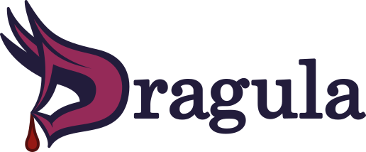

<!--  -->

# dragula란?

[dragula](https://github.com/bevacqua/dragula)는 말 그대로 어느 한 요소를 draggable하게 바꾸어주는 라이브러리이다.

체험을 위한 데모 페이지는 [여기로!](https://bevacqua.github.io/dragula/)

아마 추측컨데 **drag**와 **드라큘라**를 합쳐 만든 이름인 거 같다.

[공식 문서](https://github.com/bevacqua/dragula)에 따르면 `Angular` 와 `React`를 지원하지만, `vanilla js`를 통해 `Vue` 위에서 사용해보았다.

# 🔰사용법

[공식 문서](https://github.com/bevacqua/dragula)를 봐도 충분할 테지만, 영문과라도 한국어를 좋아한다. 한국어로 풀어보자.

## 🔨설치

> npm을 사용할 시

```
npm install dragula --save
```

> cdn을 사용할 시

```html
<script src="https://cdnjs.cloudflare.com/ajax/libs/dragula/$VERSION/dragula.min.js"></script>
```

### 스타일도 가져와야 한다.

> js 에서 사용한다면

```js
import 'dragula/dist/dragula.min.css'
```

> 만약 css에서 사용한다면

```css
@import 'node_modules/dragula/dragula';
```

## 🧵선언하기

```js
var drake = dragula(containers, options)
```

이렇게 변수에 `dragula`를 담아주면 된다.

### **끝이다!!** ~~아니다😅~~

### container

`container` 에는 드래그를 원하는 요소들이 담긴 리스트를 넣어주면 된다.

> 예시)

```js
dragula([document.querySelector('#left'), document.querySelector('#right')])
```

또는 동적으로 넣어줄 수도 있다.

```js
var drake = dragula(options)
drake.containers.push(container)
```

### options

`options`는 `object`의 형태로 전달해주어야 한다. 다시 말해 `{}` 이렇게 넣으면 된다.

옵션은 다양하다.

- 특정한 상황에서 드래그를 막는 `invalid` 함수
- 드래그시 복제가 되는 `copy`
- 드래그 도중 놓쳤을 시 제자리로 돌아가는 `revertOnSpill`
- 드래그 도중 놓쳤을 시 삭제되는 돌아가는 `removeOnSpill`

등등...

#### ❗`invalid` 가 자주 쓰여요.

자주 쓰일 것만 같은 `invalid` 옵션의 예제를 들고 왔다.

```js
invalid: function (el, handle) {
  return el.tagName === 'A';
}
```

`true`가 반환되면 드래그를 할 수 없게 하는 함수이다.

해당 예시의 뜻은 **anchor태그의 드래그를 막아라**

`el` 은 클릭한 요소이고, `handle`은 드래그될 아이템이라고 한다.
~~사실 차이는 별로 없는 것 같다~~

<br/>

### 🚋모든 길은 [공식 문서](https://github.com/bevacqua/dragula#dragulacontainers-options)로 통한다

이외에는 [공식문서의 Usage](https://github.com/bevacqua/dragula#usage)에서 참고하는 방법도 있고,

[공식 Demo 페이지](https://bevacqua.github.io/dragula/)에서 여러 옵션들을 경험해보고 맘에 드는 걸로 고르면 된다.

아니면 이번 프로젝트에 쓰인 [예시1](https://github.com/CaesiumY/vue-with-kanban-board/blob/4e130c067f8e2a3d0a99ae4f8fbbe6472559c08c/src/utils/dragger.js#L5)과 [예시2](https://github.com/CaesiumY/vue-with-kanban-board/blob/4e130c067f8e2a3d0a99ae4f8fbbe6472559c08c/src/components/Board.vue#L124)를 보셔도!

## 📡이벤트 리스너를 등록해보자!

그저 드래그만 하면 얼마나 편하고 좋을까... 허나 대부분의 서비스들은 **드래그한 뒤의 상태를 저장**해야 할 필요가 있다.😂

그래서 많이 쓰일 이벤트 리스너를 하나 소개하고자 한다.
~~이거만 알면 나머지도 다 알게 된다~~

### 드래그하고 자리에 놓았을 때 호출되는 리스너

```js
// 변수명이 drake일 때
drake.on('drop', (el, target, source, sibling) => {
  // el: 드래그하고 있는 요소
  // target: el이 드래그 후 놓아진 리스트 요소
  // sibling: 자리에 놓았을 때, 바로 그 다음 요소
  // source: 원래 el이 있던 리스트 요소
})
```

사실 영어만 할 줄 알아도 매개변수들이 무엇을 하는 지는 대강 추측이 가능할 것이다.

해당 매개변수들을 잘 조합~~?~~해 원하는 방식대로 저장하면 된다.

### 예시가 빠지면 섭해요.

이번 프로젝트에서는 [이렇게](https://github.com/CaesiumY/vue-with-kanban-board/blob/4e130c067f8e2a3d0a99ae4f8fbbe6472559c08c/src/components/Board.vue#L129) 쓰였다.

> 드래그 앤 드랍시, 앞과 뒤 카드의 포지션 값을 계산하여 그 둘을 나눈 값을 드랍된 카드에 새로 할당해주었다. <br />
> {앞 포지션: 10} - {현 포지션: 15} - {뒤 포지션: 20} 요렇게

다만 자리를 저장하는데 중요한 `sibling`의 기능이 영 탐탁치 않았기에 `setSibling` 함수로 앞과 뒤 요소를 모두 가져오도록 등록해주었다. [링크](https://github.com/CaesiumY/vue-with-kanban-board/blob/4e130c067f8e2a3d0a99ae4f8fbbe6472559c08c/src/utils/dragger.js#L13)

이외의 이벤트 리스너를 보고 싶다면 [여기로!](https://github.com/bevacqua/dragula#api)

## 🎨드래그를 꾸며보자!

드래그 도중 생기는 그림자나, 마우스 커서에 딸려오는 요소나, 드랍될 요소 자리의 스타일을 지정해줄 수 도 있다.

[제공해주는 css 파일](https://github.com/bevacqua/dragula/blob/master/dist/dragula.css)을 살펴보는 것도 추천.

- `gu-mirror`는 드래그 도중 마우스 커서에 붙어다니는 요소의 스타일

- `gu-transit`은 드랍될 요소에 생기는 그림자의 스타일

- `gu-unselectable`은 드래그시, 커서가 갈 수 있는 한계(기본 값은 `body`)에 붙는 스타일

- `gu-hide`은 그냥 요소를 숨길 때 쓰는 헬퍼

# 😎쓰인 프로젝트

[✔Vue로 만드는 칸반 보드📍](https://github.com/CaesiumY/vue-with-kanban-board) 프로젝트에서 트렐로 클론을 하며 카드와 리스트를 드래그 가능하게 만드는 데 유용하게 사용했다.

<details>
  <summary>📷Gif로 프로젝트 보기</summary>
  
</details>

# 🌄마무리

이것만 알아도 크게 문제될 것은 없어보인다.

왜냐하면 이 글을 읽는 모두들이 **게으른 천재**들이기에 하나를 알려줘도 열을 알 것이라고 기대하기 때문이다.😝