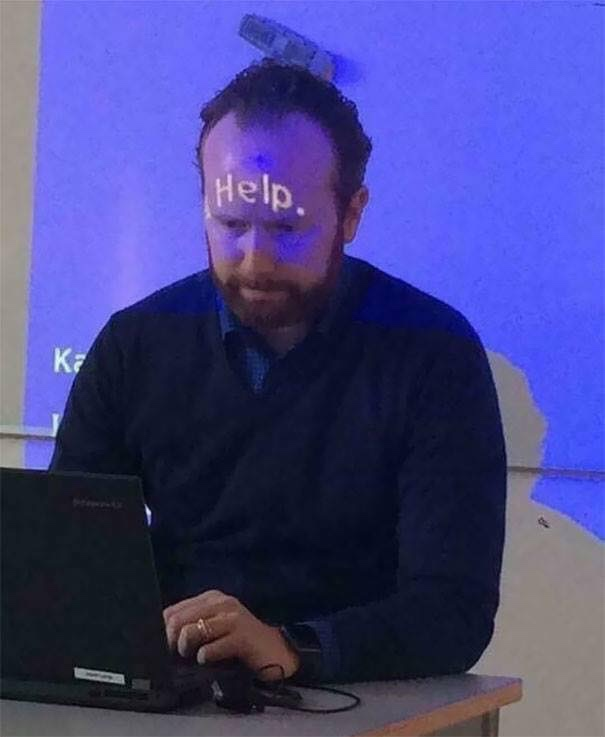

> 해당 글은 혼잣말 말투로 작성되어 말이 짧습니다:)

## 목차

## 면접을 보게 된 계기

5월 초, 스파르타 코딩에서의 내일배움캠프 튜터로서의 생활이 **끝**이 났다. 짤처럼 잘린 건 아니고(;;) 프론트엔드 트랙의 KDT 기간이 종료되면서  공중 분해된 것. 다행히도 그 뒤로 아는 분들께서 외주 계약으로서의 공동 작업을 제안해주셔서 그 뒤로 지금까지 몇 달간 AI와 함께 개발을 진행했다. 그 과정에서 어쩌다 면접을 보게 되었는데, 그 중 토스 면접을 보게 된 계기에 대해 정리해보려고 한다.

진행하던 외주 프로젝트는 갈 길이 멀어 어떻게든 연장에 연장을 계속해서 어쩌면 올해 내내 할 수도 있을 양이었다. 하지만 개발자로서 외주에서 경험할 수 있는 양이나 질에는 한계가 있다. 그래서 솔루션 기업의 정규직을 바라보게 되었다.

링크드인에서 자주 토스의 채용 글을 보고는 하는데, 그 중 토스 페이의 프라이빗 채용 세션이 진행된다는 글을 접하게 되었다. 물 흐르듯이 신청을 했고 초대까지 받게 되었다. 프라이빗이라길래 적은 수로 예상했는데 생각보다는 많았던 것 같다. 100명 정도?
해당 프라이빗 세션에서 나는 활발한 리액션을 했다. 튜터로서 리액션 없이 혼자 카메라 앞에서 말하는 게 얼마나 고독한 일인지 이해하고 있기에 적극적인 참여 모습을 보였다. 그리고 그 결과... 랄까?

> 창식 님은 꼭 지원해주세요~

라는 샤라웃...을 받게 되었고, 나도 지원을 약속 드린다고 하고 세션이 끝나게 되었다. 그리고 이번 세션 참가자들을 위해 패스트 트랙 지원 링크 또한 제공해주었다.

그러나 나는 바로 지원서를 넣지 않았다. 토스의 뛰어난 개발 문화는 선망의 대상이었지만, 한편으로는 치열한 기업 문화가 부담을 넘어 **무섭게** 느껴졌기 때문이다. 그래서 고민을 거듭하다가, 늦게 나마 지원서를 넣게 되었다. 계기는 두 가지로 압축해볼 수 있을 것 같은데, 첫째는 약속 드린다는 말을 한 것, 둘째는 채용 세션 때 원하는 인재상이 인상 깊어서였다. 

> 용기 있는 사람을 원합니다.

용기 있는 사람은 토스라는 회사에 겁먹지 않는다는 것과 자신의 잘못이나 실수를 빠르게 인정하는 것을 포함한다는 설명도 해주셨다.

그렇게 패스트 트랙 지원 마감 하루 전에 지원서를 넣게 되었다...

## 토스 면접 과정
인사 담당자께 연락이 왔는데, 내가 뒤에서 2번째 지원자라고 하신다. 허허허 늦게 지원했더니 이렇게 되었다. 그래서 과정이 좀 늦어질 수 있다는 점을 알려주시고, 채용 진행 방식을 제안해주셨다.

1. 캐주얼 챗 이후에 면접 여부 조율
2. 바로 면접 진행

물론 커피챗을 좋아하는 나이기에 캐주얼 챗을 진행한 다음 면접 여부를 말씀드리겠다고 알려드렸다.

그렇게 약 30분의 짧은 캐주얼 챗이 지나가고~ 면접을 결정하게 되었다.

### 과제 제출

면접을 진행하기 전에 과제 테스트를 보게 되었다.

널리 알려져(?) 있다시피 토스에서 사용하고 있을 법한 하나의 프로젝트를 만들어보는 과제 테스트였다.
역시나 **시간은 압도적인 10시간** 가량... 다시 말해 10시간은 꼼짝 없이 코딩을 해야 한다는 것이었다. 아마 이 부분이 진입 장벽이지 않을까~ 라는 생각이 있었지만, 오히려 며칠 내내 하는 것보다는 하루만에 끝내는 게 낫다.

10시간이라는 긴 마감 시간에도 불구하고 약 5시간 만에 거의 모든 기능을 완성해냈다. 물론 구현만을 위주로 진행했기에 리팩터링이 남아있었고 리팩터링도 약 3시간 정도 진행해 8시간만에 제출 준비가 끝났다.

그렇게 회고 글 마냥 README 문서와 PR 내용을 느긋~ 하게 작성하고 9시가 넘었을 즈음 PR을 올렸다.
어허... 자동으로 설정된 코파일럿이 내 PR을 코드 리뷰하기 시작했다. 이래도 되나? 싶었는데 자동으로 들어간 거라 막을 수가 없었다.

그리고 **매번 헛방을 치던 코파일럿의 코드 리뷰는 하필 그날따라 정확하게 내 약점들을 짚어주었다...!!** 리뷰를 확인한 나는 황급히 수정을 시작했고 마감 시간 1분 전에 아슬아슬하게 제출에 성공했다.

### 1차 면접
> 과제 테스트의 의도가 뭘까? 무엇을 기준으로 판단할까? 
> 나는 추가 기능 구현은 없다시피 하고 제공해준 요구사항만 정직하게 완성했는데 부족하지는 않을까?

라는 생각을 하면서 탈락에 떨고 있을 무렵, 무려 **과제 테스트 합격과 1차 면접 일정**이 나왔다!!

면접은 기본적으로 1시간 동안 진행되었고, 굉장히 **시간에 엄격한** 모습을 보이셨다.
프로젝트에 대한 소개도 중간에 끊겼다...ㅎ 사실 이건 뭐라고 할 수 없는 게 제한 시간을 정해주셨고 나는 말이 많은 사람이라 어쩔 수 없었다고 생각한다.

면접 내용은 대부분 **과제에 대한 분석**이었다. 내가 놓쳤던 개선 가능한 부분들을 하나하나 짚어주시면서 이 부분에 대해서 어떤 문제가 보이는지, 그렇다면 어떻게 개선할 수 있는지를 여쭤보셨다.

다행히도 챕터 리드 분이 짚어 주신 부분은 잘 답변하고 라이브 코딩(AI 자동 완성을 꺼달라고 해서 살짝 당황했다. 처음 꺼보는 거라 메뉴를 못 찾아서 헤매기도)으로 개선까지 성공했다.

그러나 이전에 캐주얼 챗에서 함께 얘기를 나눴던 실무자 분의 질문에 대해서는 완성된 대답을 해내지 못했다. 질문에 대한 의도를 파악하지 못해 이해한 내용이 맞는지 확인하기 위해 역질문도 드리고, 라이브 코딩 또한 의사 코드를 일부분 작성하고 나머지는 구두로 설명을 진행했다.

상당히 빠르게 진행되었음에도 불구하고 벌써 시간이 1시간하고도 수 분이 지났기에 급하게 종료되었다. 역시 토스는 시간이 엄격하구나 알 수 있는 순간이기도 했다.

다만 마지막에 끝내기 전에 이런 저런 얘기를 주고 받았는데 이에 대한 답변을 생각하고 말할 시간이 부족해서 아쉬운 점이 마음에 남았다. 이런 거는 또 못 참는 사람이라 나름대로의 회고 글을 노션에 작성해 챕터 리드 분께 이메일로 나의 의견을 적어서 보냈다.

### 2차 면접
국내 최고의 프론트엔드 개발자를 모셔가는 기업인만큼 1차 면접을 완벽하게 해냈다고 보기에는 무리가 있었기에 탈락의 가능성을 크게 점치고 있던 도중...

[토스도 사람 사는 곳](https://youtu.be/FJ4o6dMKeSY?si=vqnlIzcxc6vl42tT)이라고 했던가 1차 면접을 통과해버렸다...

2차 면접의 내용은 경력 인터뷰였다. 지금까지의 경력과 토스에서 마주하고 있는 실무에 대해 어떠한 대응을 할 것인지에 대한 질문을 위주로 진행되었다. 다시 말해 경험을 통해 축적해온 노하우를 특정 시나리오에서 어떻게 발휘할 것인가로 요약할 수 있겠다.

> 이메일 잘 받아보았습니다.
> 경력 인터뷰 시작하기 전에 이전 인터뷰에서 못 다한 이야기를 해볼까요?

경력이면 경험이니 문제 없겠다! 싶어서 긴장을 내려놓으려던 찰나에 말씀이 들려왔다. ~~느슨해진 면접자에게 긴장을 심어주는~~
이메일은 잘 받아보았으나 아무래도 채용 과정에 있기 때문에 다른 영향이 갈 수 있어서 답장은 안 해주셨다고 하셨다. 그리고 이어지는 추가 질문에서 나의 의견을 피력했는데 면접관 분들의 반응이 뭔가 이상하다는 점을 눈치챘다.

> 그게 정말 확실한 거죠? 그렇게 하신다는 거죠?

특정 시나리오에 대한 질문에 대해 나의 예상되는 대응을 답변해드렸더니 이와 같은 답변이 돌아왔다. 그러나 나는 굴하지 않고 그렇다고 답변했다. 나는 **'안 됩니다'** 라는 말을 하지 않으려고 노력하는 개발자였고, 이와 관련되어 재차 질문을 한 맥락이었다.

그리고 그 뒤에 이어져 오는 질문은 내가 준비한 질문과는 그 패러다임이 달랐다. 경력 면접이라고 해서 이력서에 적힌 내용을 물어볼 줄 알았는데... **이력서 내용은 거의 보지 않았다!**

대신에 **실무에서 있을 법한 현실 세계의 문제들과 운영 관리에 대한 시나리오와 이에 따른 나의 대응을 주로 물어보셨다.** 오히려 이력서에 적힌 내용은 3차 면접인 컬쳐 핏에서 물어보신다고 하셨다.

이력서를 안 본 것이 아니었다. 이건 분명 이력서를 꼼꼼히 읽어보고 나의 경력에서 빈 부분을 찾아내어 시나리오와 관련된 경험을 한 적이 있는지 확인하는 과정이었다. 계속되는 질문에 어지러워질 정도였다.

그리고 이번에는 전과 다르게 면접이 시간보다 조금 일찍 끝나게 되었다. 약 5분쯤?

### 결과

결과는 예상하다시피... **탈락!!**

면접 과정에서 실수도 많이 했지만, 경력 면접 때 나왔던 시나리오들이 더욱 기억에 남았다.
아마 토스에서는 이러한 시나리오를 잘 헤쳐나간 경험이 있는 지원자를 원했을 것이고, 그게 내가 아니었을 뿐... 이라고 스스로 위로를 해본다.

## 앞으로의 커리어 방향

**탈락 경험을 하기 전과 후로 회사를 보는 기준과 나의 커리어 방향성이 바뀌었다.**

기존에는 내가 만들고 싶은 걸 만드는 회사 또는 나의 브랜드 가치를 알릴 수 있는 회사를 가길 원했었다. 예를 들면 토스처럼 이름난 회사거나 AI 관련 서비스를 제공하는 회사들 말이다.

하지만 경력 면접 때 나왔던 시나리오를 곱씹어보니, 

> 과연 내가 이러한 시나리오를 겪지 않았으면서도 경력 있는 개발자라고 할 수 있을까? 

라는 생각이 들었다. 달리는 차의 바퀴를 갈아끼우거나, 운영에 지장이 갈 수 있는 큰 실수를 마주해본 적도 없으면서 프로젝트를 진행해봤다고 할 수 있을까? 라는 생각이 머리를 지배했다.

### 커피챗

그래서 이런 저런 회사들에 커피챗을 신청하고, 또 진행해보기도 했다. 과연 요즘 실무자들이 생각하는 경력직 개발자로서 기대하는 인재상이란 무엇인가에 대해 이야기를 들어보고 싶었다.

그리고 역시나 커피챗을 진행한 **대부분의 회사들도 토스에서 물어봤던 시나리오를 잘 해결할 수 있는 개발자를 원하고 있는 것을 확인하게 되었다.** 특히나 이런 시나리오는 AI가 해결할 수 없는 영역이기도 하기도 하고.

## 결론
나는 지원서를 난사하는 스타일이 아니기에 경력직으로서 회사에 지원한 횟수는 확실히 적다. 약 3번 정도로 다음과 같다. 1. 첫 회사 다닐 때 지원(최종 탈락) 2. 스파르타 튜터(합격) 3. 토스(2차 탈락)
이제 와서 생각해보면 1번 회사 면접 때도 토스 경력 면접 때 면접관 분들이 걱정했던 내용을 물어봤던 것 같다...(과제는 합격했는데 그 이후 실무진 면접 탈락) 

그래서 앞으로는 스탠스를 바꾸어, 신입의 마음가짐으로 돌아가 **필살기를 갈고 닦을 수 있는 경험**을 쌓으려고 한다.

지금까지는 그저 대시보드나 토이 프로젝트, 외주 프로젝트만을 진행하는, 다시 말해 AI를 활용하면 금방 요구사항을 달성할 수 있는 프로젝트만을 진행해왔다.

나의 당장의 커리어 방향이 앞으로의 미래에 큰 영향을 끼칠 것이라고 생각한다. 다음 회사에서 담당하는 업무가 필살기가 될 가능성이 매우 크다고 생각하기 때문이다.

그렇다면 나의 다음 '필살기'는 어떤 모습이 되어야 할까? 지난 면접에서 깨달았듯, 이제는 **단순히 무언가를 *만드는* 것을 넘어선 경험**이 필요하다. 그건 예측 불가능한 대규모 트래픽을 안정적으로 막아내는 경험일 수도 있고, 복잡하게 얽힌 레거시 서비스의 기술 부채를 하나씩 풀어내는 끈기일 수도 있다. 물론 내가 계속 파고들던 AI 테크닉을 실제 프로덕트에 성공적으로 녹여내는 경험 또한 멋진 필살기가 될 수 있을지도? 

---

#### Coming Soon

- `Next.js`가 아니라 `Astro` 블로그?!
- 블로그 초안을 생성하는 AI CLI 툴 만들기
- 리액트 컴포넌트 환경을 위한 네이버 지도 라이브러리 만들기
- 나의 AI Agents 탐구 일기