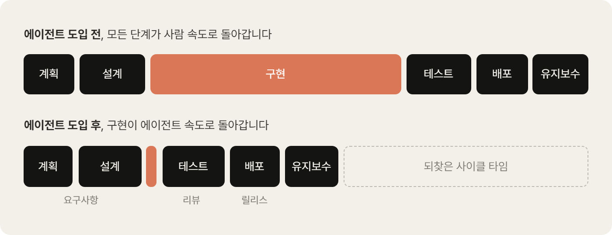
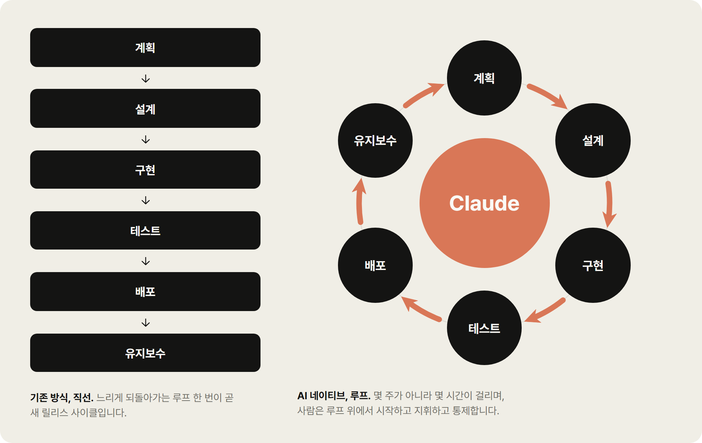
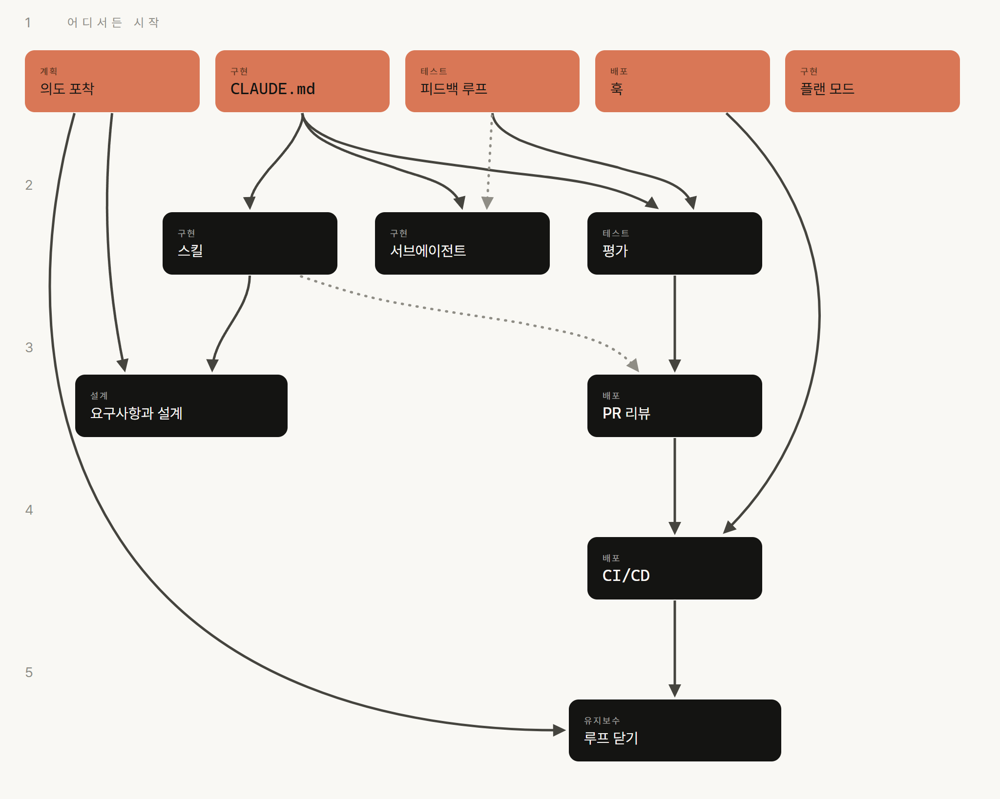
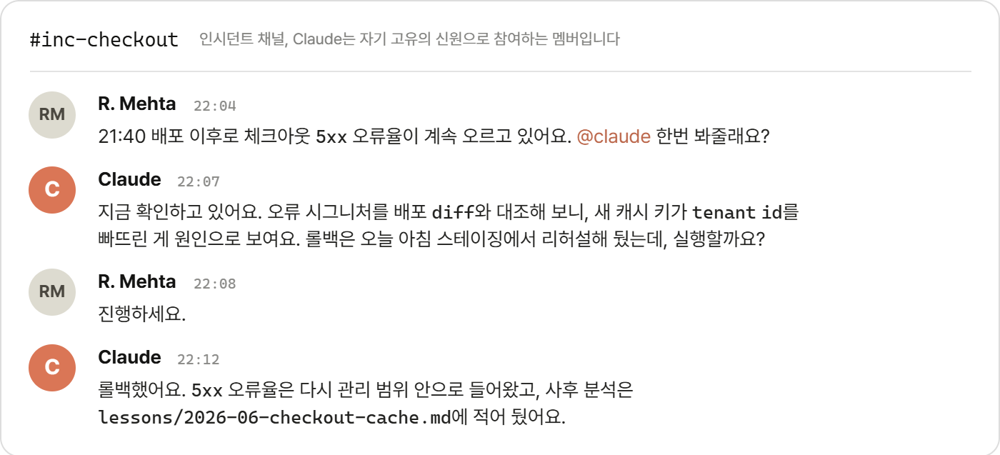

> 이 문서는 [The AI-Native SDLC playbook](https://claude.com/blog/the-ai-native-sdlc-playbook)의 한글 번역입니다. 본문의 다이어그램과 화면 목업은 원문의 그림을 한국어로 다시 그린 것이라 Anthropic이 발행한 원본 이미지와는 다릅니다.

## 목차

## 핵심 요약

<details>
<summary><strong>📌 TL;DR (클릭하여 펼치기)</strong></summary>

### 주요 내용
- **병목은 코드 작성에서 그 앞뒤 단계로 옮겨갔습니다.** 구현은 몇 시간으로 줄었지만 계획, 리뷰와 테스트, 배포는 여전히 사람 속도로 돌아가고, 한 줄씩 손으로 하는 리뷰는 에이전트의 산출 속도를 따라가지 못하고, 회의와 위원회를 거치는 예외 처리는 거버넌스 비용을 키웁니다.
- **AI 네이티브 SDLC는 산출물을 커밋하며 이어지는 루프입니다.** 각 단계는 `intent.md`, `spec.md`, `plan.md`, diff와 리뷰 결과 같은 산출물을 버전 관리에 커밋하며 끝나고 다음 단계는 그 산출물을 읽으며 시작하므로, 커밋의 사슬이 그대로 감사 추적이 됩니다.
- **계획과 설계는 사람과 에이전트가 함께 읽는 파일에서 출발합니다.** 제안자가 Claude와 브레인스토밍해 `intent.md`를 커밋하면, 조직의 스킬이 제약하는 범위 안에서 Claude가 `spec.md`를 만들고 우려되는 영역을 표시합니다.
- **구현과 테스트에서는 승인된 계획, 지식 파일, 자체 검증이 기반이 됩니다.** 플랜 모드로 `plan.md`를 승인받은 뒤 구현하고, `CLAUDE.md`와 스킬에 조직의 지식을 담으며, 피드백 루프로 사람이 보기 전에 스스로 작업을 확인하고, CI의 지속적 평가로 에이전트 설정 변경을 회귀 테스트합니다.
- **배포에서는 훅과 관리형 설정이 권한을 통제합니다.** 훅이 사람의 승인 게이트가 되고, 관리형 설정은 엔지니어가 끄거나 덮어쓸 수 없는 규칙을 강제하며, 에이전트는 프로덕션 게이트 직전까지만 동작합니다.
- **유지보수에서 루프가 닫힙니다.** 관리 범위(control band) 이탈, 티켓, 채널 메시지 같은 트리거가 사람 없이 Claude를 호출하고, Claude가 진단한 내용은 다시 `intent.md`가 되어 파이프라인으로 돌아옵니다.

### 본문에서 짚고 갈 점
- 사람의 판단은 사라지지 않고 게이트에 집중됩니다. 각 단계를 처음부터 다시 시작하기보다 에이전트가 표시해둔 내용을 리뷰하는 데 주의를 쓰며, 이 방식은 판단이 필요한 모든 결정에 사람이 책임을 진다는 전제 위에 있습니다.
- 스킬은 권고에 그치는 통제 장치이고, 반드시 지켜져야 하는 정책은 훅 같은 결정론적 장치가 뒷받침해야 합니다. 스킬은 위반을 드물게 만들고 훅은 위반을 거의 불가능하게 만듭니다.
- 통제에는 트레이드오프가 있습니다. 관리형 설정에서 deny를 하나 추가할 때마다 그만큼 기능을 내주게 되므로, 예시 설정은 그대로 복사할 것이 아니라 저장소의 데이터 분류 등급에 맞춰 조정할 출발점으로 봐야 합니다.

</details>

---

**원문 작성일**: 2026년 8월 21일 (금)

**작성자**: Louis Claxton

## 코드는 더 이상 병목이 아닙니다

조직들은 1년 전만 해도 상상하기 어려웠던 속도로 AI를 이용해 코드를 작성하기 시작했지만 코드를 둘러싼 프로세스는 그 속도를 따라가지 못했습니다.

많은 엔지니어링 팀은 여전히 예전과 같은 승인 게이트, 리뷰, 인계, 정책을 그대로 유지하고 있어 [Claude Code](https://claude.com/product/claude-code) 같은 에이전틱 코딩 솔루션을 도입해서 얻은 생산성 향상을 가로막고 있습니다.

소프트웨어 개발 생명주기(SDLC, Software Development Lifecycle)는 아이디어를 프로덕션까지 끌고 가는 과정입니다. 대다수 조직은 계획(Plan), 설계(Design), 구현(Build), 테스트(Test), 배포(Deploy), 유지보수(Maintain)라는 동일한 여섯 단계를 각기 다른 형태로 거칩니다. 전통적으로 각 단계는 서로 다른 역할이 맡는 독립된 국면이었습니다. 제품 관리자가 요구사항을 작성하면 기술 아키텍트가 이를 설계로 옮기고 엔지니어가 그 설계를 구현합니다. 규제 산업 기업의 QA 팀이 이를 검증하고 릴리스 팀이 배포하며 운영 팀이 실행 중인 시스템을 모니터링합니다. 작업은 문서, 티켓, 승인을 거쳐 단계와 단계 사이를 이동합니다.

전통적인 SDLC는 각 단계에서 책임 소재와 통제를 보장하기 위해 프로세스를 두껍게 쌓아 올린 구조입니다. 하지만 전통적인 SDLC는 코드를 작성하고 구현하는 단계가 가장 많은 시간과 비용을 잡아먹던 시대에 효율을 극대화하도록 설계되었습니다. 지금은 더 이상 그 시대가 아닙니다. PRD 작성, 추정 의식, 제품 보안 리뷰는 모두 몇 주, 몇 달, 길게는 몇 분기씩 이어지던 개발 작업 동안 팀 간 정렬을 억지로라도 맞추기 위해 존재했습니다.

전통적인 SDLC에는 모든 단계를 사람이 수행한다고 가정하는 통제 장치도 포함되어 있습니다. 가장 큰 가치를 만들어내는 조직들은 사람을 루프 안에 유지하면서도 지금 에이전틱 AI가 할 수 있는 일을 중심으로 프로세스를 다시 짰습니다. 이 가이드에서는 고객들과 함께 작업하며 얻은 통찰을 바탕으로 저희 Applied AI 팀이 사용하는 실전 노하우 몇 가지를 살펴봅니다. SDLC의 각 단계에 Claude를 내부적으로 도입해 개발을 가속하고 프로세스를 더 빠르게 돌리기 위한 노하우입니다.

코드가 더 이상 병목이 아니게 되고 구현 단계가 전통적인 SDLC가 감당할 수 있는 속도보다 빨라지면 다음 세 가지가 현실이 됩니다.

- 병목이 구현 단계 앞뒤 단계로 옮겨갑니다. 주로 계획, 리뷰/테스트, 배포 단계인데 이들은 여전히 사람 속도로 돌아갑니다.
- 통제 장치가 현실과 어긋나며 감당할 수 없어집니다. 한 줄씩 손으로 리뷰하는 방식은 사람이 코드를 작성할 때는 합리적이었지만 에이전트가 diff 대부분을 작성하기 시작하면 따라잡을 수 없습니다.
- 예외 처리가 여전히 매주나 매달 열리는 회의와 위원회를 거치기 때문에 거버넌스 비용이 늘어납니다.



구현은 더 이상 제약이 아닙니다. 제약은 그 앞뒤에 있는 사람 속도 단계입니다. 사람 속도 단계는 길이를 그대로 유지하는 반면 구현 단계는 몇 시간으로 줄어듭니다.

보안 병목을 예로 들어보겠습니다. 보안 팀은 사람이 만들어내는 산출량에 맞춰 규모가 짜여 있으므로 에이전트가 코드 산출량을 몇 배로 늘리면 리뷰 대기열이 쌓이거나 코드가 충분히 검토되지 않은 채 배포됩니다. 규제 산업 조직은 둘 중 어느 결과도 받아들일 수 없으므로 보안과 정책 검사가 에이전트의 속도를 따라잡아야 합니다.

에이전틱 AI의 생산성 향상을 온전히 실현하고 안전하게 쓰려면 전통적인 SDLC도 구현 단계가 이미 겪은 것과 같은 수준의 전환을 거쳐야 합니다.

## AI 네이티브 SDLC란 무엇인가요?

AI 네이티브 SDLC는 기존의 통제 목표에 새로운 강제 수단을 결합해 다시 설계한 프로세스입니다. 프로세스는 일직선 흐름 대신 루프가 되고 그 각 지점에 AI가 내장됩니다. AI 네이티브 SDLC는 다음 플레이(play)로의 인계와 실행을 자동화해, 전통적인 SDLC에서 단계 사이 인계를 수작업으로 번거롭게 처리하던 문제를 줄이도록 돕습니다.

이런 변화는 에이전틱 SDLC, AI SDLC, 또는 그냥 에이전틱 소프트웨어 개발이라고도 부릅니다. 이름은 다르지만 가리키는 대상은 같습니다.



### AI 네이티브 SDLC의 여섯 단계에서 일어나는 변화

아래 표는 전통적인 SDLC와 Claude가 뒷받침하는 AI 네이티브 SDLC, 이 스펙트럼의 양 끝을 보여줍니다. 대다수 조직은 두 열 사이 어딘가에 위치합니다.

| 단계 | 전통적인 SDLC | AI 네이티브 SDLC |
| --- | --- | --- |
| 계획 | 위원회가 요구사항을 수집해 워크숍과 승인을 거쳐 추려내고, 사람이 직접 문서로 작성 | Claude가 소스에서 곧바로 페인 포인트를 종합해 사람도 읽고 기계도 실행할 수 있는 `intent.md`에 담음 |
| 설계 | 분석가가 스펙을 작성하고 디자이너가 이를 해석 | 요구사항과 설계를 에이전트와의 작업 세션 하나로 압축하고, 스킬로 인코딩된 표준을 따르며, git으로 버전 관리 |
| 구현 | 테스트와 코드를 직접 손으로 작성하고, 문서는 주요 개발이 끝난 뒤 작성 | 테스트와 코드를 AI가 생성하고, 조직의 지식은 버전 관리되는 기계가 읽을 수 있는 `CLAUDE.md` 파일과 스킬로 유지 |
| 테스트 | 단계 경계마다 QA 게이트 | 구현 과정 전반에 촘촘히 엮인 지속적인 평가 |
| 배포 | 사람이 코드를 한 줄씩 모두 리뷰하고, 거버넌스는 리뷰 주기마다 이뤄지지만 일관성이 떨어지는 경우가 많음 | 여러 겹의 에이전틱 리뷰를 거치고, 사람의 리뷰는 규제 대상이거나 중요한 코드에만 집중. 거버넌스는 AI가 동작하는 순간 훅을 승인 게이트로 삼아 강제됨 |
| 유지보수 | 사람이 프로덕션을 지켜보며 버그를 확인 | 에이전트가 운영 중인 배포를 모니터링. 관리 범위(control band)를 벗어나면 원인을 진단해 새로운 `intent.md`로 루프에 다시 기록 |

오른쪽 열을 관통하는 공통 요소는 커밋된 산출물(artifact)입니다. 각 단계는 산출물 하나를 버전 관리 시스템에 기록하며 끝나고(`intent.md`, `spec.md`, `plan.md`, diff와 그 테스트, 리뷰 결과가 담긴 PR, 인시던트 기록 등) 다음 단계는 그 산출물을 읽으며 시작합니다. 초기 단계에서는 제품 책임자와 에이전트가 같은 파일을 함께 읽고 실행에 옮길 수 있기 때문에 `.md` 파일이 주된 산출물입니다. 구현 단계부터는 산출물이 코드와 그 기록으로 바뀝니다. 커밋의 사슬은 감사 추적(audit trail)이기도 합니다. 누가 무엇을 요청했는지, 에이전트가 무엇을 만들어냈는지, 누가 승인했는지를 그대로 담고 있습니다.

판단이 필요한 모든 결정에는 여전히 사람이 책임을 집니다. 에이전틱 SDLC 세계에서는 리뷰해야 할 산출물이 바뀌는 만큼 사람의 주의도 함께 옮겨갑니다.

모든 단계는 다음 단계가 읽을 수 있는 산출물을 커밋합니다. intent, spec, plan, diff, 리뷰 결과를 모두 합치면 감사 추적이 됩니다.

## 플레이

플레이는 이 플레이북의 핵심이며 여섯 개의 비선형 단계(계획, 설계, 구현, 테스트, 배포, 유지보수)로 묶여 전체 생명주기를 함께 아우릅니다.

각 플레이는 다음 내용을 다룹니다.

- 무엇이 달라지는지
- 시작하기
- 구체적인 실행 단계
- 거버넌스 고려사항
- 효과를 측정하는 방법

각 단계는 모듈식으로 구성되어 있어 조직은 저마다의 필요에 맞춰 서로 다른 단계의 전환을 서로 다른 시점에 우선순위로 둘 수 있습니다. 각 플레이는 "전제 조건(Prerequisites)" 항목에 의존 관계를 명시하며 의존성 그래프가 이를 더 자세히 보여줍니다.

한 단계는 산출물을 커밋하며 끝나고 그 커밋이 다음 단계를 시작시킵니다. 수용된 `intent.md`는 요구사항과 설계 패스를 촉발하고 승인된 `spec.md`는 플랜 모드(Plan mode)를, 머지된 PR은 파이프라인을 촉발하며 프로덕션에서 관리 범위를 벗어난 상황은 다음 `intent.md`를 작성해 루프를 계속 이어갑니다.

처음에는 각 단계를 직접 손으로 프롬프트하지만 최종적으로는 수용된 산출물마다 다음 게이트를 실행시키는 루프에 도달하는 것이 목표입니다. 사람의 주의는 게이트에 집중되어 각 단계를 처음부터 다시 시작하기보다 에이전트가 표시해둔 내용을 리뷰하는 데 쓰입니다.



플레이는 단계별로 나열되어 있고 화살표는 도입 순서를 알려줍니다. 이 둘은 같지 않습니다. 코랄/테라코타색 시작 플레이(위 의존성 그래프에서 맨 윗줄에 있는 시작 노드들, 즉 의도 포착(Capture intent), CLAUDE.md, 피드백 루프(Feedback loop), 훅(Hooks), 플랜 모드(Plan mode)) 가운데 아무거나 하나로 시작하면 됩니다. 이 플레이들은 들어오는 화살표가 없으므로 먼저 해야 할 다른 무언가가 없습니다. 그 외의 플레이는 자기 쪽으로 화살표를 보내는 플레이들을 먼저 도입해야 합니다.

## 01 · 계획(Plan)

아이디어가 더 이상 누군가 정리해주기를 기다리지 않습니다. 의도는 제안자 본인의 언어로 한 번만 포착하고 다음 단계가 바로 실행에 옮길 수 있는 버전 관리 산출물로 남깁니다.

### intent.md로 포착하기

소프트웨어 개발 프로세스를 시작하는 `intent.md`는 여러 경로로 들어올 수 있습니다. 누군가 아이디어를 떠올리기도 하고 티켓이 등록되기도 하고 알림을 통해 인시던트가 드러나기도 합니다(6단계: 유지보수 참고).

누군가 아이디어를 떠올리면 Claude와 브레인스토밍을 하고 마크다운 형식의 프로토 스펙을 만듭니다. 기존 SDLC에서는 같은 사람이 제품팀 구성원을 설득해 그 사람과 함께 또는 그 사람에게 맡겨 아이디어를 문서로 정리해야 합니다.

Claude가 생성한 프로토 스펙은 사람이 읽을 수 있고 버전 관리가 되며 다음 단계에서 곧바로 쓸 수 있습니다. 이 프로토 스펙은 `intent.md`로 저장합니다.

의도가 이벤트 트리거에서 나왔든 에이전트에서 나왔든 절차는 같습니다. 에이전트가 작성한 `intent.md`는 제품 책임자가 리뷰하고 바로잡은 뒤에 커밋합니다.

**기존 방식**  아이디어는 백로그 항목, 사용자 스토리, 스토리 포인트, 리파인먼트 회의를 거친 뒤에야 누군가 실행에 옮길 수 있습니다. 인계할 때마다 소유권이 넘어가므로 엔지니어링에 도착한 내용은 제안자가 의도한 바에서 여러 단계 멀어져 있습니다.

**AI 네이티브**  제안자가 Claude와 브레인스토밍한 뒤 그 결과를 프로토 스펙 `intent.md`로 적어둡니다. 표현은 제안자 본인의 것 그대로입니다. 이 산출물에는 무엇을 원하는지, 왜 원하는지, 어떤 제약이 있는지가 담깁니다. 반복되는 프로세스는 스킬로 인코딩합니다.

**시작하기**

**전제 조건**

없습니다.

**인프라**

엔지니어가 아닌 사람도 쓸 수 있는 Claude 접근 권한(claude.ai 또는 [Cowork](https://claude.com/product/cowork)), 합의된 `intent.md` 템플릿, 제품 책임자가 지켜보는 공유 버전 관리 저장 공간이 필요합니다. 제품이 하나라면 가장 단순한 저장 공간은 제품 저장소 안의 `intent/` 폴더입니다. 이렇게 하면 산출물의 연결 고리가 그로부터 파생된 코드 바로 옆에 놓입니다. 별도의 intent 저장소는 의도가 여러 저장소에 걸칠 때만 관리 부담을 감수할 가치가 있으며, 모노레포에서는 그냥 디렉터리 하나입니다. 이 저장 공간이 이미 기록을 보관 중인 Jira나 요구사항 도구와 어떤 관계인지는 3단계: 구현의 사이드바에서 다룹니다.

이 설정은 플랫폼 팀이나 엔지니어링 팀이 한 번만 하면 되는 작업입니다. 조직 전반에서 많은 기여자가 참여할 것이므로 기술 팀 구성원이 intent 저장 공간을 마련하고 누가 쓸 수 있는지 정해야 합니다.

저장소가 만들어지면 git 경험이 없는 기여자는 git을 직접 쓰지 않아도 됩니다. 대신 버전 관리 시스템(예: GitHub)에 연결하는 커넥터를 통해 Claude가 claude.ai나 Cowork에서 이들을 대신해 마크다운 파일을 커밋해줍니다.

#### 실행 방법

1. 제안자가 자신의 언어로 Claude에게 문제를 설명합니다. 지금 할 수 없는 일, 아이디어의 영향을 받는 사람, 더 나은 상태가 어떤 모습인지, 범위 밖에 두는 것이 무엇인지를 이야기해도 좋습니다. 형식을 갖춘 표현은 필요 없습니다.
2. 아이디어가 구체적으로 다듬어질 때까지 브레인스토밍합니다. Claude가 범위, 사용자, 제약, 성공의 기준처럼 분석가가 물었을 법한 질문을 던집니다.
3. 조직의 템플릿을 사용해 결과를 `intent.md`로 작성해달라고 Claude에게 요청합니다. 이 템플릿은 기술 팀 구성원이 스킬로 구성하고 리드가 승인해둘 수 있습니다. 문제, 기대하는 결과, 영향받는 사용자와 시스템, 제약, 미해결 질문을 담을 수 있습니다.
4. Claude가 잘못 이해한 부분은 제안자가 바로잡습니다.
5. `intent.md`를 공유 저장 공간에 커밋합니다. 작성자와 타임스탬프가 기록에 남고 제품 책임자가 거기서부터 아이디어를 이어받습니다.
```markdown
# Intent: claims status self-service
Author: J. Ortiz (claims operations). Status: draft.

## Problem
Customers phone the contact center to ask where their claim is.
Handlers spend roughly a third of call time on status-only queries.

## Proposed outcome
Customers see claim status, next step and expected date in the portal.

## Affected users and systems
Claims handlers, portal team, claims-core API.

## Constraints
No new PII in the portal session. Existing authentication only.

## Open questions
Do third-party loss adjusters need access too?
```

#### 거버넌스 고려사항

증거는 커밋된 `intent.md`이며 작성자, 타임스탬프, 전체 수정 이력이 담겨 있습니다. 이 내용은 intent 저장 공간의 git 히스토리에 기록됩니다. 제품 책임자가 승인하고 의도를 2단계: 설계로 보낼지 수락하거나 거절하는 결정은 머지 또는 리뷰 종료로 기록됩니다.

**측정 방법**

**선행 지표**

첫 대화부터 `intent.md`가 커밋되기까지의 시간입니다. intent 저장 공간의 git 히스토리에서 읽을 수 있으며 히스토리에는 작성자와 타임스탬프가 기록됩니다. 몇 주씩 걸리던 요구사항 수집과 다듬기 주기가 몇 시간으로 줄어들 것으로 기대합니다.

**후행 지표**

생존율, 즉 제품 책임자가 닫지 않고 2단계: 설계로 받아들인 `intent.md` 파일의 비율입니다. 수락 또는 거절 결정은 산출물의 머지 또는 리뷰 종료로 기록됩니다. 여기에 더해, 같은 변경에 대한 첫 `spec.md` 커밋 이후에 `intent.md`에 가해진 변경 횟수도 봅니다.

## 02 · 설계(Design)

요구사항과 설계가 하나의 세션으로 합쳐집니다. 정책은 몇 주 뒤 리뷰에서 뒤늦게 발견되는 것이 아니라, 스펙을 작성하는 동안 함께 적용됩니다.

### 요구사항과 설계

제품 책임자가 승인하면 Claude는 승인된 `intent.md`를 받아 요구사항과 설계 스펙을 만듭니다. 이 과정은 브랜드, 보안, 컴플라이언스, UX에 대한 조직의 [스킬](https://code.claude.com/docs/en/skills)이 안내합니다.

제품 책임자는 이 스펙을 리뷰하지만 직접 작성하지는 않습니다. 이 프로세스의 목표는 엔지니어링 팀이 계획을 세울 수 있는 스펙을 만드는 것입니다. 우려되는 영역은 그 스펙에 표시됩니다.

프런트엔드 작업이 가장 뚜렷한 예입니다. `intent.md`가 승인되면 제품 책임자는 그 `intent.md`를 바탕으로 [Claude Design](https://claude.com/product/design)(베타)에서 디자인 목업을 만듭니다. 목업을 다듬은 다음 Claude Code로 내보내 구현합니다.

**기존 방식**  요구사항과 설계는 서로 다른 팀이 수행하는 별개의 단계입니다. 분석가가 아이디어를 요구사항으로 정리하면 디자이너가 그 요구사항을 다시 해석해 설계로 옮깁니다. 이렇게 나누는 이유는 책임 소재를 분명히 하기 위해서지만 느리고 정보가 유실됩니다.

**AI 네이티브**  두 단계가 프롬프트를 주고받는 단일 세션에서 이뤄집니다. Claude는 `intent.md`를 받아 조직의 스킬이 제약하는 범위 안에서 요구사항과 설계 스펙을 만들고, 우려되는 영역을 표시합니다.

**시작하기**

**전제 조건**

`intent.md` 파일을 작성하고, 브랜드, 보안, 컴플라이언스, UX 정책을 스킬로 작성해 둡니다.

**인프라**

Claude를 사용할 수 있는 제품 책임자가 필요합니다. 엔지니어링 역량은 필요하지 않습니다.

#### 실행 방법

1. 제품 책임자가 조직의 스킬을 사용할 수 있는 상태로 세션을 열고 `intent.md`를 첨부합니다.
2. 제품 책임자의 프롬프트는 `intent.md`를 가리키고 제약 조건을 명시하며 우려 사항을 표시하도록 요구합니다. 처음에는 직접 실행하다가 이후 조직 수준의 슬래시 커맨드로 코드화합니다. 그다음에는 intent 저장 공간에서 `intent.md`가 승인되는 것을 트리거로 삼습니다. 머지 시점에 비대화형 작업이 실행되어 조직의 스킬을 불러온 채로 이 패스를 수행하고 `spec.md`를 풀 리퀘스트로 커밋하게 합니다(배관 작업은 5단계: 배포의 CI/CD 플레이에서 다룹니다). 이렇게 되면 제품 책임자가 처음 개입하는 시점은 리뷰입니다.
3. 같은 제품 책임자가 아이디어에 비추어 스펙을 리뷰합니다. 스펙이 제시된 문제를 해결하는지, `intent.md`의 미해결 질문이 답변되었거나 다음 단계로 이월되었는지 확인합니다.
4. 표시된 우려 사항부터 먼저 처리합니다. 분석가라면 상부에 에스컬레이션했을 지점이기 때문입니다. 제품 책임자는 엔지니어링이 스펙을 보기 전에 각 우려 사항을 해당 정책 책임자와 함께 해결합니다.
5. `spec.md`를 `intent.md`와 함께 커밋합니다. 이 파일 쌍에는 무엇이 요청되었고 무엇이 결정되었는지가 기록됩니다.
6. 제품 책임자가 스펙과 intent를 구현 단계로 넘길지 결정하며 조직이 더 높은 위험으로 분류하는 사안은 테크 리드와 상의합니다. 이 판단은 언제나 사람 팀원이 내리고, 스펙이 승인되면 3단계: 구현의 플랜 모드 플레이가 시작됩니다.

#### 예시 (프롬프트)

```markdown
Read the attached intent.md and produce a requirements and design spec for integrating it into our existing codebase. Apply the skills available to you so the plan conforms to our brand guidelines, security policies and UX standards. Document the spec fully as spec.md, ready to hand to the engineering team. Describe clearly any areas of concern, especially where you cannot satisfy contradicting policies.
```

#### 거버넌스 고려사항

몇 주 뒤 리뷰에서 뒤늦게 발견되는 대신, 스펙을 작성하는 동안 현행 정책을 읽고 적용합니다. 조직의 스킬은 스펙에 대한 제약으로 적용됩니다. 스펙, 이를 만든 프롬프트, 적용된 스킬 버전은 모두 버전 관리에 기록됩니다. 제품 책임자는 스펙을 승인하고, 표시된 우려 사항을 지정된 정책 책임자에게 넘깁니다.

**측정 방법**

**선행 지표**

같은 변경에 대한 `intent.md` 커밋과 `spec.md` 커밋 사이의 경과 시간(git 타임스탬프 두 개)을 기존의 요구사항 더하기 설계 주기와 비교합니다.

**후행 지표**

구현 시작 후의 요구사항 재작업. 같은 변경에서 첫 `plan.md` 커밋보다 날짜가 뒤인 `spec.md` 커밋 수를 셉니다. git log로 바로 확인할 수 있습니다.

## 03 · 구현(Build)

승인된 계획 없이는 아무것도 구현하지 않습니다. 조직의 지식은 에이전트가 읽는 파일이 되고 가드레일은 습관이 아니라 코드로 실행됩니다.

### 기본 출발점으로서의 Claude Code 플랜 모드

엔지니어는 [플랜 모드](https://code.claude.com/docs/en/permission-modes)로 Claude Code 세션을 시작합니다. 2단계: 설계에서 승인된 `spec.md`를 Claude에게 건넨 뒤 Claude가 던지는 질문에 답하며 엔지니어가 만족할 때까지 계획을 다듬습니다.

**기존 방식**  엔지니어가 설계를 읽고 곧바로 코드를 작성하기 시작합니다. 어떤 파일과 어떤 테스트까지 포함해 변경을 어떻게 만들지는 엔지니어의 머릿속에만 있거나 기껏해야 티켓 댓글에 남습니다. 다른 사람은 이를 리뷰할 수 없습니다. 리뷰어가 처음 보는 것은 완성된 diff입니다. 그 시점에는 재작업이 더디기만 합니다.

**AI 네이티브**  작업은 Claude가 플랜 모드에서 작성한 문서화된 계획으로 시작합니다. 플랜 모드에서 Claude는 아무것도 바꾸지 않고 코드베이스를 읽을 수 있습니다. 엔지니어는 코드를 작성하기 전에 계획을 바로잡습니다. 승인된 버전은 `plan.md`로 커밋되어 이후 단계가 대조할 기준이 됩니다.

**시작하기**

**전제 조건**

의도 산출물(`intent.md` 또는 `spec.md`)이 있다면 준비해 두세요. `CLAUDE.md` 파일도 도움이 됩니다.

**인프라**

저장소에 접근 가능한 Claude Code가 필요합니다.

#### 실행 방법

1. 엔지니어가 Claude와 함께 플랜 모드로 세션을 시작합니다.
2. 엔지니어가 Claude에게 `intent.md`와 `spec.md`를 건네고 변경될 파일, 작업 순서, 이를 증명할 테스트를 명시한 구현 계획을 요청합니다.
3. 변경이 무엇을 깨뜨릴 수 있는지, 어느 단계가 가장 위험한지, Claude가 택하지 않은 다른 선택지는 무엇인지 물으며 계획을 검증합니다.
4. 대화를 한 번도 본 적 없는 엔지니어가 계획만 보고도 변경을 구현할 수 있을 때까지 계속 다듬습니다.
5. 승인된 계획을 `plan.md`로 커밋합니다. 계획은 감사 추적(audit trail)에 포함되며 PR 리뷰 플레이(5단계: 배포)가 최종 diff를 이 계획과 대조합니다.
6. 계획을 수락하고 Claude가 구현하도록 합니다. 계획이 탄탄하면 구현은 대개 한 번에 끝납니다.
7. 구현이 계획에서 벗어나면 같은 커밋에서 `plan.md`도 함께 수정합니다. 두 파일이 어긋나지 않도록 훅으로 강제하는 방법도 고려해 보세요.

#### 예시 (plan.md)

```markdown
# Plan: claims status self-service (from intent.md 2026-06-02)

## Files that change
portal/src/claims/StatusPanel.tsx (new), claims-api/routes/status.py,
claims-api/tests/test_status.py

## Order of work
1. Add the status endpoint behind existing auth.
2. Panel against the endpoint.
3. Wire into the portal nav.

## Risks
The claims-core API rate-limits at 50 rps; the panel must cache.

## Proof
test_status.py covers the four claim states; screenshot matches the
approved mock.
```

#### 거버넌스 고려사항

설계 리뷰는 코드가 생성되기 전에 이뤄지므로 방향을 바꾸는 일이 아직 문서를 고치는 수준에 머뭅니다. 플랜 모드는 이를 스스로 강제합니다. 엔지니어가 계획을 수락하기 전까지 Claude는 파일을 수정할 수 없기 때문입니다. 계획과 수정 이력은 수락한 사람과 함께 기록됩니다. 일상적인 변경은 엔지니어가 승인하고 조직이 더 높은 위험으로 분류한 변경은 테크 리드나 아키텍트에게 올라갑니다.

**측정 방법**

**선행 지표**

첫 구현 패스에서 머지되는 변경의 비율, 그리고 계획 승인부터 PR 머지까지 걸린 시간입니다. 필요한 데이터는 PR 메타데이터에 담깁니다.

**후행 지표**

변경당 재작업 주기(마찬가지로 PR 메타데이터에서 확인), 그리고 머지된 diff가 커밋된 `plan.md`와 여전히 일치하는 빈도입니다.

### 자동 모드에서 쓰는 Claude Code

Claude Code는 자동 모드로도 실행할 수 있습니다. 엔지니어가 계획을 승인하고 충분히 다듬어 만족스러워지면 Claude가 편집마다 확인을 받지 않고 각 변경을 적용합니다. 이후 플레이의 가드레일이 성숙해지면(다듬어진 `CLAUDE.md`, 정책을 인코딩한 스킬, 안전하지 않은 동작을 막는 훅, Claude가 실행할 수 있는 테스트 모음) 자동 수락이 일상적인 작업의 기본값이 됩니다. 일상적인 작업이란 촘촘한 `spec.md`, 작은 영향 범위, 테스트가 이미 커버하는 코드를 갖춘 작업입니다.

이제 변화의 방향은 사용자가 에이전트의 편집을 지켜보며 개별 동작을 리뷰하는 방식에서, 더 긴 자율 세션이 끝난 뒤 산출물을 리뷰하는 방식으로 옮겨갑니다. 자동 수락 모드는 워크트리와 함께 쓰면 개인과 팀 전반의 병렬 작업을 더 늘려 줍니다. 자동 수락 모드는 SDLC를 자율적으로 실행하고 6단계: 유지보수에서 설명하는 대로 루프를 닫는 데도 핵심입니다.

**사이드바**

### 레거시 시스템과 단일 진실 공급원(source of truth)

*프로세스가 만들어내는 모든 산출물에 적용됩니다.*

기존 SDLC 프로세스도 이미 산출물을 추적하고 있을 가능성이 높습니다. 다만 마크다운 파일이 아닌 곳에서 추적할 뿐입니다. 작업 항목은 Jira에, 요구사항은 규제 추적성이 내장된 도구에, 설계는 Figma에, 변경 승인은 변경 심의 위원회에 있을 수 있습니다. 감사자와 규제 기관이 이미 인정하고 다른 팀들이 의존하고 있어 이런 시스템은 대체하기 어렵습니다. 그래서 AI 네이티브 SDLC는 기존에 있는 것에 맞춰 자리 잡아야 합니다.

AI 네이티브 SDLC로 전환할 때는 프로세스가 만들어내는 산출물마다 하나의 시스템을 단일 진실 공급원으로 지정하고 나머지는 사본이나 원본 링크만 갖게 하세요. 아래 구성 방식으로 단일 진실 공급원을 마련할 수 있으며 어떤 방식을 고를지는 산출물마다 달라질 여지가 있습니다.

**저장소를 단일 진실 공급원으로 삼는 방식.** 마크다운 산출물이 공식 기록이고 레거시 시스템은 커밋 안의 파일을 참조합니다. 모든 기록이 하나의 도구와 하나의 타임스탬프 기준에 모이므로 엔지니어링 주도 조직에서는 가장 깔끔한 구성 중 하나일 수 있습니다.

**레거시 시스템을 단일 진실 공급원으로 삼는 방식.** Jira, ServiceNow, 또는 요구사항 도구가 공식 기록을 보관하고 마크다운 산출물은 작업용 사본입니다. Claude는 세션을 시작할 때 그 기록을 읽고 스펙이나 계획을 만든 같은 세션에서 [MCP](https://code.claude.com/docs/en/mcp) 커넥터로 결과를 다시 기록합니다.

**최소 기준으로서의 연결.** 모든 산출물에 기록 ID를 적고 모든 레거시 기록에 마크다운 파일의 커밋 SHA를 담습니다. 진실 공급원이 둘이라는 점을 감수하더라도 AI 네이티브 SDLC로 전환하는 초기에는 연결부터 시작하는 것이 좋습니다.

레거시 시스템과 마크다운 우선 시스템은 둘 사이에 링크가 있거나 어느 한쪽이 단일 진실 공급원으로 지정되어 있기만 하면 함께 공존할 수 있습니다.

### CLAUDE.md

[`CLAUDE.md`](https://code.claude.com/docs/en/memory)는 새로 합류한 사람이 필요로 할 맥락을 Claude에게 알려줍니다. 컨벤션, 명령어, 아키텍처, 팀에서 가장 자주 나오는 실수가 그 내용입니다. 예전에는 사람들의 머릿속이나 위키에 있던 지식이 에이전트가 매 세션 시작 때 읽는 파일이 됩니다. 이 파일은 팀 전체가 관리하고 실수가 생길 때마다 계속 다듬어 나갑니다.

**시작하기**

**전제 조건**

없습니다.

**인프라**

저장소, 설치된 Claude Code, 그리고 코드베이스를 잘 아는 엔지니어 한 명이 필요합니다.

#### 실행 방법

1. 저장소에서 `/init`을 실행합니다. Claude가 찾아낸 내용을 바탕으로 초기 `CLAUDE.md`를 생성합니다.
2. 생성된 파일을 새로 합류한 사람이 첫날 필요로 할 내용만 남기고 줄입니다. 빌드, 테스트, 린트 명령어, 중요한 컨벤션, Claude가 계속 틀리는 부분은 남겨 두세요.
3. `CLAUDE.md`를 저장소 루트에서 git에 체크인해 팀 전체가 하나의 버전을 공유하고 변경도 코드처럼 리뷰하도록 합니다.
4. 여기에는 경험칙 하나가 도움이 됩니다. Claude가 같은 실수를 두 번 하면 그 교정 내용을 `CLAUDE.md`에 넣습니다.
5. 한 페이지를 넘기지 않도록 유지합니다. Claude는 세션을 시작할 때 파일 전체를 읽기 때문에 낡은 내용은 아무 이득 없이 컨텍스트만 차지합니다.

#### 예시 (CLAUDE.md)

```markdown
# Payments service

## Commands
- Build: make build
- Test: make test (unit), make itest (integration, needs docker)
- Lint: make lint (runs in CI; fix before pushing)

## Conventions
- Java 21, Spring Boot 3. No new Lombok.
- Money is always BigDecimal, never double.
- Every endpoint needs an integration test in src/itest.

## Architecture
- api/ holds REST controllers, core/ holds domain logic,
  adapters/ talks to external systems.
- Kafka events are defined in schemas/; never edit generated classes.

## Things Claude gets wrong
- Do not bump dependency versions; the platform team owns them.
- The legacy v1/ package is frozen; changes go in v2/.
```

#### 거버넌스 고려사항

`CLAUDE.md`는 버전 관리되므로 에이전트가 따르는 지시사항을 리뷰하고 감사할 수 있습니다. 팀 컨벤션은 이 파일을 통해 적용되고, 파일 변경은 git 히스토리에 기록되며, 코드 오너가 PR 리뷰에서 그 변경을 승인합니다.

**측정 방법**

**선행 지표**

`CLAUDE.md`가 막았어야 할 실수를 Claude가 반복하는 빈도입니다. `CLAUDE.md`에 대한 교정이나 변경은 git 히스토리에서 추적해야 합니다.

**후행 지표**

팀에 새로 합류한 구성원이 첫 PR을 머지하기까지 걸린 시간이며 PR 이력에서 확인합니다.

### 조직의 지식을 담는 스킬

스킬은 조직이 축적해 온 지식을 실제로 작동하게 만드는 수단입니다. 지침이 명시적이고 버전 관리되며 넓은 범위에 적용되고 정책이 바뀌면 한곳에서 갱신됩니다. 기준은 간단합니다. 일관되게 적용해야 하는 조직의 지식은 스킬로 작성하고 `CLAUDE.md`나 프롬프트에 속하는 내용은 스킬로 만들지 마세요.

**시작하기**

**전제 조건**

필수 조건은 없습니다. `CLAUDE.md`가 있으면 에이전트의 작업 지식을 저장소 안에 둘 수 있어 도움이 되지만, 스킬은 `CLAUDE.md`에 의존하지 않습니다.

**인프라**

정책 하나가 필요합니다. 그 정책에는 책임자가 정해져 있어야 하고 기준이 되는 문서가 있어야 합니다.

#### 실행 방법

1. 지금은 일관성 없이 적용되고 있는 지식 하나를 고릅니다. 보안 표준, API 설계 관례, 브랜드 규칙 등이 후보입니다.
2. 이를 스킬로 작성합니다. 스킬은 `SKILL.md`가 들어 있는 폴더입니다. frontmatter에는 스킬이 언제 발동하는지, 본문에는 무엇을 해야 하는지를 적습니다. 엔지니어가 정책 책임자의 기준 문서를 바탕으로 Claude의 도움을 받아 작성합니다.
3. 스킬을 저장소의 `.claude/skills/<name>/`에 두어 코드와 함께 배포하거나, [플러그인](https://code.claude.com/docs/en/plugin-marketplaces)을 통해 조직 전체에 배포합니다.
4. 스킬이 발동하는지 테스트합니다. 관련 작업을 여러 방식으로 Claude에게 요청해 보고 매번 스킬이 로드되는지 확인합니다.
5. 정책이 바뀌면 스킬을 수정하고 정책 책임자가 그 변경을 승인합니다.
6. 엔지니어는 다음 세션에서 새 버전을 자동으로 받아 씁니다.

#### 예시 (.claude/skills/secure-api-review/SKILL.md)

```markdown
---
name: secure-api-review
description: Apply the API security standard. Use whenever creating or
  modifying an external-facing endpoint, reviewing API code, or
  generating an OpenAPI spec.
---
# Secure API review

When you create or change an API endpoint:
1. Authentication: every endpoint requires the gateway JWT;
   no anonymous routes outside /health.
2. Input validation: validate request bodies against the OpenAPI
   schema and reject unknown fields.
3. Audit: every state-changing endpoint emits an audit event with
   actor, action, entity and timestamp.
4. Data classification: fields tagged pii in the schema must never
   appear in logs or error messages.

Run scripts/check-endpoints.sh and include its output in your summary.
```

#### 거버넌스 고려사항

스킬은 통제 장치이지만 권고에 그치는 장치입니다. 코드를 작성하는 동안 Claude가 정책을 적용할 가능성을 높여 줄 뿐, 세션이 이를 따르도록 강제하는 것은 없습니다. 반드시 지켜져야 하는 정책이라면 스킬 뒤에 결정론적인 장치가 필요합니다. 해당 동작을 막는 훅이나, PR에서 정책을 다시 검사하는 리뷰 단계가 그 예입니다. 스킬은 위반을 드물게 만들고 훅은 위반을 거의 불가능하게 만듭니다. 스킬 호출은 세션 트레이스에 기록됩니다. 정책 책임자는 스킬 변경을 코드처럼 리뷰합니다.

**측정 방법**

**선행 지표**

정책 책임자가 정책 변경을 승인한 시점부터 갱신된 스킬이 머지되기까지의 시간. 스킬 폴더의 PR에서 확인합니다.

**후행 지표**

정책을 인용하는 PR 리뷰 지적 사항. 스킬이 코드를 작성하는 동안 정책을 적용하고 있다면 0에 가까워져야 합니다. 0에 가까워지지 않는다면 스킬이 발동하지 않거나, 스킬의 문구가 공식 정책과 어긋났다는 뜻입니다.

### 구현 단계의 가드레일이 되는 훅

스킬이 권고에 그치는 통제 장치라면 [훅](https://code.claude.com/docs/en/hooks)은 그 뒤를 받치는 결정론적 계층입니다. Claude의 동작 대부분은 구현 중의 파일 편집과 셸 명령이므로, 훅이 가장 자주 실행되는 곳은 구현 단계일 가능성이 높습니다.

구현 단계의 훅은 다음을 할 수 있습니다.

- 생성된 클래스나 동결된 패키지 같은 보호 대상 경로에 대한 편집을 막습니다.
- 파일을 편집한 뒤 포매터와 린터를 실행해, 코드 스타일이 어긋난 채 쌓이지 않게 합니다.
- 자격 증명이 diff에 들어가지 않게 합니다.

예외 없이 지켜져야 하는 정책이 담긴 스킬이라면 훅으로 뒷받침하세요. 훅은 조건에 맞는 동작이 일어날 때마다 실행되므로 구현 단계의 훅은 빠르게 동작해야 하고 변경된 파일로 범위를 좁혀야 합니다. 전체 테스트 모음처럼 무거운 검사는 커밋이나 PR 단계에 두는 것이 맞습니다.

사람에게 승인을 요청하는 훅은 5단계: 배포의 게이트에 속합니다. 구현 중에 승인 프롬프트를 띄우면 병렬로 실행 중인 모든 세션의 크리티컬 패스에 사람이 다시 끼어들게 되기 때문입니다.

### 병렬 세션과 서브에이전트

엔지니어 한 명이 여러 작업 흐름을 동시에 이끌 수 있습니다.

병렬 세션은 또 하나의 완전한 Claude Code 인스턴스로, 자체 [git 워크트리](https://code.claude.com/docs/en/worktrees)에서 별도의 작업을 처리합니다. 각 세션은 서로 독립적이어서 다른 세션을 전혀 모르며 세션들이 공유하는 것은 이를 조종하는 엔지니어뿐입니다.

[서브에이전트](https://code.claude.com/docs/en/sub-agents)는 하나의 세션 안에서 범위가 정해진 도우미로 실행됩니다. 자체 컨텍스트 윈도우와 도구 제한이 있습니다. 앱이 기대대로 동작하는지 검증하는 일처럼 여러 작업에서 반복되는 업무에 알맞습니다.

병렬 세션은 엔지니어가 동시에 진행할 수 있는 작업 수를 늘리고 서브에이전트는 각 세션이 자기 작업에 집중하게 합니다. 엔지니어는 이 모두를 조종하고 리뷰하는 역할을 맡습니다.

**기존 방식**  엔지니어 한 명이 한 번에 작업 하나를 맡으며 하루나 한 주의 상당 부분을 빌드, 테스트, 리뷰어를 기다리는 데 씁니다. 기다리는 동안 다른 작업으로 옮겨갈 수는 있지만 컨텍스트 전환이 워낙 피곤해서 그렇게 하는 사람은 드뭅니다.

**AI 네이티브**  엔지니어 한 명이 여러 Claude 세션을 동시에 실행하며 각 세션은 자기 워크트리에서 각자의 작업을 맡습니다. 반복되는 업무는 자체 컨텍스트와 도구 제한이 있는 서브에이전트가 됩니다. 엔지니어의 일은 조율로 옮겨가고, 결국에는 루프를 만들고 모니터링하는 일로 이어집니다.

**시작하기**

**전제 조건**

모든 세션이 이 파일을 읽으므로 `CLAUDE.md`가 필요합니다. 피드백 루프(4단계: 테스트)도 도움이 됩니다. 세션이 스스로 작업을 검증할 수 있으면 엔지니어가 지켜봐야 할 부분이 줄어들기 때문입니다.

**인프라**

git 저장소가 필요합니다. 격리는 워크트리에서 나오기 때문입니다. 또한 조직이 안전하다고 보는 명령에 대해 세션이 승인 프롬프트를 기다리지 않도록 권한 설정을 조정해 두어야 합니다.

#### 실행 방법

1. 엔지니어는 작업을 서로 다른 파일을 건드리는 태스크로 나눕니다. 이때 플랜 모드 플레이(3단계: 구현)에서 만든 계획을 보고 어디까지가 독립적인 작업인지 파악합니다. 파일을 공유하는 태스크는 하나의 세션에서 차례로 실행합니다.
2. 병렬 태스크마다 자체 워크트리를 부여합니다. 예를 들어 한 터미널에서는 `claude --worktree feature-auth`, 다른 터미널에서는 `claude --worktree fix-rate-limit`를 실행합니다. 워크트리는 자체 브랜치를 가진 별도의 체크아웃이므로 세션끼리 파일 충돌을 일으키지 않습니다.
3. 세션 두세 개로 시작하는 것이 무난합니다. 현실적인 상한은 한 사람이 제대로 리뷰할 수 있는 작업 흐름의 수이므로, 리뷰가 따라오는 동안에만 세션을 늘리세요.
4. 반복되는 업무는 서브에이전트로 만듭니다. 서브에이전트는 `.claude/agents/`의 마크다운 파일로 정의하며 각각 이름, 언제 쓰는지에 대한 설명, 사용할 수 있는 도구를 담습니다. 예를 들면 메인 에이전트가 작업을 마친 뒤 불필요한 복잡성을 걷어내는 코드 단순화 에이전트, 앱을 실행해 동작을 확인하는 검증 에이전트, 메인 컨텍스트를 넘치게 하지 않으면서 코드베이스를 탐색하고 결과를 보고하는 조사 에이전트가 있습니다. 정의 파일을 git에 커밋해 팀 전체가 공유하세요.

#### 예시 (.claude/agents/verifier.md)

```markdown
---
name: verifier
description: Runs the app and checks the change works before the session
  reports done
tools: Bash, Read
---
Start the app with make run. Exercise the changed behavior and the two
nearest neighboring flows. Report what you ran, what you saw, and any
behavior that does not match plan.md. Do not fix anything; report only.
```

#### 거버넌스 고려사항

세션이 많을수록 산출물도 많아지므로 통제는 저장소의 설정에서 나와야 합니다. 저장소에 있는 훅과 권한 설정은 모든 세션에 적용됩니다. 세션이 한 일은 그 세션을 실행한 엔지니어의 이름으로 기록됩니다.

**측정 방법**

**선행 지표**

리뷰 품질이 유지되는 범위에서 엔지니어 한 명이 동시에 돌리는 세션 수. OpenTelemetry 내보내기 데이터로 집계합니다. 여기에 기다리지 않고 조종하는 데 쓴 하루 시간의 비중을 함께 봅니다.

**후행 지표**

엔지니어 1인당 주간 머지 건수. PR 이력으로 산출한 재작업 비율과 나란히 놓고 해석합니다.

## 04 · 테스트(Test)

모든 세션은 사람이 보기 전에 자기 작업을 스스로 확인합니다. 에이전트를 이끄는 설정도 에이전트가 작성하는 코드처럼 회귀 테스트를 받습니다.

### Claude에게 피드백 루프 만들어 주기

Claude가 자기 작업을 스스로 검증할 수단을 항상 주세요. 테스트든 빌드든 스크린샷 비교든 상관없습니다. 세션이 자기 작업을 확인하고 실수를 직접 고치면 엔지니어는 그 실수를 보지 않아도 됩니다.

피드백 루프를 검증자 서브에이전트(3단계: 구현)와 혼동하면 안 됩니다. 피드백 루프는 작업량만큼 여러 번, 작업 내내 돌아갑니다. 반면 검증자 서브에이전트는 마지막 확인을 포장하는 방법 중 하나로, 세션이 작업을 끝냈다고 판단한 시점에 새 컨텍스트 윈도우로 최종 점검을 실행합니다. 이렇게 하면 코드를 만들어낸 가정에 판정이 물들지 않습니다.

**기존 방식**  코드가 제대로 동작한다는 신호가 늦게 도착합니다. CI는 몇 분 뒤에, 테스터는 며칠 뒤에, 프로덕션은 몇 주 뒤에 알려줍니다. 에이전트가 코드를 만드는 환경에서 신호가 늦으면 사람이 그 결과물을 전부 확인해야 하고 그 사람이 병목이 됩니다.

**AI 네이티브**  세션에는 사람이 보기 전에 자기 작업을 확인할 방법이 있습니다. 테스트를 돌리고 빌드를 돌리고 스크린샷을 찍습니다. Claude는 점검을 통과할 때까지 반복하므로 엔지니어에게 도착하는 결과물은 이미 그 점검을 통과한 상태입니다. 루프를 설정하는 일은 세션을 실행하는 엔지니어의 몫이며 아래 단계도 그 엔지니어를 위해 쓴 것입니다.

**시작하기**

**전제 조건**

없습니다.

**인프라**

로컬에서 각각 명령 하나로 실행되는 테스트 모음과 빌드가 필요합니다. UI 작업에서는 Claude가 결과를 볼 수단이 중요한데, MCP로 연결한 브라우저 도구나 스크린샷 유틸리티가 그 역할을 합니다.

#### 실행 방법

1. 지금 작업을 확인하는 데 여러 명령과 약간의 환경 지식이 필요하다면, 실패 시 0이 아닌 값으로 종료하는 "make test"나 "npm test" 같은 단일 타깃으로 묶으세요.
2. `CLAUDE.md`의 Commands 섹션에 각 명령을 정상 출력 예시와 함께 나열하세요.
3. Claude가 여러분에게 묻지 않고도 작업을 확인할 수 있도록 목표를 정하고 수치로 확인 가능하게 만드세요. 예를 들면 "test_status.py의 모든 테스트가 통과한다", "스크린샷이 첨부한 목업과 일치한다", "엔드포인트가 새 필드와 함께 200을 반환한다" 같은 식입니다.
4. 버그를 고칠 때는 실패하는 테스트를 먼저 작성합니다. Claude에게 버그를 테스트로 재현하게 하고 실행해서 예상한 이유로 실패하는지 확인하세요. 그 테스트를 커밋합니다. 그런 다음에야 Claude에게 테스트를 수정하지 말고 통과시키라고 요청하세요. 마지막 단계의 테스트 파일 훅이 이 제한을 강제합니다. 수정 전부터 있었고 에이전트가 고쳐 쓸 수 없었던 테스트는 버그가 사라졌다는 증거가 됩니다.
5. UI 작업은 시각적 확인으로 루프를 닫습니다. Claude에게 브라우저나 스크린샷 도구를 주고 목업을 주고 반복하게 하세요. 구현하고 스크린샷을 찍고, 비교하고, 조정합니다. 두세 번 도는 것이 보통이며 돌 때마다 결과가 나아져야 합니다.
6. 검증을 "완료"의 일부로 만드세요. 지시는 `CLAUDE.md`에 둡니다. 작업 완료를 보고하기 전에 테스트를 실행하고 출력을 보여주게 하세요.
7. 마지막으로 루프 자체를 보호해야 합니다. 코드를 고치는 에이전트가 그 코드에 대한 검사를 약화할 수 있어서는 안 되기 때문입니다. 수정 작업 중에 테스트 파일 편집을 막는 훅이 이 역할을 합니다. 대안으로는 리뷰에서 diff를 확인해 테스트를 건드린 변경을 모두 거절합니다.

#### 예시 (CLAUDE.md 검증 블록)

```markdown
## Verifying your work

- Build: make build (must finish with "Build succeeded")
- Test: make test (all green; never skip or delete a failing test)
- Lint: make lint (zero warnings)

Run all three before reporting any task complete, and paste the output.
If a test fails, fix the code, not the test.
```

#### 거버넌스 고려사항

**무엇을 강제하는가**

작업 완료를 보고하기 전의 검증, 그리고 수정 작업 중 에이전트가 테스트 파일을 편집하지 못하게 막는 조치입니다. 조직이 보장을 원하는 곳에서는 둘 다 훅으로 구현합니다.

**증거는 무엇인가**

Claude가 실행하고 붙여넣은 "make test"의 출력 원문, 빌드 로그, 또는 스크린샷 비교 결과입니다. 증거가 툴체인에서 나오는 셈입니다.

**어디에 기록되는가**

세션 트랜스크립트에 남으며 OpenTelemetry 내보내기가 이를 조직의 관측 스택으로 전달합니다. PR의 체크 실행 결과에도 남아 리뷰어와 이후의 감사자 모두 볼 수 있습니다.

**누가 승인하는가**

PR을 리뷰하는 코드 오너입니다. 기계적인 증거가 이미 첨부되어 있으므로 의도와 리스크에 집중할 수 있습니다.

**측정 방법**

**선행 지표**

에이전트가 작성한 변경의 CI 최초 통과율입니다. CI 시스템이 이미 지원하는 지표입니다.

**후행 지표**

PR당 리뷰 시간(PR 메타데이터 기준)과 인시던트 트래커에서 얻는 변경 실패율입니다. 리뷰어가 잡던 문제를 테스트가 잡아주기 시작하면 PR당 리뷰 시간은 줄어야 합니다.

### CI 속 지속적 평가(Continuous evals)

평가(Evals)는 단계 경계마다 두던 QA 게이트에 해당하는 AI 네이티브 방식입니다. 실무에서는 에이전트의 설정이 바뀔 때마다 실행되는 평가 모음을 뜻합니다. 새 모델로 교체하거나 프롬프트를 고쳐 쓰면 평가 모음이 에이전트가 여전히 같은 수준으로 일하는지 알려줍니다.

평가는 살아 있는 모음으로 봐야 합니다. 모델이 좋아지면 한때 변별력이 있던 케이스는 더 이상 변별하지 못하게 되므로 지속적인 모니터링에서 나온 새 케이스를 계속 추가해야 합니다.

사용 사례에 따라서는 변경마다 실행하는 대신 정해진 주기로 오프라인에서 평가를 돌리기를 선호하는 팀도 있습니다. 아래 단계는 지속적 평가를 위한 것입니다.

**시작하기**

**전제 조건**

`CLAUDE.md`와 피드백 루프(4단계: 테스트)가 필요합니다.

**인프라**

Claude Code를 비대화형으로 실행할 수 있는 CI와, 평가 실행 예산이 있는 API 키가 필요합니다.

#### 실행 방법

1. 플랫폼 엔지니어가 최근 작업에서 실제 태스크 20~50개를 예상 결과, 즉 수용 가능한 결과와 함께 수집합니다.
2. 각 태스크를 평가로 작성합니다. 프롬프트와, 무엇이 수용 가능한지 정의하는 검사(테스트 통과, 린트 통과, 동작 불변, 정책 준수)를 묶은 것입니다.
3. 평가 모음은 CI에서 일정에 따라, 그리고 `CLAUDE.md`, 스킬, 훅이 바뀔 때마다 비대화형으로 실행합니다. 이 설정이 에이전트를 이끌므로 코드와 같은 회귀 테스트를 받아야 합니다.
4. 결과를 기준으로 설정 변경에 게이트를 겁니다. 통과율을 떨어뜨리는 스킬 변경은 머지되기 전에 리뷰를 받습니다.
5. 프로덕션 인시던트마다 평가를 하나씩 만듭니다. 해당 인시던트를 맡았던 팀이 작성하고 회귀 테스트로 모음에 계속 남깁니다.

#### 예시 (.github/workflows/agent-evals.yml)

```yaml
name: Agent evals
on:
  pull_request:
    paths: ['CLAUDE.md', '.claude/**']
  schedule:
    - cron: '0 2 * * *'
jobs:
  evals:
    runs-on: ubuntu-latest
    steps:
      - uses: actions/checkout@v4
      - run: npm install -g @anthropic-ai/claude-code
      - name: Run eval suite
        env:
          ANTHROPIC_API_KEY: ${{ secrets.ANTHROPIC_API_KEY }}
        run: |
          for eval in evals/*.json; do
            claude -p "$(jq -r '.prompt' $eval)" \
              --allowedTools "Read,Edit,Bash(make test)" \
              --output-format json > result.json
            ./evals/check.sh "$eval" result.json
          done
```

#### 거버넌스 고려사항

평가가 에이전트 산출 속도를 따라가는 QA 게이트 역할을 합니다. 통과율 임계값은 머지 체크로 강제합니다. 실행 기록은 로그로 남겨 시간에 따른 결과를 비교할 수 있게 하고, 설정 변경은 그 설정을 소유한 팀이 승인합니다.

**측정 방법**

**선행 지표**

시간에 따른 평가 통과율(모음이 실행할 때마다 보고합니다)과 프로덕션 인시던트가 영구 평가로 자리 잡기까지 걸리는 시간입니다.

**후행 지표**

CI에서 잡은 회귀와 프로덕션에서 발견된 회귀의 비교입니다. 프로덕션 쪽은 인시던트 트래커에서 파악합니다.

## 05 · 배포(Deploy)

리뷰는 양방향으로 돌아가고 거버넌스는 에이전트가 동작하는 순간에 강제됩니다. 에이전트는 프로덕션 게이트 직전까지의 모든 일을 하고 그 너머는 건드리지 않습니다.

### PR 리뷰 루프 속 AI

Claude는 리뷰를 하기도 하고 받기도 합니다. 들어오는 PR을 조직의 정책에 비추어 리뷰하고 자신이 올린 PR에 달린 리뷰 코멘트를 스스로 처리합니다. 덕분에 엔지니어는 PR 리뷰에서 동작에 집중할 수 있고 결국 이 일은 의도와 리스크를 판단하는 것으로 귀결됩니다.

**기존 방식**  리뷰 역량은 사람이 만들어내는 산출량에 맞춰 계획되었습니다. PR은 리뷰어가 전체를 읽어주기를 기다립니다. 리뷰 품질은 리뷰어의 업무량에 따라 들쭉날쭉하고 대기열이 쌓이는 동안 작성자는 리뷰어를 쫓아다닙니다.

**AI 네이티브**  모든 PR이 동일한 리뷰 패스를 거치고 발견 사항은 심각도순으로 정렬됩니다. 사람의 주의는 한 단계 위로 올라가, 변경이 계획한 의도대로 동작하는지와 리스크를 받아들일 수 있는지를 살핍니다.

**시작하기**

**전제 조건**

3단계: 구현에서 갱신한 `CLAUDE.md` 파일이 필요합니다. 리뷰 패스가 문서화된 정책을 강제한다면 스킬도 필요합니다. 정의된 서브에이전트도 필요합니다.

**인프라**

Claude 통합이 설치된 저장소가 필요합니다. 관리자가 활성화하는 관리형 [Code Review](https://code.claude.com/docs/en/code-review)(리서치 프리뷰) 서비스를 쓰거나, 자체 CI에서 [claude-code-action](https://code.claude.com/docs/en/github-actions)을 실행하면 됩니다. 필요하다면 모델 호출은 AWS Bedrock, Google Vertex, Microsoft Foundry를 거치게 할 수 있습니다(배포 옵션은 CI/CD 플레이에서 다룹니다). 코드 오너의 승인을 요구하는 브랜치 보호 정책도 갖춰두면 좋습니다.

#### 실행 방법

1. 가장 빠르게 시작하는 방법은 관리형 Code Review 서비스입니다. 관리자가 서비스를 활성화하고 저장소를 선택합니다. 파이프라인을 직접 통제해야 하거나 API 호출을 자체 클라우드 계약으로 라우팅하고 싶다면 claude-code-action으로 자체 CI에서 리뷰를 실행하세요(이 배관 작업은 CI/CD 플레이에서 다룹니다).
2. 테크 리드가 저장소 루트에 `REVIEW.md`로 리뷰 정책을 작성합니다. 조직이 중시하는 패스별로 나누어 버그와 논리 오류, 보안과 취약점, 그리고 스펙(요구사항 플레이의 `spec.md`), 구현 계획(플랜 모드 플레이의 `plan.md`), 설계 원칙에 대한 준수 여부를 담습니다. `REVIEW.md`에는 무엇을 Nit이 아닌 Important로 볼지, 무엇을 건너뛸지도 정의합니다.
3. 테크 리드가 사람의 개입 기준을 정합니다. 발견 사항만으로 PR이 승인되거나 차단되지는 않습니다. 브랜치 보호는 여전히 코드 오너의 승인을 요구합니다. 발견 사항을 기준으로 머지를 게이트하고 싶은 플랫폼 엔지니어는 심각도별 개수를 읽으면 됩니다. 이 개수는 체크 런이 기계가 읽을 수 있는 집계로 게시합니다.
4. 리뷰어나 작성자가 리뷰 코멘트에 `@claude`를 태그하면 Claude가 그 코멘트를 처리하고 수정 사항을 푸시합니다. 요청과 변경 내역이 모두 PR 스레드에 남습니다. 이 수정 루프는 claude-code-action을 통해 돌아갑니다. 관리형 서비스에서는 `@claude review`라고 코멘트하면 대신 새 리뷰를 요청합니다. Claude가 연 PR이라면 한 걸음 더 나아가 Claude가 머지될 때까지 PR을 돌보게 할 수 있습니다. 팀들은 이 루프를 커스텀 슬래시 커맨드로 감쌉니다. 이 커맨드는 PR에 남은 미해결 리뷰 코멘트와 실패한 체크를 훑고 처리해 수정 사항을 푸시합니다. 이 과정을 PR이 초록불이 되어 코드 오너의 승인만 기다리는 상태가 될 때까지 반복합니다.
5. 리뷰 발견 사항은 `CLAUDE.md`로 되돌아갑니다. 리뷰가 같은 실수를 두 번째로 지적하면 그 리뷰 과정에서 수정 내용을 `CLAUDE.md`에 넣습니다. 리뷰가 `CLAUDE.md`를 읽기 때문에 다음 PR부터는 그 실수가 걸러집니다. 변경 때문에 `CLAUDE.md`가 낡았다면 리뷰가 그 점도 짚어냅니다.
6. 테크 리드는 한 달에 한 번, 발견 사항을 평가해 리뷰어가 나아지게 하고 `REVIEW.md`에서 Nit 개수에 상한을 두는 식으로 설정을 조율합니다. 생성된 경로와 CI가 이미 강제하는 항목은 제외합니다.

#### 예시 (REVIEW.md)

```markdown
# Review instructions

## Passes
Run three passes and tag each finding with its pass:
- Bugs: logic errors, broken edge cases, subtle regressions
- Security: injection risks, authentication gaps, PII in logs
- Compliance: the change matches spec.md, plan.md and our design principles

## What Important means here
Reserve Important for findings that would break behavior, leak data
or breach a policy. Style and naming are nits.

## Cap the nits
Report at most five nits per review; summarize the rest as a count.

## Do not report
Generated files under src/gen/ and anything CI already enforces.
```

#### 거버넌스 고려사항

코드를 작성한 에이전트가 그 코드를 승인할 방법이 없으므로 업무 분리가 유지됩니다. `REVIEW.md`의 리뷰 정책은 모든 PR에 적용되고 발견 사항, 수정, 평가, 승인은 PR 히스토리에 기록되므로 PR 자체가 감사 기록이 됩니다. 승인은 발견 사항을 참고한 사람이 브랜치 보호를 통해 내립니다.

이런 통제 장치들이 프로덕션 규모에서 어떻게 어우러지는지는 [Anthropic의 AI 네이티브 SDLC 보안](https://claude.com/blog/how-anthropic-secures-its-ai-native-software-development-lifecycle)을 확인하세요.

**측정 방법**

**선행 지표**

첫 리뷰까지 걸리는 시간은 몇 분 수준으로 떨어져야 합니다. 여기에 사람이 브랜치에 손대지 않고 해결된 리뷰 코멘트의 비율을 함께 봅니다. 이 데이터는 Git에 바로 저장됩니다.

**후행 지표**

머지 전에 잡아낸 결함과 취약점을 프로덕션으로 새어 나간 것과 비교합니다. 데이터는 PR 히스토리와 인시던트 트래커에서 얻습니다.

### 승인 게이트로서의 훅

구현 단계에서는 훅을 가드레일로 사용해 사람의 개입 없이 동작을 허용하거나 차단했습니다(3단계: 구현). 훅은 물어볼 수도 있습니다. 특정 사람이 승인할 때까지 동작을 멈춰 세우는 방식으로, 릴리스 게이팅에는 바로 이것이 필요합니다.

이 플레이가 5단계: 배포에 있는 것은 릴리스 게이트가 가장 분명한 사례이기 때문입니다. 하지만 훅은 배포에만 해당하지 않고 Claude가 동작하는 모든 곳에서 실행됩니다. 예를 들어 3단계: 구현에서는 변경 티켓 없이 마이그레이션과 인프라를 편집하는 것을 훅으로 막을 수 있습니다. 4단계: 테스트에서는 수정 작업 중에 에이전트가 테스트 파일을 편집하지 못하게 막을 수 있습니다.

**시작하기**

**전제 조건**

없음.

**인프라**

변경 프로세스가 요구하는 승인 목록을 문서로 정리해둔 것이 필요합니다.

#### 실행 방법

1. 엔지니어링 리더십이 변경 관리 및 컴플라이언스 팀과 함께, 반드시 남겨야 하는 사람의 승인 게이트를 나열합니다. 변경 관리 승인, 릴리스 승인, 보호된 경로에 대한 편집 등이 여기에 해당합니다.
2. 플랫폼 엔지니어가 각 게이트를 훅으로 표현합니다. 훅은 Claude가 동작하기 전에 실행되는 스크립트로, 허용하거나 묻거나 차단할 수 있습니다.
3. 팀 단위 훅은 git에 있는 `.claude/settings.json`에 두고 절대 양보할 수 없는 훅은 플랫폼 또는 IT 관리자가 소유하는 관리형 설정에 둡니다. 관리형 설정에서는 개별 엔지니어가 훅을 끌 수 없습니다.
4. 차단에는 이유가 따라야 합니다. 훅이 동작을 막으면 그 이유와 승인을 받는 경로가 Claude의 출력에 나타나야 합니다.

#### 예시 (.claude/settings.json)

```json
{
    "hooks": {
      "PreToolUse": [
        {
          "matcher": "Bash",
          "hooks": [
            { "type": "command",
              "command": "${CLAUDE_PROJECT_DIR}/.claude/hooks/production-gate.sh" }
          ]
        }
      ]
    }
}
```

#### 게이트 자체 (.claude/hooks/production-gate.sh)

```bash
#!/bin/bash
# Production deploys require a named release authorization
cmd=$(jq -r '.tool_input.command' < /dev/stdin)
if [[ "$cmd" == *"deploy"* && "$cmd" == *"production"* ]]; then
   if [ -z "$RELEASE_APPROVAL" ]; then
     echo "Production deploys need a release authorization." >&2
     exit 2 # exit 2 blocks the action; the message goes to Claude
   fi
fi
exit 0
```

#### 거버넌스 고려사항

훅이 곧 승인 게이트입니다. 게이트 조건은 누구에게나, 매번 강제됩니다. 허용과 차단 결정은 타임스탬프와 함께 기록됩니다. 게이트는 무엇을 승인으로 인정할지도 정의하며 승인된 변경 티켓이든 릴리스 매니저의 서명이든 마찬가지입니다.

**실제 예시**

### 규제 대상 기업을 위한 관리형 설정(Managed settings)

*플랫폼 팀이 MDM이나 관리자 콘솔로 배포하며 엔지니어는 어떤 항목도 수정하거나 덮어쓸 수 없습니다.*

```json
{
  "permissions": {
    "deny": [
      "Read(.env*)", "Read(./secrets/**)",
      "WebFetch", "Bash(curl *)", "Bash(wget *)"
    ],
    "allow": [
      "Bash(git *)", "Bash(make build)",
      "Bash(make test)", "Bash(make lint)"
    ],
    "disableBypassPermissionsMode": "disable"
  },
  "allowManagedPermissionRulesOnly": true,
  "sandbox": {
    "enabled": true,
    "failIfUnavailable": true,
    "allowUnsandboxedCommands": false,
    "network": { "allowedDomains": ["git.internal.example.com", "registry.npmjs.org"] },
    "credentials": {
      "files": [
        { "path": "~/.ssh", "mode": "deny" },
        { "path": "~/.aws/credentials", "mode": "deny" }
      ],
      "envVars": [ { "name": "GITHUB_TOKEN", "mode": "deny" } ]
    }
  },
  "allowManagedHooksOnly": true,
  "disableSideloadFlags": true,
  "allowManagedMcpServersOnly": true,
  "strictKnownMarketplaces": [
    { "source": "github", "repo": "example-corp/approved-plugins" }
  ],
  "requiredMinimumVersion": "2.1.193"
}
```

각 줄이 통제 측면에서 얻는 것

`permissions.deny`는 시크릿이 에이전트의 컨텍스트에 들어가지 않게 막습니다. 도구를 통한 임의의 외부 네트워크 송신을 차단합니다. `permissions.allow`는 안전한 내부 루프를 미리 승인해서, deny 목록이 승인 피로로 변질되지 않게 합니다.

`disableBypassPermissionsMode`와 `allowManagedPermissionRulesOnly`를 함께 쓰면 어떤 엔지니어도 프로젝트 파일도 커맨드라인 플래그도 규칙 범위를 넓힐 수 없습니다.

`sandbox`는 권한만으로는 막을 수 없는 틈을 메웁니다. WebFetch에 도구 수준 deny를 걸어도 셸 명령이 네트워크에 닿는 것까지는 막지 못하지만 OS 수준의 도메인 허용 목록은 외부 송신을 아예 차단합니다.

`failIfUnavailable`과 `allowUnsandboxedCommands`는 샌드박스를 하나의 게이트로 만듭니다. 샌드박스를 초기화하지 못하면 Claude Code가 시작을 거부하고 샌드박스 안에서 실패한 명령은 샌드박스 밖에서 다시 시도할 수 없습니다.

`credentials`는 deny 규칙이 남겨둔 틈을 메웁니다. `permissions.deny`는 Claude의 파일 도구를 통제합니다. 하지만 샌드박스 안의 셸 명령은 기본값 그대로면 여전히 `~/.ssh`나 `~/.aws/credentials`를 읽을 수 있습니다. 이 블록은 그 읽기를 거부하고 명시한 시크릿을 샌드박스 안에서 실행되는 모든 명령의 환경 변수에서 제거합니다.

`allowManagedHooksOnly`는 이 플레이의 승인 게이트만 훅으로 실행된다는 뜻입니다. 로컬에서는 아무것도 추가하거나 교체할 수 없습니다.

`disableSideloadFlags`와 `strictKnownMarketplaces`는 엔지니어의 머신에 있는 모든 스킬, 에이전트, 훅, MCP 서버가 조직이 승인한 플러그인 마켓플레이스를 거쳐 들어왔다는 뜻입니다. 홈 디렉터리에서 들어온 것은 하나도 없습니다.

`allowManagedMcpServersOnly`는 에이전트의 도구 표면을 플랫폼 팀이 관리하는 허용 목록으로 만듭니다.

`requiredMinimumVersion`은 승인된 최저 버전보다 낮은 버전에서는 시작을 거부하므로 조직이 실제로 평가를 마친 빌드가 통제 장치를 강제하게 됩니다.

위 설정은 그대로 복사하라는 권장이 아니라, 각자 상황에 맞게 조정할 출발점으로 보세요. deny를 하나 추가할 때마다 그만큼 기능을 내주게 되므로 적절한 균형은 저장소의 데이터 분류 등급에 따라 달라집니다. 관리 전용 키를 포함한 모든 키는 설정 레퍼런스에 정리되어 있습니다: [code.claude.com/docs/en/settings](https://code.claude.com/docs/en/settings)

**측정 방법 (훅 자체에 대해)**

**선행 지표**

각 승인 게이트에서 대기하는 시간. 모든 훅 결정은 타임스탬프와 허용 또는 차단 판정과 함께 OpenTelemetry 내보내기에 기록되므로 게이트별 대기 시간을 확인할 수 있습니다.

**후행 지표**

훅 도입 전후로, 게이트 위반이 프로덕션까지 도달한 건수(인시던트 트래커 기준).

### CI/CD 통합과 배포

CI/CD 파이프라인 안에서 Claude Code를 비대화형으로 실행하세요. 오래 도는 에이전트가 안전하게 실행되도록 실행 환경을 샌드박스로 격리하고 MCP 통합으로 배포 기능을 노출하세요. 에이전트에게 롤백 경로가 필요해지기 전에 미리 롤백을 연습해 두세요.

**기존 방식**  파이프라인은 결정론적인 스크립트를 실행하고 판단이 필요한 일은 사람을 기다립니다. 불안정한(flaky) 테스트를 분류하거나, 변경 내역을 작성하거나, 빌드가 왜 깨졌는지 밝혀내는 일이 그 예입니다. 배포와 롤백은 사람이 압박 속에서 따르는 런북입니다.

**AI 네이티브**  Claude가 파이프라인 안에서 비대화형으로 실행되며 판단이 필요한 단계를 맡습니다. 실행 환경은 범위가 제한된 자격 증명을 쓰는 샌드박스입니다. 배포 도구는 MCP로 에이전트에 노출되므로 변경을 작성하고 테스트한 워크플로가 조직이 환경별로 정한 게이트 안에서 그 변경을 배포하고 롤백까지 할 수 있습니다.

**시작하기**

**전제 조건**

PR 리뷰 루프의 Claude와 승인 게이트로서의 훅이 필요합니다. 자동화가 무언가를 빠르게 통과시키기 전에 게이트가 먼저 있어야 하기 때문입니다.

**인프라**

claude-code-action이 설치된 CI 플랫폼, 또는 `claude -p`를 호출할 수 있는 러너가 필요합니다. 모델은 API를 통해 접근하거나, 트래픽이 조직의 클라우드 계약 안에 머물러야 한다면 Bedrock, Foundry, Vertex를 통해 접근합니다. 배포 대상별 MCP 서버도 필요합니다. 에이전트 작업용 샌드박스 프로필도 필요합니다. 이 프로필에는 상시 프로덕션 자격 증명이 없습니다.

#### 실행 방법

1. 플랫폼 엔지니어는 읽기 전용 판단 단계부터 시작합니다. 파이프라인 작업에서 `claude -p`를 사용해 실패한 빌드를 분류하거나, 불안정한 테스트를 요약하거나, 변경 내역 초안을 작성합니다.
2. 기존 게이트 뒤에 쓰기 단계를 추가합니다. 린트 수정, 생성된 문서 업데이트, `@claude` 멘션으로 들어온 리뷰 코멘트 처리 같은 작업이 여기에 해당합니다. 에이전트가 작성한 것은 모두 브랜치 보호를 거쳐 PR로 올라오며 에이전트에게는 main에 직접 푸시할 경로가 없습니다.
3. 실행은 샌드박스에서 이뤄집니다. 에이전트 작업은 네트워크 정책이 적용된 컨테이너에서 실행되고 수명이 짧고 범위가 제한된 토큰을 쓰며 기본적으로 프로덕션 자격 증명을 보유하지 않습니다.
4. MCP로 배포를 노출합니다. 배포, 상태 확인, 롤백이 환경별로 범위가 제한된 도구가 되므로 에이전트의 배포 권한은 자격 증명이 든 셸 스크립트가 아니라 허용 목록이 됩니다.
5. 환경별로 자율성을 단계화합니다. 개발 환경에서는 에이전트가 자유롭게 배포합니다. 프로덕션에서는 에이전트가 릴리스를 준비하고 릴리스 매니저가 승인하며 훅이 프로덕션 게이트를 강제합니다. 스테이징은 그 중간쯤에 놓입니다.
6. 롤백은 파이프라인에서 가장 많이 연습한 경로여야 합니다. 에이전트가 실행할 수 있는 단일 명령이어야 하고 스테이징에서 정기적으로 실행해 검증해야 합니다. 루프 닫기(Closing the loop) 플레이(6단계: 유지보수)는 관리 범위(control band)를 벗어났을 때 이 롤백을 호출하므로 사전에 검증되어 있어야 합니다.

#### 예시 (pipeline step)

```markdown
- name: Triage failed build
  if: failure()
  run: >
    claude -p "Read the build log at out/build.log. Identify the most
    likely cause, say whether the failure looks flaky or real, and write a
    three-line summary for the PR thread." >> triage.md
```

#### 거버넌스 고려사항

핵심 원칙은 에이전트가 프로덕션 게이트까지는 행동할 수 있지만 그 게이트를 통과할 수는 없다는 것입니다. 아래 통제 장치가 이 원칙을 강제합니다.

- 브랜치 보호가 에이전트가 작성한 모든 것을 PR로 바꾸므로 main으로 가는 직접 경로가 없습니다.
- 프로덕션 배포 훅은 지정된 릴리스 매니저가 승인할 때까지 릴리스를 막습니다. 각 비대화형 실행은 에이전트 자신의 신원으로 동작합니다. 그래서 파이프라인 로그에서 에이전트가 한 일과 실행을 촉발한 엔지니어가 한 일이 구분됩니다.
- 환경별 권한 단계는 게이트에 이르는 길에서 에이전트가 얼마나 할 수 있는지를 정합니다.

**측정 방법**

**선행 지표**

CI/CD 파이프라인 로그에서 가져온, 사람을 호출하지 않고 분류를 마친 파이프라인 실패의 비율.

**후행 지표**

DORA(DevOps Research and Assessment) 지표. CI 시스템과 배포 도구가 이미 내보내는 값입니다.

## 06 · 유지보수(Maintain)

루프가 닫힙니다. 트리거가 사람 없이 Claude를 호출하고 Claude가 발견한 내용은 `intent.md`로 파이프라인에 다시 들어갑니다.

### 유지보수와 루프 닫기

지금까지 SDLC의 각 단계에 Claude를 넣는 방법을 다뤘습니다. 각 단계는 사람이 첫 단계를 시작해야 했습니다. 하지만 이 단계에서는 Claude가 자율적으로 실행되며 루프를 닫는 데 초점을 둡니다.

예를 들어 상시 실행되는 모니터링 에이전트가 버그 티켓이 생성되는 것을 계기로 `intent.md`를 만들고 요구사항, 계획, 구현, 테스트, 리뷰 단계를 차례로 거칠 수 있습니다. 6단계: 유지보수는 사람 없이 헤드리스로 실행됩니다. 단계 사이마다 독립된 신뢰도 게이트(결정론적 검사 또는 적대적 리뷰 에이전트)가 있어, 이전 단계의 결과물을 계속 진행할지 사람에게 에스컬레이션할지를 판단합니다.

**기존 방식**  유지보수는 반응형 단계입니다. 모든 티켓이나 인시던트는 사람이 조치하고 프로세스를 다시 시작하기를 기다립니다. 새벽 3시에 알림이 울려도 놓칠 수 있고 티켓은 누군가 집어 들기 전까지 백로그에 머물 수 있으며 다른 급한 불이 먼저 터지면 사후 분석(post-mortem)에서 나온 조치가 코드베이스에 반영되지 않을 수도 있습니다.

**AI 네이티브**  관리 범위(control band) 이탈, 티켓, 채널 메시지, 일정 같은 트리거가 사람 없이 Claude를 호출합니다. Claude는 원인을 진단하고 게이트를 거치는 경로로만 조치하며 발견한 내용을 `intent.md`로 작성합니다. 이 `intent.md`는 앞서 설명한 단계들을 거칩니다. 사람은 그 작업을 분류하고 리뷰하지만 더 이상 직접 시작하지 않아도 됩니다.

### 루프 닫기(Closing the loop)

결정론적 스크립트가 프로덕션을 감시하다가 관리 범위가 깨지면 Claude를 호출합니다. 이탈을 모니터링하는 것은 루프가 자율적으로 돌아가는 패턴을 보여주는 좋은 예입니다. 이 단계의 마지막에 나오는 [Claude Tag](https://claude.com/product/tag)(공개 베타) 섹션에서는 다른 채널로 들어오는 작업을 다룹니다.

**시작하기**

**전제 조건**

`Intent.md`(루프가 다시 시작될 수 있도록 구조화된 출력을 제공합니다), Claude로 가속한 PR 리뷰, 행동 경계로서의 훅, CI/CD의 롤백 경로(가장 높은 자율성 등급이 이 경로를 호출합니다)가 필요합니다.

**인프라**

탐지 스크립트가 쿼리할 수 있는 지표 저장소(Prometheus, CI 시스템의 API 또는 그에 준하는 것), 저장소 읽기 권한, CI에서 Claude Code를 비대화형으로 실행하는 방법 또는 웹훅을 받는 서비스용 [Agent SDK](https://platform.claude.com/docs/en/agent-sdk/overview)가 필요합니다.

#### 실행 방법

1. 서비스 오너나 플랫폼 엔지니어가 안정적인 롤링 기준선을 가진 지표 하나를 고릅니다. CI 테스트 실패율, 배포 후 5xx 비율, PR 사이클 타임 등이 예입니다.
2. 탐지 스크립트를 작성합니다. 보통 롤링 윈도우에 대한 평균과 표준편차에 (Western Electric 등의) 규칙을 적용해 관리 범위가 급등뿐 아니라 서서히 진행되는 드리프트도 잡도록 합니다. 스크립트는 버전 관리하고 단위 테스트를 거치며 탐지는 모델 없이 전적으로 결정론적으로 유지합니다.
3. 대응 등급은 버전 관리되는 설정(아래의 `bands.yaml`)에 정의합니다. 1σ에서는 스크립트가 로그만 남기고 2σ에서는 진단을 위해 Claude를 읽기 전용으로 호출하며 3σ에서는 Claude가 조치할 수 있습니다. 다만 리뷰 게이트로 이어지는 PR을 열거나 사전 승인된 런북을 실행하는 방식으로만 가능합니다.
4. 트리거 계층은 GitHub나 GitLab의 예약 워크플로, 기존 모니터링 스택의 웹훅, 또는 네트워크 내부의 크론 잡이 될 수 있습니다. Claude는 상태를 유지하지 않는(stateless) 방식으로 실행되며 CI 러너의 비대화형 단계로 돌리거나 샌드박스 컨테이너 안의 Agent SDK 서비스로 돌립니다. 배포와 모델 접근 옵션은 CI/CD 플레이가 다룹니다. 실행이 상태를 유지하지 않고 비대화형이므로 아무도 시작하지 않아도 루프가 시작되고 끝날 수 있습니다.
5. 에이전트는 진단 결과를 1단계: 계획의 형식에 맞춰 `intent.md`로 작성합니다. 이상 징후와 그 근거, 제안하는 결과, 영향받는 시스템, 남은 의문점이 담깁니다. 이후 이 발견 사항은 다른 작업과 똑같이 파이프라인을 거칩니다.
6. 서비스 오너나 당직 엔지니어가 대기열을 분류하고 제품과 관련된 발견 사항은 제품 책임자에게 넘깁니다. 지금 고칠지, 일정을 잡을지, 기각할지를 정합니다. 기각한 내용은 관리 범위를 조정하고 노이즈를 줄이는 데 쓰입니다.
7. 수정 사항이 배포되면 해당 인시던트에 대한 평가(지속적 평가 플레이)를 추가해 앞으로 같은 문제를 방지합니다.

#### 예시 (예: CI 테스트 실패율을 모니터링하는 bands.yaml)

```yaml
metric: ci_test_failure_rate
baseline: rolling_30d
rules: western_electric
tiers:
  1sigma: { action: log }
  2sigma: { action: diagnose,
            tools: "Read,Grep,Bash(gh run view *)" }
  3sigma: { action: propose,
            routes: [pull_request, runbook:rollback-deploy] }
```

#### 거버넌스 고려사항

등급 경계는 버전 관리되는 설정으로 강제하고 권한과 관리형 설정(managed settings)으로 프로덕션 접근을 막습니다. 호출, 발견 사항, 분류 결정은 타임스탬프와 함께 기록합니다. 서비스 오너가 발견 사항을 분류하고 승인하며 그에 따른 변경은 일반 PR 리뷰 게이트를 거치고 에이전트가 실행할 수 있는 런북은 사전에 승인된 것입니다.

**측정 방법**

**선행 지표**

관리 범위 이탈부터 분류 대기열에 `intent.md`가 올라오기까지 걸린 시간을, 예전의 인시던트부터 사후 분석 조치까지 걸리던 시간과 비교합니다. 탐지 스크립트의 로그에 이탈 시각과 인시던트 등급이 남아 있습니다.

**후행 지표**

발견 사항 중 머지된 수정으로 이어진 비율(분류 대기열과 실제 PR 이력을 대조)과 같은 유형의 인시던트가 반복되는 횟수입니다. 수정할 때마다 평가 모음에 케이스가 추가되므로 반복 횟수는 줄어들어야 합니다.

#### 사례

- CI 테스트 실패율이 3σ를 넘으면 에이전트가 불안정한(flaky) 테스트를 격리하거나 되돌리기(revert) PR을 열고 리뷰 게이트가 결정합니다.
- 배포 후 5xx 비율이 3σ를 넘고 그 구간에 배포가 있었다면 에이전트는 기존 롤백 파이프라인을 실행합니다.
- PR 사이클 타임이 드리프트 규칙에 걸리면 에이전트가 엔지니어링 리더십을 위한 보고서를 작성합니다. 이는 하네스가 프로덕션 지표뿐 아니라 프로세스 지표에도 통한다는 것을 보여줍니다.

탐지는 결정론적으로 유지됩니다. Claude는 관리 범위가 깨졌을 때 호출되며 등급이 Claude가 할 수 있는 일을 정합니다.

### 정기 코드베이스 스캔

보안 스캔은 특정 모델이 코드베이스를 특정 시점에 점검한 결과일 뿐이며 두 요소 모두 금방 낡습니다. 코드는 매주 바뀌고 모델 세대가 바뀔 때마다 이전 세대가 놓친 취약점을 찾아내기 때문입니다. AI 네이티브 방식의 답은 스캔을 사람 없이 일정에 맞춰 실행하고 발견한 내용을 코드베이스의 다른 변경과 똑같은 게이트로 보내는 것입니다.

[Claude Security](https://claude.com/product/claude-security)는 예약 스캔을 호스팅 형태로 제공합니다. GitHub 저장소를 연결하면 Anthropic 인프라에서 Claude Mythos 5로 스캔이 실행됩니다. 각 발견 사항은 보고되기 전에 검증되며 신뢰도 등급이 붙습니다. 제안된 패치는 웹 버전 Claude Code에서 리뷰하고 적용합니다. 조직은 모델에 직접 접근하지 않고도 발견 사항을 얻습니다.

**기존 방식**  보안 스캔은 릴리스나 감사 전에 한 번 실행하는 이벤트입니다. 보고서는 트래커로 가고 백로그는 다음 이벤트까지 사람이 손으로 처리합니다. 그 사이에 작성된 코드는 PR 리뷰에서 걸러진 만큼만 점검됩니다.

**AI 네이티브**  스캔은 연결된 모든 저장소를 대상으로, 사용 가능한 가장 강력한 모델로 일정에 맞춰 실행됩니다. 발견 사항은 누군가 읽기 전에 검증을 거칩니다. 각 발견 사항은 관리 범위 이탈과 같은 방식으로 처리됩니다. PR 하나로 끝나는 수정은 리뷰 게이트를 거치고 더 큰 사안은 `intent.md`가 됩니다. 점검 범위는 처음이 아니라 마지막 실행 시점을 기준으로 날짜가 매겨집니다.

**시작하기**

**전제 조건**

발견 사항이 다른 변경과 같이 리뷰를 거치도록 하는 PR 리뷰 게이트와 승인 게이트로서의 훅(**5단계: 배포**), 그리고 PR 하나에 담기에는 큰 발견 사항을 위한 **1단계: 계획**의 `intent.md` 형식이 필요합니다.

**인프라**

Claude Security는 Claude Enterprise 조직에서 공개 베타로 사용할 수 있습니다. 대상 저장소에 Anthropic GitHub App이 설치되어 있어야 하고(클라우드 호스팅 github.com), Claude Code on the Web을 활성화해야 하며 지출 한도를 설정한 Extra Usage를 켜야 합니다. 스캔을 실행하는 사람에게는 프리미엄 시트가 필요하고 관리자가 `claude.ai/admin-settings/claude-code`에서 이 기능을 켜야 합니다. 스캔은 Mythos 5 요금으로 사용량만큼 과금되므로 지출 한도는 저장소의 규모와 개수에 맞춰야 합니다.

#### 실행 방법

1. 보안 리드가 저장소를 연결하고 발견 사항의 소유권이 처음부터 분명하도록 저장소, 서비스, 팀 단위로 프로젝트를 구성합니다.
2. 가장 중요한 저장소부터 첫 전체 스캔을 실행합니다. 다른 도구나 이전 모델로 이미 스캔한 저장소도 포함합니다. 첫 스캔은 기준선으로 삼으세요. 첫 스캔에서는 깨끗하다고 여겨지던 코드에서도 발견 사항이 나올 가능성이 높습니다.
3. 프로젝트별로 일정을 정합니다. 활발히 개발 중인 서비스에는 주 1회가 무난한 기본값입니다. 저장소가 크거나 여러 성격이 섞여 있다면 스캔 범위를 디렉터리나 브랜치로 좁힙니다.
4. 신뢰도 등급을 보면서 발견 사항을 분류합니다. 기각할 때는 사유를 남겨 기각 기록이 남고 다음 실행에서 같은 발견 사항이 새 항목으로 다시 올라오지 않게 합니다.
5. 범위가 한정된 발견 사항은 웹 버전 Claude Code에서 제안된 패치를 열어 리뷰하고 다른 변경과 똑같이 PR 리뷰 게이트로 보냅니다. 수정을 제안한 에이전트에게는 그 수정을 승인할 경로가 없습니다.
6. 아키텍처상의 약점이나 여러 서비스에 반복되는 패턴처럼 패치 하나로 끝나지 않는 사안은 1단계 형식의 `intent.md`로 작성해 계획 단계에서 시작합니다.
7. 수정이 프로덕션에 릴리스되면 지속적 평가 플레이의 평가 모음에 해당 취약점 유형에 대한 평가를 추가합니다. 그러면 에이전트를 이끄는 설정이 그때부터 그 유형에 대해 테스트를 받게 됩니다.
8. 발견 사항을 CSV나 Markdown으로 내보내거나 웹훅을 사용해, 감사자가 기대하는 조직의 기존 트래커와 감사 시스템이 계속 기록의 원천(system of record) 역할을 하도록 유지합니다.

#### 거버넌스 고려사항

스캔은 조직의 관리자 통제 아래 실행됩니다. 어떤 저장소를 연결할지, 누가 스캔 시트를 갖는지, 지출 한도가 얼마인지를 모두 중앙에서 정합니다. 모든 발견 사항에는 검증 결과와 신뢰도 등급이 있고 모든 기각에는 사유가 있으므로 스캔 이력은 무엇을 발견했고, 무엇을 고쳤고, 무엇을 의식적으로 받아들였는지에 대한 감사 기록이 됩니다.

수정은 스캔 자체가 아니라 PR 리뷰 게이트와 브랜치 보호를 거쳐 프로덕션에 도달합니다. Claude Security는 기존의 정적 분석과 의존성 스캔을 보강합니다. 결정론적 검사는 CI에 그대로 두고 모델 기반 스캔은 맥락에 좌우되는 취약점을 다룹니다. 그런 검사가 찾도록 만들어지지 않은 취약점입니다.

**측정 방법**

**선행 지표**

일정에 등록된 연결 저장소의 비율과, 발견 사항이 보고되고 나서 그 패치가 PR 리뷰 게이트에 들어가기까지 걸린 시간입니다. 스캔 이력과 PR 메타데이터에서 읽습니다.

**후행 지표**

예약 스캔이 찾아낸 취약점을 프로덕션에서 또는 외부 제보로 발견된 취약점과 비교한 수치(인시던트 트래커 기준), 그리고 여러 번 실행을 거친 저장소의 스캔당 발견 건수 추이입니다. 수정과 평가가 쌓일수록 발견 건수는 줄어들어야 합니다.

### Claude Tag로 Claude를 온콜에 세우기

인시던트는 Slack이나 Teams 같은 업무용 커뮤니케이션 앱으로도 들어올 수 있습니다. 인시던트 채널에 밤 10시에 올라온 긴급 수정 요청 메시지 같은 경우가 그렇습니다. 이제는 이런 요청도 즉시 처리할 수 있습니다. Claude Tag(현재 Slack에서 공개 베타로 제공)는 Claude를 그런 채널의 구성원으로서 자기 고유의 신원으로 참여시킵니다. 새 인시던트마다 첫 대응자가 생기고, 대응 과정 자체가 루프이자 이후 인시던트를 위한 기억의 일부가 됩니다.

대화와 조직의 지식은 채널에 남고 채널의 누구든 대응을 이끌고 실행할 수 있습니다. 팀원 누구나 실시간으로 가설을 검증하고, 새 선택지를 탐색하고, 조사할 수 있으며 채널 기록이 감사 가능성을 더해 줍니다. MCP 접근 권한을 통해 Claude는 지표가 기준선으로 돌아왔는지 확인해 스레드에 알리고 사후 분석을 버전 관리되는 교훈 파일에 기록해 이후 조사에서 읽을 수 있게 합니다.

Claude Tag가 맡는 일이 인시던트만은 아닙니다. MCP를 통해 티켓에 태그되거나 채널에서 요청을 받으면 Claude는 같은 방식으로 작업을 분류합니다. 작고 범위가 분명한 수정은 리뷰 게이트를 거치는 PR로 올라오고 더 큰 사안은 1단계: 계획을 위한 `intent.md`로 작성되어 루프가 스스로 다음 일을 채우기 시작합니다. 참고: [Anthropic에서 Claude Tag가 CI/CD 온콜을 운영하는 방법](https://claude.com/blog/ai-ci-cd-on-call).



채널이 곧 감사 추적입니다. 요청, 진단, 사람의 승인, 수정이 모두 인시던트를 처리한 그 자리에 남습니다.

## 맺음말

모델과 하네스가 한층 발전하면서, 조직은 코드를 만드는 방식뿐 아니라 소프트웨어 개발 생명주기 전체를 바꿀 수 있게 됐습니다.

이 변화는 사람의 판단을 프로세스의 중심에 두고, 대기업 조직이 요구하는 거버넌스와 규제 요건까지 고려합니다.

이 가이드에는 저희 Applied AI 팀이 고객사를 위해 날마다 실행하는 실전 모범 사례를 많이 담았습니다. 실용적이고 바로 실행에 옮길 수 있는 자료가 되었기를 바랍니다.

루프는 계속 돌아갑니다. 사람의 판단은 그 위에 남습니다.

### 참고 자료와 감사의 말

아래 문서는 플랫폼 팀이 이런 통제 장치를 구축하는 데 필요한 자료이며, 도입하는 순서에 가깝게 나열했습니다.

- [조직을 위한 Claude Code 설정하기](https://code.claude.com/docs/en/admin-setup) (관리자용 의사결정 지도, 여기서 시작하세요)
- [설정 레퍼런스와 우선순위](https://code.claude.com/docs/en/settings), 관리자 전용 키를 모두 포함
- [Claude 관리자 콘솔의 서버 관리형 설정](https://code.claude.com/docs/en/server-managed-settings)
- [권한](https://code.claude.com/docs/en/permissions)
- [샌드박싱](https://code.claude.com/docs/en/sandboxing) (OS 수준의 파일 시스템 및 네트워크 격리)
- [훅(가이드)](https://code.claude.com/docs/en/hooks-guide)
- [훅(레퍼런스)](https://code.claude.com/docs/en/hooks)
- [스킬](https://code.claude.com/docs/en/skills)
- [플러그인과 프라이빗 마켓플레이스](https://code.claude.com/docs/en/plugin-marketplaces) (스킬과 훅을 조직 전체에 배포하는 방법)
- [관리형 MCP](https://code.claude.com/docs/en/managed-mcp) (에이전트가 쓸 수 있는 도구 범위를 중앙에서 통제)
- [엔터프라이즈 배포 개요](https://code.claude.com/docs/en/third-party-integrations) (Bedrock, Vertex, Foundry)
- [엔터프라이즈 네트워크 구성](https://code.claude.com/docs/en/network-config)
- [모니터링(OpenTelemetry)](https://code.claude.com/docs/en/monitoring-usage)
- [분석 대시보드](https://code.claude.com/docs/en/analytics)
- [Compliance API](https://platform.claude.com/docs/en/manage-claude/compliance-api) (Enterprise 활동 피드, 채팅 조회 및 삭제)
- [보안 모델](https://code.claude.com/docs/en/security)

## 참고 자료

- [The AI-Native SDLC playbook - 원문](https://claude.com/blog/the-ai-native-sdlc-playbook)
