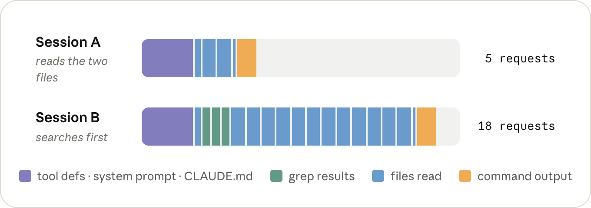
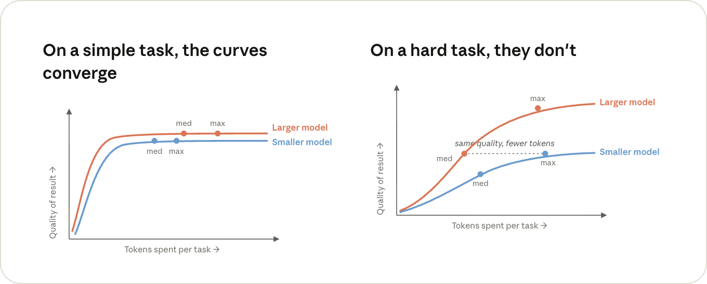
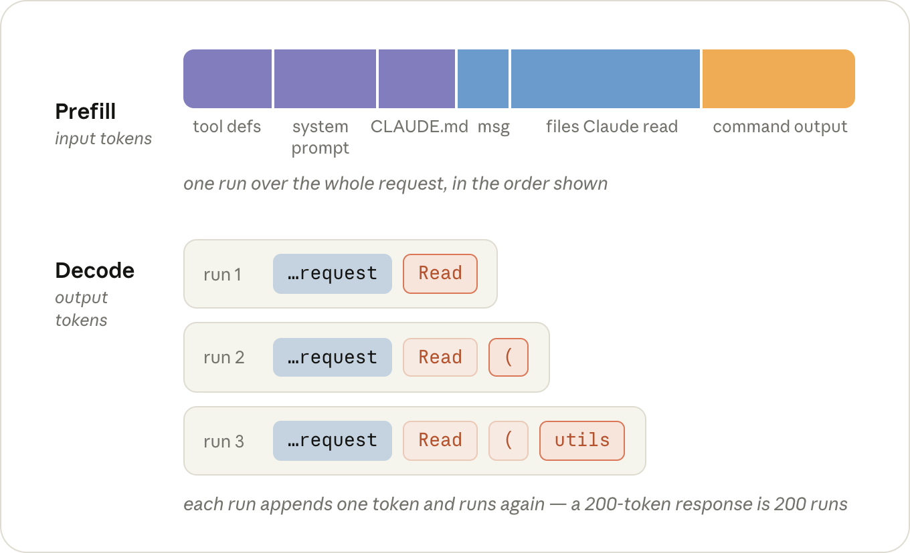
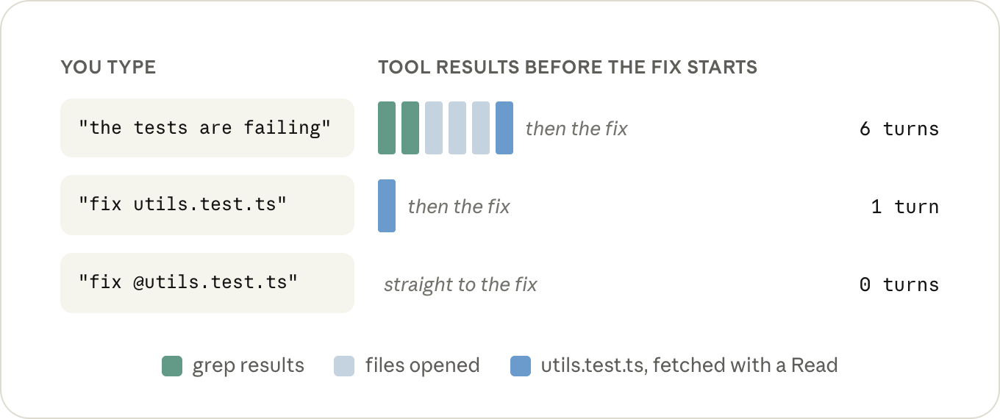
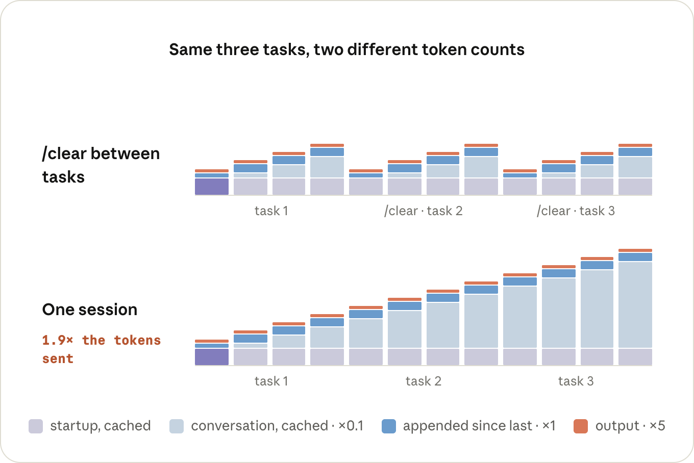
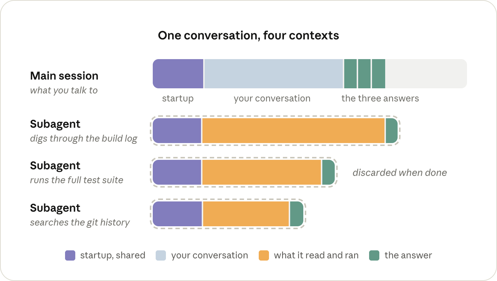
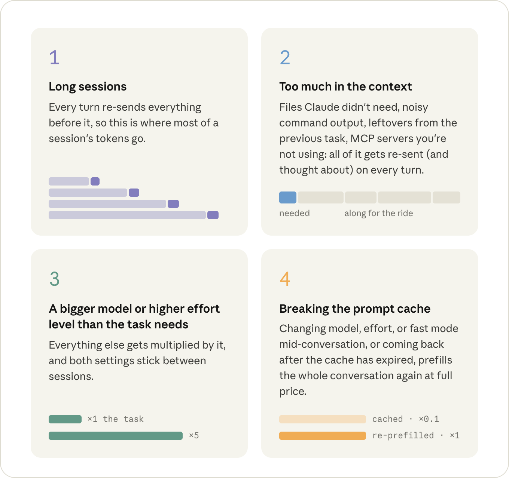

> 이 문서는 [Maximizing the value of your Claude Code sessions](https://claude.com/blog/maximizing-the-value-of-your-claude-code-sessions)의 한글 번역입니다.

## 목차

## 핵심 요약

<strong>📌 TL;DR (클릭하여 펼치기)</strong>

### 주요 내용
- **작업 사이에는 `/clear`를 실행하세요.** 앞선 작업에서 남은 불필요한 컨텍스트가 다시 모델에 전달되지 않아 토큰 사용량을 줄일 수 있습니다.
- **세션을 시작하기 전에 모델과 effort 레벨을 먼저 정하세요.** 대화 도중에 둘 중 하나라도 바꾸면 프롬프트 캐시가 깨질 수 있고 그만큼 토큰 비용이 늘어날 수 있습니다.
- **파일 경로를 직접 입력하는 대신 @-멘션하세요.** 파일이 메시지에 바로 첨부되어 Read 호출을 아끼고, Claude가 파일을 직접 찾아야 하는 상황이라면 탐색 과정까지 생략할 수 있습니다.
- **출력이 많은 명령어에는 quiet 플래그를 추가하거나 서브에이전트에서 실행하세요.** 명령어 출력은 파일과 마찬가지로 대화에 그대로 추가되어 세션이 끝날 때까지 남습니다.
- **새 세션에서는 한 번 `/context`를 실행해보세요.** 무엇이 로드되어 있는지(`CLAUDE.md`, MCP 도구 정의) 점검해 불필요한 부분을 정리할 수 있습니다.
- **자리를 비우기 전에는 `/compact`를 실행하세요.** 프롬프트 캐시는 한 시간이 지나면 만료되는데, 대화가 아직 캐시에 남아 있을 때 요약하는 편이 훨씬 저렴합니다.

### 본문에서 짚고 갈 점
- 토큰을 아낀다는 건 전체 사용량 자체를 줄이는 게 아니라, 실제로 요청한 작업에 토큰이 온전히 쓰이도록 하는 것입니다.
- 세션의 비용은 결국 컨텍스트에 쌓인 토큰 양, 그 토큰이 남아 있는 턴 수, 동시에 돌리는 컨텍스트 수로 정해집니다.

---

**원문 작성일**: 2026년 8월 14일 (금)

**작성자**: Lydia Hallie

## 가치 극대화하기

얼마 전까지만 해도 개발 도구는 정액 요금(혹은 무료)이었습니다. 편집기는 그날 오후 테스트를 하나 고치든 쉰 개를 고치든 요금이 같았기 때문에 개별 작업 하나하나에 따로 가격이 매겨지지는 않았습니다.

하지만 Claude Code 같은 에이전트 기반 코딩 도구에서는 다릅니다. 작업 하나에도 가격이 매겨지고 같은 작업을 끝내더라도 어떻게 쓰느냐에 따라 비용이 달라질 수 있습니다.

어떤 세션에서는 Claude가 테스트와 그 테스트가 검증하는 파일을 읽고 수정한 뒤 몇 턴 만에 끝냅니다. 다른 세션에서는 저장소를 grep으로 먼저 훑고 필요한 두 파일에 도달하기까지 십여 개 파일을 읽어들입니다. 그 모든 턴마다 오늘 아침부터 쌓인 다른 대화 내용까지 함께 끌고 다니는 셈입니다.

*세션 A(두 파일만 읽음)는 요청 5번, 세션 B(먼저 탐색함)는 요청 18번.*

고친 내용은 같아도 쓴 토큰 수는 다르고, 그동안 모델은 필요하지도 않은 파일 열 개를 계속 신경 써야 했습니다.

토큰을 효율적으로 쓴다는 건 전체 사용량 자체를 줄이는 게 아닙니다. 실제로 요청한 작업에 토큰이 온전히 쓰이도록 하는 것입니다.

그러면 토큰 하나의 가격을 무엇이 결정하는지, 그리고 세션이 토큰을 얼마나 많이 보내는지를 무엇이 결정하는지 차례로 살펴보고 그 과정에서 세션을 어떻게 운영해야 하는지도 함께 짚어보겠습니다.

## 토큰 하나의 가격을 결정하는 요소

비용은 토큰 단위로 청구되지만 실제로 지불하는 대상은 추론(inference)입니다. GPU든 TPU든 모델이 실행되는 어떤 하드웨어든 토큰을 처리하는 데 걸리는 시간을 말합니다.

토큰 하나가 이 시간을 얼마나 차지하는지는 세 가지가 결정합니다. 어떤 모델을 쓰는지, 입력 토큰(들어가는 토큰)인지 출력 토큰(나오는 토큰)인지, 캐시되었는지 여부입니다.

### 모델

더 큰 모델은 입력 토큰과 출력 토큰 모두에서 더 많은 일을 합니다. 어떤 작업에 어떤 모델이 적합한지는 그 자체로 다룰 만한 주제라 저희는 [Claude Code에서 Claude 모델과 effort 레벨 고르기](https://claude.com/blog/claude-model-and-effort-level-in-claude-code)에서 이미 설명했습니다.

이 글에서 알아야 할 것은 하나입니다. 지금부터 다룰 나머지 내용은 전부 모델 가격에 곱해집니다. 문제가 정말 어렵거나 모호할 때는 더 큰 모델을, 작업이 일상적일 때는 더 작은 모델을 쓰세요.

*그래프는 예시일 뿐입니다.*

### 입력 토큰과 출력 토큰

요청 하나는 GPU를 두 단계로 거치는데, 두 단계는 비용이 다릅니다.

첫 번째는 프리필(prefill) 단계입니다. 모델이 요청과 컨텍스트를 읽습니다. 여기에는 시스템 프롬프트, `CLAUDE.md`, 메시지, 그 이후 대화에 추가된 모든 내용(Claude가 읽은 파일과 실행한 명령어의 출력)이 포함됩니다. 이 전체가 입력 토큰입니다.

두 번째는 디코드(decode) 단계로, 모델이 출력 토큰, 즉 생각 과정과 도구 호출, 여러분이 눈으로 보는 텍스트를 씁니다. 토큰을 한 번에 하나씩 생성하므로 200토큰 응답은 모델을 200번 순차 실행하는 것입니다. 토큰당 GPU를 붙잡아 두는 시간이 디코드 쪽이 훨씬 길기 때문에 출력 토큰 가격은 입력 토큰의 약 5배입니다.

세션에서 나오는 출력 토큰 중 상당수는 생각(thinking) 토큰입니다. 모델이 턴마다 얼마나 생각할지는 effort 레벨이 결정합니다. 모델과 마찬가지로 `/effort`로 고른 레벨도 다음 세션의 기본값으로 그대로 남습니다.

> **팁:** 새 세션에서 한 번 `/model`과 `/effort`를 실행해 지금 어떤 설정으로 돌아가고 있는지 살펴보세요. 둘 다 지난번에 고른 값을 그대로 기억하므로 그 선택은 의식적으로 내린 결정인 편이 좋습니다.

> **팁:** 세션이 단순 반복 작업일 게 뻔하다면, `MAX_THINKING_TOKENS=0 claude`로 해당 세션에서만 생각(thinking) 기능을 끌 수 있습니다(Fable 5는 예외). `/effort low`보다 한 단계 더 아래인 설정입니다.

### 프롬프트 캐싱

어떤 요청이 서버가 방금 처리한 요청과 정확히 같은 토큰으로 시작하면, 그 공통된 앞부분의 상태도 똑같이 나옵니다. 그래서 서버는 지난번 상태를 그대로 남겨두고 그 뒤에 오는 부분만 새로 프리필하면 됩니다. 이를 프롬프트 캐싱이라고 부릅니다.

캐시에서 읽으면 입력 가격의 0.1배만 들어갑니다. 서버가 상태를 다시 계산하는 대신 그대로 불러오기 때문입니다. 반대로 캐시에 토큰을 쓰는 데는 일반 입력보다 조금 더 들어서 최대 2배까지 비용이 붙는데, 서버가 그 이후로도 상태를 계속 들고 있어야 하기 때문입니다. 다만 쓰기는 토큰당 한 번뿐이고 0.1배짜리 읽기는 그 이후 모든 턴에서 반복됩니다.

Claude Code는 모든 요청에서 프롬프트 캐시를 알아서 관리하므로 따로 켤 것은 없습니다. 다만 여러분이 캐시를 깨뜨릴 수는 있으니, 이런 비용 급증을 피하는 방법을 알아둘 필요가 있습니다.

예를 들어 "`utils.test.ts`에서 실패하는 테스트를 고쳐줘"라고 입력했다고 해봅시다. 이때 Claude Code가 실제로 보내는 요청은 다음과 같습니다.

- Claude Code는 시스템 프롬프트(도구 정의 포함), `CLAUDE.md`, 메시지로 첫 번째 요청을 구성해 전송합니다(입력 토큰). 아직 캐시에 아무것도 없으므로 전체가 프리필되어 캐시에 새로 쓰입니다.
- 모델은 본 적 없는 테스트를 고칠 수 없으므로 잠시 생각한 뒤 `utils.test.ts`를 읽으려는 Read 호출로 응답합니다(출력 토큰). Claude Code가 파일을 읽어 대화에 추가하고 전체를 다시 전송합니다(입력 토큰). 이번에는 첫 번째 요청에 있던 모든 내용이 10분의 1 가격으로 캐시에서 읽히고 새로 프리필되어 전체 가격이 붙는 부분은 Read 호출과 파일뿐입니다.
- 이제 모델은 테스트 대상 파일을 요청합니다(출력). 또 한 번의 Read와 추가가 이뤄지고 전체가 다시 전송됩니다. 첫 번째와 두 번째 요청은 캐시에서, 두 번째 파일은 전체 가격으로 처리됩니다(입력).
- 모델이 Edit으로 응답합니다(출력). Claude Code가 이를 적용하고 결과를 추가한 뒤 전체를 다시 전송합니다. 마찬가지로 Edit과 그 결과만 새롭고 그 앞의 모든 내용은 캐시에서 읽힙니다(입력).
- 모델이 `npm test`를 실행합니다(출력). Claude Code가 테스트 출력을 추가하고 전체를 다시 전송하는데, 이번에 새로운 부분은 테스트 출력뿐입니다(입력).
- 테스트가 통과하고 모델이 짧은 요약으로 응답합니다(출력). 도구 호출이 없으니 추가할 것도, 여섯 번째 요청도 없습니다. 여기서 끝입니다.

작은 수정 하나에 요청이 다섯 번 나갔고 그 요청 하나하나마다 그 시점까지의 대화 전체가 담겨 있었습니다. 일반적인 턴은 균형이 맞지 않아서 수만 개 토큰이 들어가고 수백 개 정도만 나옵니다. 하지만 그 턴에서 새로 생긴 부분만 전체 가격으로 프리필됩니다.

턴 하나의 비용 청구는 이렇게 정리됩니다. 이전 대화 내역은 캐시 읽기 가격, 새로 생긴 부분은 전체 입력 가격, 응답은 출력 가격입니다.

> 구독제에서도 마찬가지입니다. 이 가격이 직접 눈에 보이지는 않지만, 똑같은 요청이 여러분의 사용 한도를 깎아 먹습니다.

캐시는 요청의 맨 처음부터 순서대로 일치해야 하는데, 요청은 항상 같은 순서로 나갑니다. 도구 정의, 시스템 프롬프트, 대화(맨 앞에 `CLAUDE.md`가 놓입니다) 순서입니다.

이 앞부분 중 어느 하나라도 바뀌면 그 뒤에 있는 모든 내용이 다시 프리필됩니다. 도구 결과가 대화 맨 끝에 추가되는 것이 가장 이상적인데, 뒤에 아무것도 없기 때문입니다. 캐시를 통째로 날려버리는 원인은 요청의 앞부분이나 캐시 키 자체를 바꾸는 변화입니다. 구체적으로는 다음과 같습니다:

- **`/model`**: 모델마다 캐시가 따로 있어서 다음 턴에 대화 전체가 전체 가격으로 다시 프리필됩니다(플랜 모드에 들어가고 나올 때마다 모델을 바꾸는 opusplan도 포함됩니다).
- **`/effort`**: effort 레벨도 캐시 키의 일부라 마찬가지입니다. `/model`과 `/effort` 모두 대화 도중에 바꾸려 하면 확인을 요청하는 이유가 여기에 있습니다.
- **패스트 모드(Fast mode)**: 이 역시 캐시 키의 일부이고 다시 프리필될 때 패스트 모드 가격이 적용됩니다. 켤 계획이라면 세션을 시작할 때 켜두세요(끄는 건 캐시 관점에서 공짜입니다).
- **`/compact`**: 대화가 더 짧은 내용으로 교체되어 이전 내용과 더 이상 일치하지 않습니다(앞에 있는 시스템 프롬프트는 그대로 남습니다). 이전 대화가 아직 캐시에 남아 있는 동안에는 요약 자체를 쓰는 비용이 덜 드므로, 긴 휴식 전에 실행하는 편이 휴식 후에 실행하는 것보다 훨씬 저렴합니다.
- **시간**: 턴이 발생할 때마다 시계가 초기화되지만 캐시는 구독제 기준 한 시간, API 키 기준 5분이 지나면 만료됩니다. `ENABLE_PROMPT_CACHING_1H=1`을 설정하면 한 시간으로 늘어납니다. 이 시간을 넘겨서 돌아오면 다음 턴에 대화 전체가 다시 프리필됩니다. 오래된 세션을 재개할 때도 거의 항상 마찬가지인데, 그때쯤이면 캐시가 대부분 사라져 있는 데다 시스템 프롬프트도 실행 시점에 다시 만들어지기 때문입니다.

그렇다고 모델이나 effort를 절대 바꾸지 말라는 뜻은 아닙니다. 다만 바꾸기 저렴한 시점이 있고 비싼 시점이 있다는 뜻입니다. 세션을 시작할 때나 `/clear` 직후는 저렴하고, 긴 대화 중간은 비쌉니다.

> **팁:** 최근 몇 턴이 원하지 않는 방향으로 흘러갔다면, `/compact`를 실행하는 대신 그 직전으로 `/rewind`하세요. 되감기(rewind)는 그 턴들만 끝에서 잘라내므로 그 이전 내용은 그대로 캐시에 남아 비용이 전혀 들지 않습니다. 압축(compact)은 대화 전체를 다시 쓰기 때문에 항상 비용이 발생합니다.

## 세션이 보내는 토큰 수를 결정하는 요소

여기서 가장 중요한 건 아무것도 딱 한 번만 전송되지 않는다는 사실입니다. 대화에 한 번 들어간 내용, 즉 Claude가 읽은 파일이든 실행한 명령어의 출력이든 그 이후 세션이 끝날 때까지 모든 턴마다 다시 전송됩니다.

캐시되어 있어서 매번 다시 보내는 비용 자체는 저렴하지만 저렴하다고 공짜는 아닙니다. 게다가 모델이 매 턴마다 헤치고 지나가야 하는 컨텍스트 공간까지 차지합니다.

결국 세션의 비용 구조는 이렇습니다. 컨텍스트에 토큰이 얼마나 쌓이는지, 그 토큰이 몇 턴 동안 남아 있는지, 동시에 컨텍스트를 몇 개나 돌리는지입니다.

### 컨텍스트에 쌓이는 것들

컨텍스트 일부는 여러분이 아무것도 입력하기 전부터 이미 들어 있습니다. 도구 정의, 시스템 프롬프트, `CLAUDE.md`, 시작할 때 로드되는 그 밖의 것들입니다.

> **팁:** 새 세션에서 아무것도 입력하기 전에 `/context`를 실행해 무엇이 들어 있는지 점검해보세요. `CLAUDE.md`에는 구체적인 지시사항만 남기고 워크플로우별 지시사항은 스킬로 옮기세요. 스킬은 실제로 쓰일 때만 로드됩니다. 이번 세션에 필요 없는 MCP 서버가 있다면 `/mcp`로 꺼두세요.

세션 도중 추가되는 나머지 대부분은 도구 결과입니다. Claude가 읽은 파일과 실행한 명령어의 출력입니다.

Claude가 얼마나 많이 읽는지는 대부분 스스로 얼마나 알아내야 하는지에 달려 있습니다. "테스트가 실패해"라고만 말하면 어떤 테스트인지부터 찾아내야 하는데, grep을 한두 번 돌리고 관련 있는 파일을 찾으려 몇 개를 열어보게 됩니다. 그 결과는 쓸모가 없어진 뒤에도 한참 동안 컨텍스트에 남아 있습니다.

"`utils.test.ts`에서 실패하는 테스트를 고쳐줘"라고 하면 탐색 과정을 건너뛰고 Read 호출 한 번만 들고, "`@utils.test.ts`에서 실패하는 테스트를 고쳐줘"라고 하면 그 Read 호출조차 들지 않습니다.

*"테스트가 실패해"는 6턴, "utils.test.ts를 고쳐줘"는 1턴, "@utils.test.ts를 고쳐줘"는 0턴.*

> **팁:** 파일을 언급할 때는 경로를 직접 입력하는 대신 @-멘션하세요. Claude Code가 전송 전에 메시지에 파일을 바로 첨부하므로 첫 번째 요청부터 파일이 포함되고 Read 호출도 들지 않습니다. 파일 자체가 컨텍스트에서 차지하는 공간은 어느 쪽이든 같으므로 대화당 한 번만 언급하면 충분합니다. 파일은 계속 남아 있고, 이후 턴에서 다시 @-멘션하면 대개 사본이 하나 더 첨부됩니다.

컨텍스트를 채우는 또 다른 요소는 Claude가 실행하는 명령어의 출력입니다. 테스트든 빌드든 git log든 실행할 때마다 출력된 내용이 Claude가 읽은 파일과 마찬가지로 대화에 그대로 추가되고 똑같은 턴 수만큼 남아 있습니다.

출력이 정말 클 때는 오히려 괜찮습니다. 3만 자를 넘어가면 Claude Code가 출력을 파일에 써두고 대화에는 짧은 미리보기와 경로만 남기기 때문입니다(바꾸고 싶다면 `BASH_MAX_OUTPUT_LENGTH`를 조정하세요).

문제는 그 아래 크기입니다. 테스트 400개가 통과했다고 한 줄씩 출력하는 테스트 러너는 이 기준 아래에 들어오고 그 400줄이 이후 모든 턴에 그대로 포함됩니다.

Claude가 플래그와 `tail`을 써서 이 문제를 알아서 처리해주는 경우도 많지만 Claude에게 맡기고 싶지 않다면 문서에 나온 작은 훅을 쓰면 됩니다. 이 훅은 명령어를 실행하기 전에 출력이 많은 명령어를 다시 써서 정말 중요한 줄만 돌아오게 만듭니다.

> **팁:** 하루 종일 반복해서 쓰는 명령어 두세 개는 quiet 플래그까지 포함해서 직접 입력하듯이 `CLAUDE.md`에 적어두세요("테스트 파일 하나만 실행하려면 `npx vitest run <file> --reporter=dot`을 쓴다"처럼요). 작은 추가지만 이후 모든 세션에서 턴 하나와 출력 수백 줄을 아낄 수 있습니다.

### 몇 턴 동안 남아 있는가

같은 작업이라도 긴 세션 하나로 처리하면 짧은 세션 여러 개로 나눠 처리할 때보다 비용이 더 듭니다. 그것도 생각보다 훨씬 많이 드는데, 40번째 턴은 그 앞의 39개 턴까지 함께 다시 읽어들이기 때문입니다. 세션의 컨텍스트는 짧고 관련성 있게 유지하는 게 좋으므로 한 작업의 컨텍스트를 다음 작업까지 끌고 가지 마세요. 새로운 걸 시작할 때는 `/clear`를, 같은 작업의 앞부분이 끝났을 때는 `/compact`를 실행하세요.

> **팁:** 나중에 세션을 다시 찾고 싶다면 `/clear`하기 전에 `/rename`하세요. `/compact`할 때는 무엇을 남길지 알려주거나 항상 같은 내용이라면 `CLAUDE.md`에 "Compact instructions" 섹션을 만들어두세요. 100만 토큰 모델을 쓰면서 자동 압축 안전망을 예전 위치로 돌리고 싶다면, `/autocompact 200k`로 되돌릴 수 있습니다(Claude Code v2.1.221 이상 필요).

여러분이 직접 입력하지 않을 때 발생하는 턴도 신경 써야 합니다. `/loop`는 설정해둔 세션에서 매번 완전한 턴 하나로 실행되고 그때마다 전체 대화를 그대로 끌고 갑니다. 게다가 마지막 턴 이후 한 시간이 넘게 지났다면 캐시 미스까지 더해집니다. 다른 터미널에서 새 세션을 열어 그쪽에서 루프를 돌리세요.

### 서브에이전트

컨텍스트에서 뭔가를 빼두는 또 다른 방법은 아예 다른 컨텍스트에서 처리하는 것인데, 이게 바로 서브에이전트가 하는 일입니다. 서브에이전트는 자기만의 컨텍스트 윈도우를 갖습니다. 자기만의 시스템 프롬프트, 도구, 그리고 여러분의 `CLAUDE.md`를 갖지만 여러분의 대화는 갖지 않습니다. 자기 턴을 스스로 돌리고 메인 세션에 돌아오는 건 결과 답변뿐입니다. 나머지는 작업이 끝나면 전부 버려집니다.

대화를 물려받지 않는다는 점은 단점이기도 합니다. 메인 세션에 이미 있던 내용을 서브에이전트가 다시 읽어야 할 때도 있고 그 과정에서 자기 턴 비용도 따로 냅니다. 작은 작업이라면 그냥 오버헤드일 뿐입니다.

로그를 훑어보는 일처럼 유지할 필요 없는 출력이 많이 나온다면 서브에이전트를 쓰면 그만큼 이득을 봅니다. Claude가 이런 작업에는 종종 알아서 서브에이전트를 쓰지만 그렇지 않을 때는 직접 요청하면 됩니다("이 로그는 서브에이전트에서 훑어봐줘"처럼요). 다만 메인 세션에는 서브에이전트가 보고하기로 한 내용만 돌아온다는 점은 기억해두세요.

*하나의 대화가 메인 세션과 서브에이전트 세 개, 총 네 개의 컨텍스트로 나뉘고, 서브에이전트의 컨텍스트는 작업이 끝나면 버려집니다.*

> **팁:** 출력이 많은 작업을 반복해서 넘긴다면, `model: haiku`(또는 `sonnet`)를 지정한 전용 서브에이전트 정의를 만들어두세요. 그렇지 않으면 메인 세션이 쓰는 모델 그대로 돌아갑니다.

## 가장 먼저 확인할 것

지금까지 살펴본 내용 중 눈여겨볼 만한 것은 네 가지입니다. 대략 비용이 큰 순서대로 정리했습니다.

1. **긴 세션**: 매 턴이 그 앞의 모든 내용을 다시 보내므로 세션 토큰의 대부분이 여기서 나갑니다.
2. **컨텍스트에 너무 많은 것**: Claude에게 필요 없던 파일, 출력이 많은 명령어 결과, 이전 작업에서 남은 찌꺼기, 쓰지 않는 MCP 서버까지 전부 매 턴 다시 전송되고 모델이 매번 신경 씁니다.
3. **작업에 필요한 것보다 큰 모델이나 높은 effort 레벨**: 나머지 모든 비용이 여기에 곱해지고, 두 설정 모두 세션 사이에 그대로 남습니다.
4. **프롬프트 캐시 깨뜨리기**: 대화 도중에 모델, effort, 패스트 모드를 바꾸거나 캐시 만료 후에 돌아오면 대화 전체가 전액으로 다시 프리필됩니다.

## 참고 자료

- [Maximizing the value of your Claude Code sessions - 원문](https://claude.com/blog/maximizing-the-value-of-your-claude-code-sessions)
- [Choosing a Claude model and effort level in Claude Code](https://claude.com/blog/claude-model-and-effort-level-in-claude-code)
