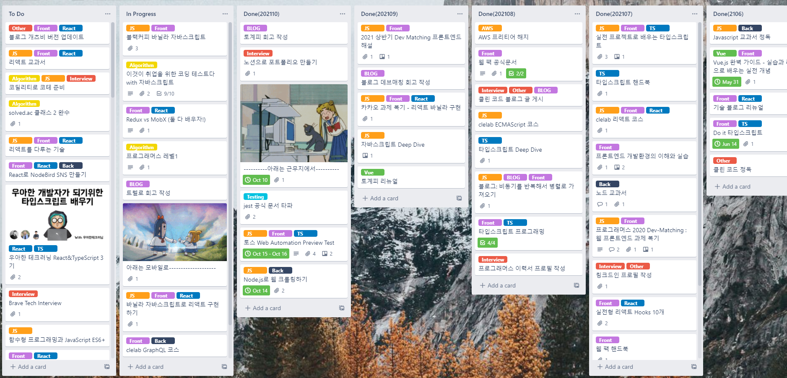

# Trello를 통한 개발 여정

약 2년간 Trello를 활용해 개인 프로젝트들을 관리해왔다. 단순히 할 일 목록을 정리하는 도구로 시작했지만, 시간이 지나면서 나의 성장과 변화를 보여주는 기록이 되었다.

[Trello 보드 링크](https://trello.com/b/yourboardlink) (비공개)

# 사용한 보드 구조

## 기본 칼럼 구성
- **Backlog**: 언젠가 해보고 싶은 아이디어들
- **To Do**: 이번 달 내에 해야 할 작업들
- **In Progress**: 현재 진행 중인 작업 (최대 3개까지)
- **Review**: 완료했지만 점검이 필요한 작업들
- **Done**: 완료된 작업들

## 라벨 시스템
- 🔴 **긴급**: 빠른 처리가 필요한 작업
- 🟡 **학습**: 새로운 기술 학습 관련
- 🔵 **개발**: 실제 개발 작업
- 🟢 **배포**: 배포 및 운영 관련
- 🟣 **리팩토링**: 코드 개선 작업

# 주요 프로젝트 흐름

## 2019년 12월 - 2020년 상반기
### 첫 React 프로젝트들
- **토계피 v1** (Vue.js)
- **개인 포트폴리오 사이트**
- **간단한 Todo 앱들**

이때는 주로 튜토리얼을 따라하는 수준의 작업들이 많았다. Trello 카드들도 매우 단순하게 "React 공부하기", "포트폴리오 만들기" 같은 추상적인 내용들이었다.

## 2020년 하반기
### 체계적인 학습 시작
- **알고리즘 문제 풀이** (매일 1문제씩)
- **Clean Code 독서**
- **TypeScript 학습**

이 시기부터 카드를 좀 더 구체적으로 작성하기 시작했다. "백준 1234번 문제 해결", "Clean Code 3장 정리" 같은 식으로 측정 가능한 목표를 설정했다.

## 2021년 상반기
### 실전 프로젝트 도전
- **토계피 v2** (React + TypeScript)
- **Show me the lucky meme**
- **개인 블로그 구축** (Gatsby)

프로젝트의 규모가 커지면서 카드 하나를 여러 개의 체크리스트로 나누기 시작했다. 예를 들어 "토계피 v2 개발" 카드에는:
- [ ] UI 디자인 완료
- [ ] Firebase 연동
- [ ] 반응형 적용
- [ ] 배포 및 테스트
같은 세부 항목들이 있었다.

## 2021년 하반기 (현재)
### 품질과 운영에 집중
- **블로그 SEO 최적화**
- **기존 프로젝트 리팩토링**
- **성능 최적화**
- **CI/CD 구축**

최근에는 단순히 기능을 만드는 것에서 벗어나 품질과 사용자 경험에 더 신경 쓰고 있다. Trello 카드들도 "Lighthouse 점수 95점 이상 달성", "번들 크기 30% 감소" 같은 구체적인 지표를 포함하게 되었다.

# Trello 사용 팁과 학습

## 1. 카드 크기의 적절한 조절
초기에는 "React 공부하기" 같은 너무 큰 카드를 만들어서 진행 상황을 파악하기 어려웠다. 

**개선한 방법:**
- 카드 하나당 1-3일 내에 완료할 수 있는 크기로 조절
- 큰 작업은 여러 개의 작은 카드로 분할
- 체크리스트를 적극 활용해서 진행률 시각화

## 2. 라벨과 데드라인 활용
색상 라벨로 작업의 성격을 구분하고, Due Date를 설정해서 우선순위를 명확히 했다.

**효과적이었던 규칙:**
- 빨간 라벨(긴급)은 최대 1개까지만 유지
- 파란 라벨(개발)은 In Progress에 최대 2개까지
- 매주 일요일에 다음 주 계획 수립

## 3. 회고 카드 작성
프로젝트가 완료되면 "Done" 칼럼으로 이동하기 전에 "Review" 칼럼에서 회고를 진행했다.

**회고 템플릿:**
- **잘했던 점:** 
- **아쉬웠던 점:**
- **배운 점:**
- **다음에 적용할 점:**

# 데이터로 보는 성장

## 카드 완료 통계
- **2020년**: 총 87개 카드 완료 (월평균 7.3개)
- **2021년**: 총 124개 카드 완료 (월평균 12.4개) - 10월까지

완료 카드 수가 증가한 건 물론 생산성 향상도 있지만, 작업을 더 작은 단위로 쪼개서 관리하게 된 것도 영향이 크다.

## 라벨별 분포 변화

### 2020년
- 🟡 학습: 45%
- 🔵 개발: 30%
- 🟢 배포: 15%
- 🟣 리팩토링: 10%

### 2021년
- 🟡 학습: 25%
- 🔵 개발: 40%
- 🟢 배포: 20%
- 🟣 리팩토링: 15%

학습 비중이 줄고 실제 개발과 배포 비중이 늘어난 것을 볼 수 있다. 이는 기초를 다지는 단계에서 실전 적용 단계로 넘어갔다는 의미로 해석된다.

# 인사이트와 패턴 발견

## 1. 계절별 생산성 패턴
여름(7-8월)과 연말(12월)에 완료 카드 수가 줄어드는 패턴을 발견했다. 이를 바탕으로 해당 시기에는 무리한 계획을 세우지 않고 휴식이나 가벼운 학습에 집중하도록 조정했다.

## 2. 프로젝트 타입별 소요 시간
- **학습 프로젝트**: 평균 2-3주
- **토이 프로젝트**: 평균 1-2개월
- **포트폴리오 프로젝트**: 평균 2-3개월

이 데이터를 바탕으로 새로운 프로젝트를 시작할 때 더 현실적인 일정을 수립할 수 있게 되었다.

## 3. 가장 많이 미루는 작업들
- 문서화 작업
- 테스트 코드 작성
- 성능 최적화

이런 작업들은 별도의 전용 시간을 확보해서 처리하는 것이 효과적이었다.

# 아쉬웠던 점과 개선 방향

## 1. 너무 많은 백로그
"언젠가 해보고 싶다"는 아이디어들이 백로그에 계속 쌓여만 갔다. 정기적으로 백로그를 정리하고 우선순위를 재평가하는 시간이 필요했다.

## 2. 완료 기준의 애매함
"개인 블로그 구축" 같은 카드의 경우 언제가 완료인지 명확하지 않아서 계속 In Progress에 머물러 있는 경우가 많았다.

**개선 방안:**
- 모든 카드에 명확한 완료 조건 정의
- "MVP 버전 완료", "1.0 버전 완료" 같은 단계별 목표 설정

## 3. 번아웃 방지 장치 부족
연속으로 개발 작업만 하다가 번아웃이 온 적이 있었다. 적절한 휴식과 다양성을 보장하는 규칙이 필요했다.

# 다른 도구들과의 비교

## GitHub Issues vs Trello
- **GitHub Issues**: 코드와 직접 연관된 작업 관리에 유리
- **Trello**: 시각적이고 직관적인 칸반 보드, 비개발 작업도 포함

결론적으로 코딩 작업은 GitHub Issues, 전체적인 개인 프로젝트 관리는 Trello를 사용하는 것이 효과적이었다.

## Notion vs Trello
- **Notion**: 강력한 문서화 기능, 복잡한 관계 설정 가능
- **Trello**: 단순하고 빠른 작업 관리에 특화

Trello의 단순함이 오히려 장점이었다. 복잡한 기능 때문에 도구 사용에 시간을 쓰기보다는 실제 작업에 집중할 수 있었다.

# 앞으로의 계획

## 2022년 목표
- **오픈소스 기여**: 월 1회 이상
- **기술 블로그**: 주 1회 포스팅
- **새로운 기술 스택**: 백엔드(Node.js, Python) 학습
- **팀 프로젝트**: 다른 개발자들과의 협업 경험

## Trello 사용법 개선
- 분기별 회고 카드 추가
- 학습과 개발의 균형 모니터링
- 장기 목표와 단기 작업의 연결점 강화

# 마무리

2년간 Trello를 사용하면서 가장 큰 깨달음은 **작은 성공들의 누적이 큰 성장을 만든다**는 것이었다.

매일 작은 카드 하나씩 완료하면서 느끼는 성취감이 장기적인 동기부여로 이어졌고, 돌아보니 상당한 거리를 걸어왔다는 것을 확인할 수 있었다.

완벽한 도구는 없지만, 자신에게 맞는 방식으로 꾸준히 사용하는 것이 가장 중요하다고 생각한다.

> "작은 카드 하나의 완료도 성장의 한 걸음이다"