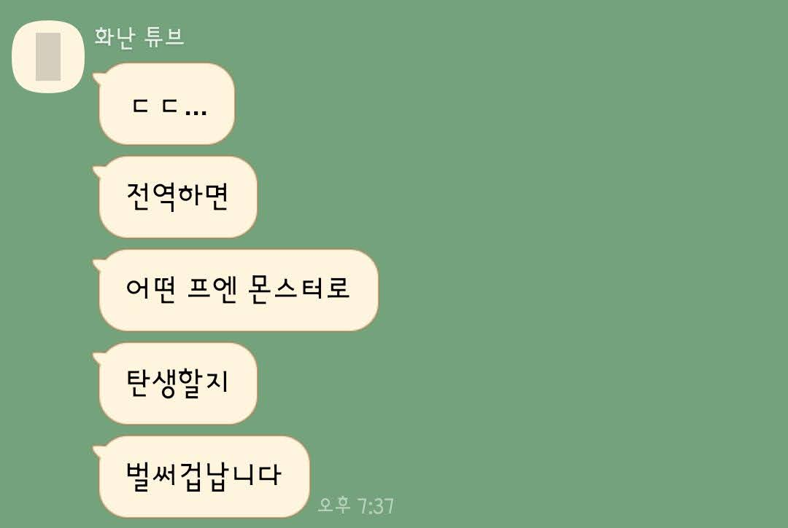

# 전역

~~프엔(X) 그냥 몬스터(O)~~

드디어 전역했다! 
학교 다닐 때는 적체라서 못 가고 있다가 졸업하고 나서야 겨우 연말에 입대해서... 드디어 전역의 해가 밝았습니다.

물론 군생활 하면서도 꾸준히 코딩도 하고, 일과 시간 도중 남는 시간엔 개발 서적 읽고, 출퇴근 때는 폰으로 블로그 글들을 꾸준히 봐왔지만... 전역하고 하는 공부의 양이 훨씬 더 많다고 느껴진다.

산업요원으로 전직할까도 생각을 해봤었는데, 그러기엔 그때 근무지가 나쁘지 않아서 정착하고 싶었었던 것 같다.
~~안 돼 어서 돌아가서 경력 쌓아~~

> 위 사진은 학부 + 동아리 시절에 프론트엔드 + `JS`로 스타 개발자...? 가 되어버려서 생긴 별명입니다ㅋㅋㅋㅋ

# 취준 시작

일단 기본기를 다지기 시작했다.
복무하는 동안 정말 많이도 다른 길로 새서 해보고 싶었던 개발들을 해봤으니, 이젠 취준에 필요한 스킬들을 공부할 때라고 판단했기 때문이다.

## 개발 서적들

그렇게 잡은 책들은

- `JS` 로는 `자바스크립트 Deep Dive` 
- `React`는 `리액트를 다루는 기술`
- 코딩 테스트로는 `이것이 취업을 위한 코딩 테스트다 with 파이썬`
- 클린 코드

이렇게 되시겠다. 

> 이제보니 저자분들이 다 스타 개발자이시다...

### 자바스크립트 Deep Dive

`자바스크립트 Deep Dive`는 요근래 나온 `JS` 책들 중에서 상당히 좋은 책이었다. 그동안 `모던 자바스크립트 입문` 이나 `자바스크립트 완벽 가이드` 책을 읽어봤었지만, 문법과 가독성의 면에서 이 책을 따라올 수는 없다.

`es6`이후의 `es-next` 수준을 다루고 있고, 책의 볼륨도 상당하다. 천 페이지 정도 되었던 걸로.

다만 다른 책에 비해 부족한 건, '예시가 되는 알고리즘' 과 '연습 문제' 이다. 그래서 뭔가 공부를 했다고 따로 손으로 코딩을 하거나 하는 부분이 없어서 참고서로의 기능만을 한다.

### 리액트를 다루는 기술

`리액트를 다루는 기술`은 리액트를 다루는 기술을 집필한 책 중 최고라고 할 수 있다. 또 그동안 읽어온 다른 리액트 기술 서적들을 보면... es5 문법을 사용한다거나 훅에 관한 내용은 없다든지, 그저 따라하기만 하는 헛지식 주입이라든지... 무엇보다도 한참 지난 패키지 버전을 사용하고 있는 것들이 너무 많아서 어지러울 지경이었다.

하지만 `리액트를 다루는 기술`은 최신 리액트 기술을 담고 있으면서도 `SSR` 에 관한 지식도 있고, 최적화에 관한 지식도 알려준다! (와!)
게다가 오탈자는 저자분 깃허브에서 업데이트가 된다. A/S 까지 확실하다ㄷㄷ

이 책도 천 페이지 정도로 볼륨도 많고, 배울 점이 굉장히 많다. 리액트 초보자 필독 도서! 덕분에 후속작인 `리액트 네이티브를 다루는 기술`을 충동구매하려다 겨우 참았다. 지금은 저걸 공부할 때가 아니니깐...

단점이라고 한다면, 실습에서 쓰이는 백엔드 프레임워크가 취향을 탄다는 거 정도. 

> [리액트를 다루는 기술을 정리한 레포](https://github.com/CaesiumY/react-with-velopert)

### 이것이 취업을 위한 코딩 테스트다 with 파이썬

항상 찔끔찔끔씩 보는 책... 코딩 테스트를 엄청 좋아하지는 않는지라 잘 안 보게 되었다. 지금도 가끔 이론만 읽어보고 그냥 프로그래머스 가서 문제 풀고 있다.

처음에 공부할 때는 책에 나온대로 `파이썬`을 사용했다. 그리고 백준이랑 `solved.ac` 에서도 똑같이 `파이썬` 으로 문제들을 풀었다.
그러던 어느 날, 뭔가를 깨달은 듯이 `파이썬`을 멀리하고 `JS`로 알고리즘을 풀기 시작했다. 역시 주력기로 코딩하는 게 맘이 편하다.
하지만 그 덕분에 `JS` 인풋을 기본 지원하지 않는 백준을 떠나고, 프로그래머스 문제를 풀게 되었다...

책은 그냥 코딩 문제를 알려주는 게 아니라, 여러 자료구조와 알고리즘을 알려준다. 학부 시절의 기억이 새록새록 떠올라서 반가웠다. 이미 배워본 부분이라 빠르게 훑어보고 문제로 들어가는데... 어려워!! 물론 지금은 그리 안 어렵지만, 처음 봤을 땐 어려웠다.

이 책의 단점이라고 한다면 역시 책의 한계와도 같은 것인데, 바로 코딩 문제에 대한 답을 풀고 테스트 케이스나 시간 제한을 알 수 없다는 것이다. 그래서 어떻게든 답만 내는 방식으로 풀게 되는 부작용을 낳을 수 있다.

> [이것이 취업을 위한 코딩 테스트다 with 파이썬을 자바스크립트로 정리한 레포](https://github.com/CaesiumY/js-for-coding-test)

### 클린 코드

말이 필요없다. 당장 가서 읽어라. 나에게 코딩 잘하는 법을 알려주신 학부 조교님... 이 책을 보고 알려주신 것이었군요...

책의 앞장에도 쓰여있지만 가볍게 읽는 책이 아니다. 나도 펜을 2개나 다 써가면서 완독했다.

아쉬웠던 점은, 마지막 실습? 파트가 `java` 로 쓰여있다는 점... `JS` 버전도 내주세요!

## 인터넷으로 배우기

서적이 아닌 인터넷 강의나 블로그로 배운 것도 있다. 책과는 달리 복무 중부터 해온 것들이 많다.

### 프론트엔드 개발환경

먼저 `웹팩`에 대해 개념을 정리했다. 계기는 `토스`의 개발 컨퍼런스. 어느 프레젠테이션에서 말하기를 `CRA`를 통해 스캐폴딩한 리액트를 결국 싹 갈아엎고 웹팩 설정부터 다시 하게 되었다고...

그래서 `webpack`, `babel`, `eslint`, `prettier` 등 개발 환경에 대해 공부를 했었다. 그에 대한 실습으로 `CRA` 없이 리액트 개발 환경 구성하기도 해보았다.

거기에 추가로 리액트 개발 환경 구성하는 김에 `RTK(Redux Tool Kit)`도 공부해보았다. 꽤 굉장한 라이브러리라 다음에 쓸 기회를 만들고 싶다.

> [정리 레포](https://github.com/CaesiumY/react-without-CRA)

### 타입스크립트

`타입스크립트`도 빼먹을 수 없다. 웹으로도 배우고, 서평 이벤트로 받은 서적으로 근무지에서도 공부했다. 좋은 타이핑을 하는 블로그 글을 많이 읽었는데, 감탄만 하고 많이 흡수하지는 못 한 거 같다...

타이핑을 하니 조금 번거롭지만, 자동완성이 완벽하게 되는 게 제일 맘에 든다. 타입도 점점 많아지니 관리하기, 로직 짜는 게 힘들어지는 게 느껴진다. 점점 어려워지는 프론트엔드 업계😭

> [정리 레포](https://github.com/CaesiumY/typescript-textbook)

### 테스팅 도구

`테스팅`도 조금 배웠다. `토스`에서 내준 과제를 `TDD`로 해야한다길래, 부리나케 `jest` 공식 문서 읽고 개인 플젝도 해보고, `FEConf`에서 발표한 `TDD` 프레젠테이션도 보고 그랬다.

하지만 과제는 그 프론트엔드로 나온 게 아니었고... 여기까지만 말하겠습니다.

> 정리한 레포는 비공개입니다^^

# 코딩 테스트

취준이라고는 말했지만, 지금도 그렇고 적극적으로 하고 있지는 않았다. 여러가지 이유가 있는데,

1. 보상 심리 - 전역했으니 몇 개월 놀아도 되겠지? (그래도 매일 공부는 하지만)
2. 취업한 친구 - 얘 맨날 야근해;;

그래서 네이버, 카카오, 토스 등등 지원 기간이 있는 공채들만 지원을 했다.

## 네이버 공채 코테

총 4문제(3문제 였나).

이전 년도 문제들을 풀고 왔으니 풀 수 있겠지!!!

> 0솔 광탈

나만 역대급으로 어려웠어...??

## 카카오 공채 코테

총 6문제

프로그래머스에서 카카오 코테 문제들을 다 풀고 왔다!!!

> 3.5솔 광탈

크윽... 시간 제한 케이스만 넘겼어도

## 토스 공채 코테

총 4문제

일반 알고리즘 문제가 아니라 프론트엔드 지식을 활용하는 문제가 출제되어서 신기

그러나 처음으로 본 코테(전역 다음 날)인데다 준비 없이 봤다...

> 2솔 광탈

## 카카오 기타 코테

### 카카오 엔터프라이즈

그럭저럭 준비한 편

> 300/400 점 맞고 광탈

이번에도 시간 제한 문제가...
이번엔 플랫폼을 구름을 썼는데 와... `js` 인풋 지원이 안 돼... 프로그래머스 돌려줘!!

### 카카오 브레인

열심히 준비했다. `HackerRank`문제도 풀고, 프로그래머스 문제도 풀었다!!

> 4문제 올솔(!!!)

다 풀고 최적화도 하고 40분이나 남기고 제출한 지라 기쁜 마음으로 면접을 준비하고 있었는데

> 올솔인데 탈락

대체 어떤 인재를 인턴으로 뽑길래...

### 네이버 인턴

현재 진행형이긴 한데 문제를 반밖에 못 풀어서 기대는 하지 않는다...

# ☀내년에는

21년도까지는 놀겠다고 선언해둔 게 있으니 내년부터는 꼼짝없이 취준을 할 수 밖에 없다.
코테 공부 비중을 늘리고, 수시 지원도 여기저기 해봐야 할 듯 하다.

> 하지만 나는 토이 프로젝트를 하고 싶은 걸

## ++쓰고보니

손 가는대로 쓰다보니 중구난방이 되어버렸다. 그리고 아무래도 기억력 때문인지 최근 일만 적어버렸다... 회고를 1년에 2번 해야하나...?